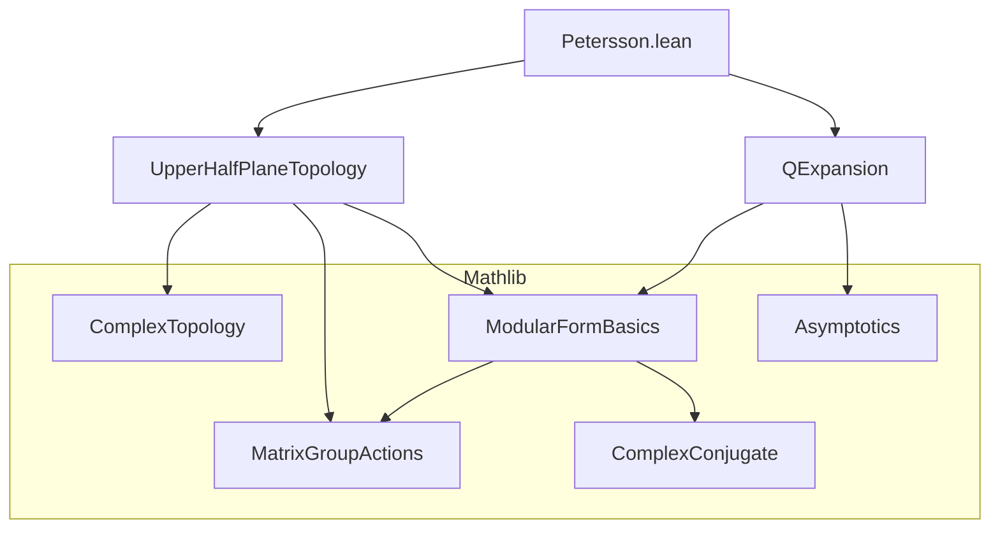
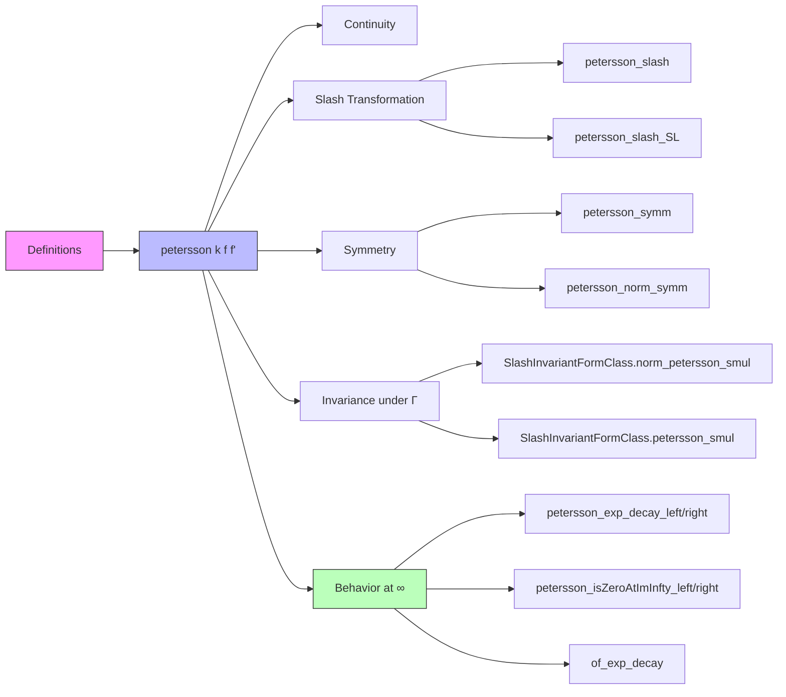

Here is the structured technical brief for `Petersson.lean`, extracted with precision and aligned with Lean 4 formalization conventions.

---

### **1. Key Definitions & Theorems**

| Name | Type / Signature | Purpose |
|------|------------------|---------|
| `petersson` | `petersson (k : ℤ) (f f' : ℍ → ℂ) (τ : ℍ) := conj (f τ) * f' τ * τ.im ^ k` | Defines the *integrand* of the Petersson inner product: pointwise product of conjugate of `f`, `f'`, and weight-dependent height factor. |
| `petersson_continuous` | `Continuous f → Continuous f' → Continuous (petersson k f f')` | Ensures the integrand is continuous under continuity of inputs. |
| `petersson_slash` | `petersson k (f ∣[k] g) (f' ∣[k] g) τ = |g.det.val| ^ (k - 2) * σ g (petersson k f f' (g • τ))` | Describes transformation law of the Petersson integrand under slash operator for general $g \in \mathrm{GL}(2,\mathbb{R})$. |
| `petersson_slash_SL` | `petersson k (f ∣[k] g) (f' ∣[k] g) τ = petersson k f f' (g • τ)` | Specialization to $g \in \mathrm{SL}(2,\mathbb{Z})$, where determinant is 1 and $\sigma(g,\cdot)=1$. |
| `petersson_symm` | `petersson k f' f τ = conj (petersson k f f' τ)` | Symmetry: swapping $f,f'$ conjugates the integrand. |
| `petersson_norm_symm` | `‖petersson k f' f τ‖ = ‖petersson k f f' τ‖` | Norm is symmetric in $f,f'$. |
| `SlashInvariantFormClass.norm_petersson_smul` | `g ∈ Γ → ‖petersson k f f' (g • τ)‖ = ‖petersson k f f' τ‖` | Norm-invariance under $\Gamma$-action when $\Gamma$ has determinant $\pm 1$. |
| `SlashInvariantFormClass.petersson_smul` | `g ∈ Γ → petersson k f f' (g • τ) = petersson k f f' τ` | Full invariance under $\Gamma$ when $\Gamma$ has determinant 1. |
| `petersson_exp_decay_left` | `IsZeroAtImInfty f → ∃ a>0, petersson k f f' =O[atImInfty] exp(-a·im τ)` | Exponential decay of Petersson integrand when one factor vanishes at cusp $\infty$. |
| `petersson_exp_decay_right` | `IsZeroAtImInfty f' → ∃ a>0, petersson k f f' =O[atImInfty] exp(-a·im τ)` | Same as above, with decay from second argument. |
| `petersson_isZeroAtImInfty_left/right` | `IsZeroAtImInfty (petersson k f f')` | Consequence: integrand vanishes at cusp if either factor does. |
| `of_exp_decay` | `∃ a>0, f =O[...] exp(-a·im τ) → IsZeroAtImInfty f` | General criterion: exponential decay implies vanishing at cusp. |

---

### **2. Naming Conventions**

- **Prefixes**:
  - `petersson_`: all definitions/lemmas related to the integrand.
  - `SlashInvariantFormClass.`: for invariance properties under group actions.
  - `UpperHalfPlane.IsZeroAtImInfty.`: for behavior at cusp $\infty$.
- **Suffixes**:
  - `_left`, `_right`: indicate which argument causes a property (e.g., decay).
  - `_smul`: action on argument via group multiplication (`g • τ`).
  - `_norm`: norm-related variants.
- **Operators**:
  - `∣[k] g`: slash operator of weight $k$.
  - `•`: action of $g \in \mathrm{GL}(2,\mathbb{R})$ on $\tau \in \mathbb{H}$.
  - `conj`, `σ g z`: complex conjugation and automorphy factor.

---

### **3. Tactic Stack**

Frequent tactics used in proofs:

| Tactic | Usage |
|--------|-------|
| `simp` / `simp_rw` | Simplify definitions (`petersson`, `slash_def`, `σ`, `norm`, `zpow`), often with custom lemmas disabled (`-...`) to avoid interference. |
| `rw` / `conv_rhs => rw` | Rewrite using transformation laws (e.g., `petersson_slash`, `slash_action_eq`). |
| `ring` | Algebraic simplification of exponent arithmetic (e.g., $k - 2 + k = 2k - 2$). |
| `fun_prop` | Prove continuity using `fun_prop` infrastructure (with `disch := simp [...]`). |
| `norm_num`, `abs_ne_zero`, `mod_cast` | Handle positivity, invertibility, and coercion of real determinants. |
| `exact`, `refine`, `apply` | Especially in big-O arguments (`IsBigO.of_norm_left`, `trans_tendsto`, etc.). |
| `have`, `set` | Introduce intermediate variables (e.g., `D := |g.det.val|`, `j := denom g τ`). |
| `calc` | Chain equalities in `petersson_slash`. |

---

### **4. Proof Logic**

- **Structure of main lemmas**:
  - **`petersson_slash`**: Expand definitions (`slash_def`, `petersson`), factor out determinants, use identity $\operatorname{im}(g \cdot \tau) = \frac{|\det g| \cdot \operatorname{im} \tau}{|j|^2}$, and simplify using properties of $\sigma(g,\cdot)$ and complex conjugation.
  - **`petersson_exp_decay_left`**:
    1. Extract exponential decay rate $b$ from `h_bd.exp_decay_atImInfty'`.
    2. Choose $a < b$ via `exists_between`.
    3. Reduce to bounding norms: use `norm_mul`, `norm_conj`, `norm_zpow`, and boundedness of $f'$.
    4. Apply comparison test: `isLittleO_exp_mul_rpow_of_lt` implies big-O comparison.
  - **`of_exp_decay`**: General principle: exponential decay dominates any polynomial growth ⇒ vanishing at cusp.

- **Inductive/structural pattern**: mostly direct computation + asymptotic analysis; no induction needed.

---

### **5. Imports & Dependencies**

| Module | Role |
|--------|------|
| `Mathlib.Analysis.Complex.UpperHalfPlane.Topology` | Topology of $\mathbb{H}$, continuity, action of $\mathrm{GL}(2,\mathbb{R})$, automorphy factor $\sigma$, determinant, denominator function. |
| `Mathlib.NumberTheory.ModularForms.QExpansion` | Modular forms, slash operators, $q$-expansions, behavior at cusps (`IsZeroAtImInfty`, `IsBoundedAtImInfty`, `ModularFormClass`). |

**Key auxiliary theories used**:
- `Matrix.GeneralLinearGroup`, `Matrix.SpecialLinearGroup`
- `ComplexConjugate`, `ModularForm`
- `Asymptotics`, `Filter` (for `atImInfty`)

---

### **6. Mermaid Diagrams**

#### **Dependency Graph (Module-Level)**

#### **Overview of File Structure**

---

Let me know if you'd like a formalized dependency graph (e.g., for `leanproject`), or a summary of how this module fits into the broader modular forms library.
