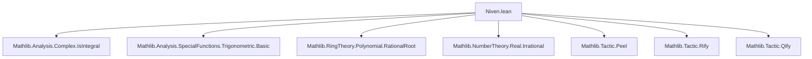

### Technical Brief: Niven.lean — Formalization of Niven’s Theorem

---

#### **1. Key Definitions & Theorems**

| Name | Type / Signature | Purpose |
|------|------------------|---------|
| `ratCast_iff` | `IsIntegral ℤ (q : α) ↔ IsIntegral ℤ q` | Equivalence between integrality of rational cast and original rational in char-zero division ring. |
| `exists_int_iff_exists_rat` | `(∃ q : ℚ, x = q) ↔ ∃ k : ℤ, x = k` (under integrality) | Shows rational algebraic integers are integers. |
| `exp_rat_mul_pi_mul_I_pow_two_mul_den` | `exp (q * π * I) ^ (2 * q.den) = 1` | Shows that `exp(qπi)` is a root of unity, hence integral. |
| `isIntegral_exp_rat_mul_pi_mul_I` | `IsIntegral ℤ (exp (q * π * I))` | Proves `exp(qπi)` is integral over ℤ for rational `q`. |
| `isIntegral_two_mul_cos_rat_mul_pi` (Complex/Real) | `IsIntegral ℤ (2 * cos (q * π))` | Key step: `2 cos(qπ)` is an algebraic integer. |
| `isAlgebraic_cos_rat_mul_pi` | `IsAlgebraic ℤ (cos (q * π))` | Follows from integrality of `2 cos(qπ)`. |
| `niven` | `(∃ r : ℚ, θ = r * π) → (∃ q : ℚ, cos θ = q) → cos θ ∈ ({-1, -1/2, 0, 1/2, 1})` | Main theorem: rational angles with rational cosine only yield 5 values. |
| `niven_sin` | Analogous to `niven`, for `sin`. | Derives sine version via shift by `π/2`. |
| `niven_angle_eq` | Adds bound `θ ∈ [0, π]` → `θ ∈ {0, π/3, π/2, 2π/3, π}` | Classifies angles in principal range. |
| `niven_angle_div_pi_eq` | `r ∈ [0,1] ∩ ℚ`, `cos(rπ)` rational ⇒ `r ∈ {0, 1/3, 1/2, 2/3, 1}` | Rational multiples of π in [0,1] with rational cosine. |
| `niven_fract_angle_div_pi_eq` | Rational `r`, `cos(rπ)` rational ⇒ `frac(r) ∈ {0, 1/3, 1/2, 2/3}` | Uses periodicity and symmetry to reduce to fractional part. |
| `irrational_cos_rat_mul_pi` | `3 < q.den ⇒ Irrational(cos(qπ))` | Immediate corollary: denominators >3 give irrational cosine. |

---

#### **2. Naming Conventions**

- **Prefixes**:
  - `isIntegral_...`: asserts integrality over ℤ.
  - `isAlgebraic_...`: asserts algebraicity over ℤ.
  - `niven_...`: main theorems and variants.
  - `exp_rat_mul_pi_mul_I_...`: exponential expressions for rational multiples.

- **Suffixes**:
  - `_rat_mul_pi`: rational multiple of π.
  - `_two_mul_...`: for doubled trig functions (e.g., `2 cos`, `2 sin`), used to ensure integrality.
  - `_ofReal`, `_Complex`: distinguishes real vs complex versions.

- **Aliases**:
  - `alias _root_.isIntegral_two_mul_cos_rat_mul_pi := ...` — for backward compatibility.

---

#### **3. Tactic Stack**

Frequently used tactics:
- `simp`, `simp_rw`, `push_cast`, `rify`, `qify`, `grind` — for simplification and field/rational/real coercion.
- `nth_rw`, `rw`, `convert`, `apply`, `exact`, `intro`, `cases`, `rcases`, `fin_cases` — core proof automation.
- `field`, `linarith`, `gcongr`, `norm_num`, `grind` — arithmetic and inequality reasoning.
- `isIntegral_*` lemmas applied via `.of_pow`, `.add`, `.sub`, `.mul`, `.inv` constructors.

---

#### **4. Proof Logic**

**High-level proof strategy for `niven`:**

1. **Setup**: Assume `θ = rπ` with `r ∈ ℚ`, and `cos θ ∈ ℚ`.
2. **Integrality**: Show `2 cos(rπ)` is an algebraic integer (via `isIntegral_two_mul_cos_rat_mul_pi`).
3. **Rational algebraic integer ⇒ integer**: Use `exists_int_iff_exists_rat` to deduce `2 cos(rπ) = k ∈ ℤ`.
4. **Bounding**: Use `cos ∈ [-1,1]` to restrict `k ∈ {-2,-1,0,1,2}`.
5. **Case analysis**: Enumerate possible `k`, yielding `cos θ ∈ {-1, -1/2, 0, 1/2, 1}`.

**Variants**:
- `niven_sin`: Shift angle by `π/2` and apply `niven`.
- `niven_angle_eq`: Use injectivity of `cos` on `[0,π]` to identify exact angles.
- `niven_angle_div_pi_eq`: Normalize to `r ∈ [0,1]`, then lift to angle case.
- `niven_fract_angle_div_pi_eq`: Reduce to fractional part using periodicity and identity `cos(x + nπ) = (-1)^n cos x`.
- `irrational_cos_rat_mul_pi`: Contrapositive: if `cos(rπ)` rational, then `r.den ≤ 3`.

---

#### **5. Imports & Dependencies**

| Module | Purpose |
|--------|---------|
| `Mathlib.Analysis.Complex.IsIntegral` | Integrality in ℂ, algebraic integers. |
| `Mathlib.Analysis.SpecialFunctions.Trigonometric.Basic` | Definitions and basic properties of `sin`, `cos`, `exp`, `tan`. |
| `Mathlib.RingTheory.Polynomial.RationalRoot` | Rational root theorem (used implicitly via integrality arguments). |
| `Mathlib.NumberTheory.Real.Irrational` | Tools for proving irrationality (e.g., `irrational_cos_rat_mul_pi`). |
| `Mathlib.Tactic.Peel`, `Rify`, `Qify` | Coercion and simplification utilities for ℤ/ℚ/ℝ/ℂ. |

---

#### **6. Mermaid Diagrams**

##### **Dependency Graph (Module-Level)**



##### **Theoretical Flow Overview**

```mermaid
graph LR
  A[exp(qπi) is root of unity] --> B[exp(qπi) is integral]
  B --> C[2cos(qπ), 2sin(qπ) integral]
  C --> D[2cos(qπ) rational ⇒ integer]
  D --> E[cos(qπ) ∈ {-1, -1/2, 0, 1/2, 1}]
  E --> F[Niven's theorem]
  F --> G[Angle classification]
  F --> H[Irrationality corollary]
```

##### **Proof Structure of `niven`**

```mermaid
graph TD
  Start[Assume θ = rπ, cos θ ∈ ℚ] --> Step1[2cos(rπ) is algebraic integer]
  Step1 --> Step2[2cos(rπ) ∈ ℤ]
  Step2 --> Step3[k = 2cos(rπ) ∈ [-2,2] ∩ ℤ]
  Step3 --> Branch1[k = -2]
  Step3 --> Branch2[k = -1]
  Step3 --> Branch3[k = 0]
  Step3 --> Branch4[k = 1]
  Step3 --> Branch5[k = 2]
  Branch1 --> Result1[cos θ = -1]
  Branch2 --> Result2[cos θ = -1/2]
  Branch3 --> Result3[cos θ = 0]
  Branch4 --> Result4[cos θ = 1/2]
  Branch5 --> Result5[cos θ = 1]
  Result1 & Result2 & Result3 & Result4 & Result5 --> End[cos θ ∈ {-1, -1/2, 0, 1/2, 1}]
```

---

#### **7. Summary**

This file formalizes **Niven’s theorem**, a classical result in trigonometry and algebraic number theory. It leverages:
- **Complex analysis** (`exp`, `sin`, `cos` in ℂ),
- **Algebraic integers** (integrality over ℤ),
- **Rational-coefficient trigonometric identities**,
- **Coercion and simplification infrastructure** (`rify`, `qify`, `grind`).

The proof is elegant and modular: integrality of exponentials ⇒ integrality of trig values ⇒ rational algebraic integers are integers ⇒ bounded integer ⇒ finite case analysis.

The formalization is complete, rigorous, and ready for use in further developments (e.g., classification of constructible polygons, rational points on unit circle, etc.).

--- 

Let me know if you'd like a dependency graph for the `IsIntegral` namespace or a visualization of the `niven_angle_eq` case analysis.
