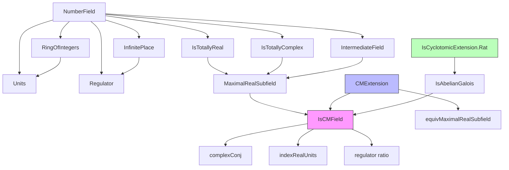

**Technical Brief: CM-Extension of Number Fields (Lean 4 Formalization)**  
*Based on `CMField.lean` (X. Roblot, 2025)*

---

### 1. KEY DEFINITIONS & THEOREMS

| Name | Type / Signature | Purpose |
|------|------------------|---------|
| `NumberField.IsCMField` | `class IsCMField (K : Type*) [Field K] [CharZero K] : Prop` | Predicate stating that a field `K` is a *totally complex quadratic extension* of its *maximal real subfield* `K⁺`. |
| `NumberField.CMExtension.equivMaximalRealSubfield` | `F ≃+* maximalRealSubfield K` | Isomorphism between any base field `F` in a CM-extension `K/F` and the maximal real subfield `K⁺`. |
| `NumberField.IsCMField.complexConj` | `K ≃ₐ[K⁺] K` | Complex conjugation automorphism over `K⁺`. |
| `NumberField.IsCMField.complexConj_eq_self_iff` | `complexConj K x = x ↔ x ∈ K⁺` | Characterization of elements fixed by conjugation: precisely those in `K⁺`. |
| `NumberField.IsCMField.indexRealUnits_eq_one_or_two` | `indexRealUnits K = 1 ∨ 2` | Index of subgroup generated by real units and roots of unity in `(𝓞 K)ˣ` is 1 or 2. |
| `NumberField.IsCMField.regulator_div_regulator_eq_two_pow_mul_indexRealUnits_inv` | `regulator K / regulator K⁺ = 2^rank K * (indexRealUnits K)⁻¹` | Relation between regulators of `K` and `K⁺`. |
| `NumberField.IsCMField.ofCMExtension` | `IsCMField K` | If `K/F` is a CM-extension, then `K` is a CM-field. |
| `NumberField.IsCMField.of_isAbelianGalois` | `IsCMField K` | A totally complex abelian extension of `ℚ` is CM. |
| `NumberField.IsCyclotomicExtension.Rat.isCMField` | `IsCMField K` | A nontrivial abelian (cyclotomic) extension of `ℚ` is CM. |

---

### 2. NAMING CONVENTIONS

- **Prefixes**:
  - `is_`: predicate classes (`isTotallyComplex`, `isQuadraticExtension`, `isCMField`)
  - `complexConj_`: conjugation-related functions/properties (`complexConj`, `complexConj_eq_self_iff`, `complexEmbedding_complexConj`)
  - `real_`: real subfield/unit related (`realUnits`, `realFundSystem`)
  - `units_`: unit-group constructions (`unitsComplexConj`, `unitsMulComplexConjInv`)
  - `indexRealUnits`: index of subgroup generated by real units and torsion.

- **Suffixes**:
  - `_eq_self_iff`: iff-characterizations of fixed points.
  - `_eq_two`: characterizations yielding value 2 (e.g., `orderOf_complexConj_eq_two`).
  - `_inv`: inverses in unit group context.
  - `_sup_torsion`: joins with torsion subgroup.

- **Notation**:
  - `K⁺`: `maximalRealSubfield K`
  - `𝓞 K`: ring of integers of `K`
  - `torsion K`: torsion subgroup of `(𝓞 K)ˣ`
  - `realUnits K`: subgroup generated by units of `K⁺`

---

### 3. TACTIC STACK

Frequently used tactics in proofs:

| Tactic | Usage |
|--------|-------|
| `aesop` | Automated reasoning for algebraic structure (e.g., `IntermediateField`, `Subgroup`, `RingHom`) |
| `simp_rw` / `simp` | Rewriting with lemmas about `algebraMap`, `complexConj`, `units`, `regulator` |
| `rw [← ...]` | Rewriting using equivalences, especially `equivMaximalRealSubfield`, `ringOfIntegers.ext_iff` |
| `ext` | Extensionality for ring/field homomorphisms, subgroups, functions |
| `convert` + `congr_arg` | Proving equalities up to definitional equality (e.g., regulators, determinants) |
| `obtain ⟨x, hx⟩` / `have h : ...` | Case analysis, existence lemmas (e.g., `exists_isConj`) |
| `exact` / `apply` | Direct proof steps, especially for `IsCMField` class instances |
| `ring` / `linarith` | Polynomial identities, positivity arguments (e.g., regulator positivity) |
| `rw [MonoidHom.mem_ker, Subtype.ext_iff]` | Working with kernels, unit groups, torsion |

---

### 4. PROOF LOGIC

**General proof strategy**:

1. **Structure setup**:
   - Assume `K` is a number field, `K⁺ = maximalRealSubfield K`.
   - Use `IsCMField` to assume `K` is totally complex and quadratic over `K⁺`.

2. **Conjugation analysis**:
   - Prove existence of conjugation via ramification (`exists_isConj_of_isRamified`).
   - Show uniqueness of conjugation in quadratic extensions (`isConj_eq_isConj`).
   - Define `complexConj` and prove it has order 2, generates Galois group.

3. **Fixed field & units**:
   - Use `complexConj_eq_self_iff` to identify `K⁺` as fixed field.
   - Lift to ring of integers and units: `RingOfIntegers.complexConj_eq_self_iff`, `Units.complexConj_eq_self_iff`.

4. **Unit group decomposition**:
   - Define `unitsMulComplexConjInv : (𝓞 K)ˣ →* torsion K`, `u ↦ u * conj(u)⁻¹`.
   - Show `ker = realUnits`, `range.index ∣ 2`, and relate to `indexRealUnits`.
   - Compute regulator ratio via `regOfFamily_realFunSystem` and `regulator_div_regulator_eq_two_pow_mul_indexRealUnits_inv`.

5. **General CM-extension case**:
   - For `K/F` CM, show `F ≅ K⁺` via `equivMaximalRealSubfield`.
   - Deduce CM-field properties for `K` using this isomorphism (`ofCMExtension`).

6. **Abelian/cyclotomic cases**:
   - Use Galois-theoretic properties: existence of a single conjugation (`of_forall_isConj`).
   - For abelian extensions, use that all embeddings share same conjugation.
   - For cyclotomic extensions, reduce to abelian case.

---

### 5. IMPORTS

| Module | Purpose |
|--------|---------|
| `Mathlib.FieldTheory.Galois.Abelian` | Abelian Galois theory, automorphism groups |
| `Mathlib.FieldTheory.Galois.IsGaloisGroup` | Galois correspondence, fixed fields |
| `Mathlib.NumberTheory.NumberField.InfinitePlace.TotallyRealComplex` | Infinite places, totally real/complex fields |
| `Mathlib.NumberTheory.NumberField.Cyclotomic.Embeddings` | Cyclotomic extensions, embeddings |
| `Mathlib.NumberTheory.NumberField.Units.Regulator` | Dirichlet unit theorem, regulator |

---

### 6. DEPENDENCY & OVERVIEW DIAGRAM

#### **Dependency Graph (simplified)**



#### **Overview of `CMField.lean`**

```mermaid
flowchart LR
  subgraph Definitions
    D1[IsCMField K]
    D2[CMExtension K/F]
    D3[equivMaximalRealSubfield]
    D4[complexConj]
    D5[realUnits]
    D6[indexRealUnits]
  end

  subgraph Main Theorems
    T1[complexConj_eq_self_iff]
    T2[indexRealUnits_eq_one_or_two]
    T3[regulator_div_regulator_eq_two_pow_mul_indexRealUnits_inv]
    T4[ofCMExtension]
    T5[of_isAbelianGalois]
    T6[isCMField (cyclotomic)]
  end

  D1 --> T1
  D5 --> T2
  D1 --> T3
  D2 --> D3
  D2 --> T4
  D3 --> T4
  D3 --> T5
  D3 --> T6

  style D1 fill:#f9f,stroke:#333
  style D2 fill:#bbf,stroke:#333
  style T1 fill:#cfc,stroke:#333
  style T6 fill:#cfc,stroke:#333
```

---

### 7. SUMMARY

This formalization develops the theory of **CM-extensions** and **CM-fields** in Lean 4, with a focus on:

- Structural properties (quadratic, totally complex/real),
- Conjugation automorphism and its fixed field,
- Unit group decomposition (real units, torsion, index),
- Regulator relations,
- Applications to abelian and cyclotomic extensions.

The design distinguishes between the *relative* case (`K/F`) and the *absolute* case (`K/K⁺`), connected via `equivMaximalRealSubfield`. Most results live in `NumberField.IsCMField`, while general CM-extensions use `NumberField.CMExtension`. The formalization is highly structured, leveraging existing libraries for Galois theory, algebraic number theory, and Dirichlet’s unit theorem.

--- 

Let me know if you'd like a **proof sketch of a specific theorem** (e.g., `regulator_div_regulator_eq_two_pow_mul_indexRealUnits_inv`) or a **dependency analysis** for a particular namespace.
