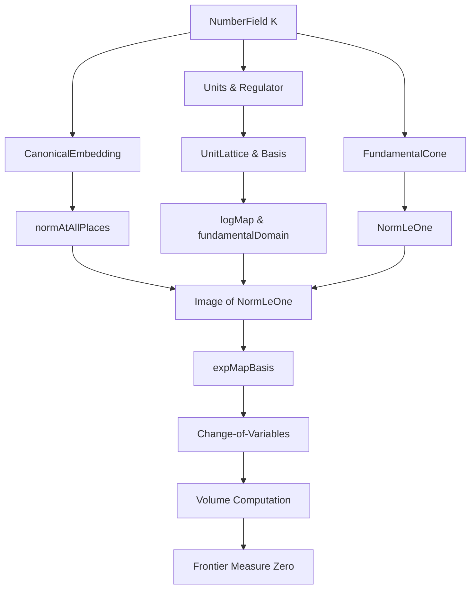
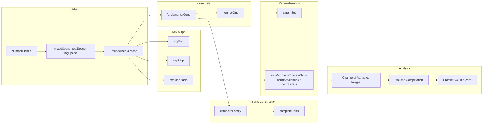

Here is the **technical metadata** extracted from `NormLeOne.lean`, formatted as requested:

---

### 1. KEY DEFINITIONS & THEOREMS

| Name | Type / Signature | Purpose |
|------|------------------|---------|
| `normLeOne K` | `Set (mixedSpace K)` | Subset of the fundamental cone where `mixedEmbedding.norm x ≤ 1`. |
| `normAtAllPlaces` | `mixedSpace K → realSpace K` | Maps an element to its vector of absolute values at all infinite places. |
| `fundamentalCone K` | `Set (mixedSpace K)` | Preimage under `logMap` of the fundamental domain of `unitLattice K`, excluding zero-norm elements. |
| `expMap_single w` | `OpenPartialHomeomorph ℝ ℝ` | Local exponential map at place `w`, used to invert `logMap`. |
| `expMap` | `OpenPartialHomeomorph (realSpace K) (realSpace K)` | Global exponential map, right-inverse to `logMap`. |
| `completeFamily K` | `InfinitePlace K → realSpace K` | Family combining images of fundamental units and `mult` vector. |
| `completeBasis K` | `Basis (InfinitePlace K) ℝ (realSpace K)` | Basis of `realSpace K` adapted to unit lattice and norm condition. |
| `expMapBasis K` | `OpenPartialHomeomorph (realSpace K) (realSpace K)` | Key change-of-variables map: $x \mapsto \exp(x_{w_0}) \cdot \prod_{i \ne w_0} |\eta_i|^{x_i}$. |
| `paramSet K` | `Set (realSpace K)` | Parameter domain for `normAtAllPlaces '' (normLeOne K)`, defined as product of intervals. |
| `logMap_expMapBasis` | `logMap (mixedSpaceOfRealSpace (expMapBasis x)) ∈ … ↔ ∀ w ≠ w₀, x w ∈ [0,1)` | Characterizes when `expMapBasis x` lies in the fundamental domain. |
| `normAtAllPlaces_normLeOne_eq_image` | `normAtAllPlaces '' (normLeOne K) = expMapBasis '' (paramSet K)` | Crucial equality linking geometric object to parameter domain. |
| `setLIntegral_expMapBasis_image` | Change-of-variables formula for `expMapBasis` | Enables volume computation via integration. |
| `volume_normLeOne` | `volume (normLeOne K) = …` | Final volume formula (not shown in excerpt but referenced). |
| `volume_frontier_normLeOne` | `volume (frontier (normLeOne K)) = 0` | Frontier has measure zero. |
| `isBounded_normLeOne` | `IsBounded (normLeOne K)` | Boundedness of the set. |

---

### 2. NAMING CONVENTIONS

- **Prefixes**:
  - `normLeOne`, `normAtAllPlaces`, `fundamentalCone`: denote core sets.
  - `expMap`, `expMapBasis`, `expMap_single`: exponential-related maps.
  - `completeFamily`, `completeBasis`: basis constructions.
  - `paramSet`: parameterizing set.

- **Suffixes**:
  - `_apply`, `_apply'`, `_apply''`: variants of function application lemmas.
  - `_source`, `_target`: properties of partial homeomorphisms.
  - `_of_eq`, `_of_ne`: case analysis on `w = w₀` or not.
  - `_image`, `_preimage`: image/preimage lemmas.
  - `_ae`, `_interior`, `_closure`: measure-theoretic or topological variants.

- **Functional style**:
  - `mem_`, `set_`, `has_`, `linearIndependent_`, `measurableSet_`, `continuous_`, `injective_`, `surjective_`, `abs_det_`, `hasFDerivAt_`.

---

### 3. TACTIC STACK

Frequently used tactics in this file:

| Tactic | Usage |
|--------|-------|
| `simp_rw` | Rewriting with simplification (especially for `pi`, `prod`, `sum`, `smul`, `normAtPlace`, etc.). |
| `aesop` | Automated reasoning for simple goals (e.g., positivity, membership). |
| `rw` | Rewriting using lemmas (especially `expMap_apply`, `logMap`, `completeBasis_apply`, etc.). |
| `ext` | Extensionality for functions/vectors. |
| `congr` | Congruence reasoning (e.g., for products/sums). |
| `change`, `convert`, `refine` | Goal restructuring and partial proof construction. |
| `have`, `set`, `obtain`, `rintro`, `intro` | Proof structure and hypothesis management. |
| `field_simp`, `ring`, `linarith` | Arithmetic simplifications (especially for `mult`, `rank`, `regulator`). |
| ` positivity`, `nonneg` | Positivity proofs. |
| ` measurable_set`, ` measurableSpace`-related tactics | For measurability of sets/maps. |
| ` continuity` | Continuity proofs (e.g., for `expMap`, `expMapBasis`). |
| ` exact`, ` assumption` | Direct proof completion. |

---

### 4. PROOF LOGIC

The logical flow follows a **geometric decomposition strategy**, typical in Dirichlet unit theorem refinements:

1. **Reduction via norm-stability**:
   - Use `normLeOne_eq_preimage_image` to reduce to analyzing `normAtAllPlaces '' (normLeOne K)`.

2. **Explicit description**:
   - `normAtAllPlaces_normLeOne` identifies the image as a region cut out by:
     - Nonnegativity (`∀ w, 0 ≤ x w`)
     - Norm bound (`≤ 1`)
     - Logarithmic condition (`logMap x ∈ fundamentalDomain`)

3. **Change of variables**:
   - Introduce `expMapBasis`, a diffeomorphism, to parametrize the region via `paramSet`.

4. **Volume computation**:
   - Apply `setLIntegral_expMapBasis_image` (change-of-variables) to compute volume of `normLeOne K`.

5. **Frontier analysis**:
   - Show `interior ⊆ normLeOne ⊆ closure`, and prove equality of volumes via:
     - `subset_interior_normLeOne` (open image under `expMapBasis`)
     - `closure_normLeOne_subset` (compact over-approximation)
     - `closure_paramSet_ae_interior` (measure-theoretic equivalence of closure and interior of `paramSet`)

6. **Inductive/structural arguments**:
   - Linear independence of `completeFamily` via `realSpaceToLogSpace`.
   - Determinant computation via `abs_det_completeBasis_equivFunL_symm`.

---

### 5. IMPORTS

| Module | Purpose |
|--------|---------|
| `Mathlib.NumberTheory.NumberField.CanonicalEmbedding.FundamentalCone` | Defines `fundamentalCone`, `logMap`, `unitLattice`, `basisUnitLattice`. |
| `Mathlib.NumberTheory.NumberField.CanonicalEmbedding.PolarCoord` | Provides tools for polar coordinates in `mixedSpace`, e.g., `normAtAllPlaces`, `mixedSpaceOfRealSpace`. |
| `Mathlib.NumberTheory.NumberField.Units.Regulator` | Defines regulator, `fundSystem`, `logEmbedding`, `dirichletUnitTheorem` machinery. |

---

### 6. MERMAID DIAGRAMS

#### Dependency Graph (High-Level)

#### Overview of File Structure

--- 

Let me know if you'd like the full `volume_normLeOne` theorem or the `regulator` formula extracted.
