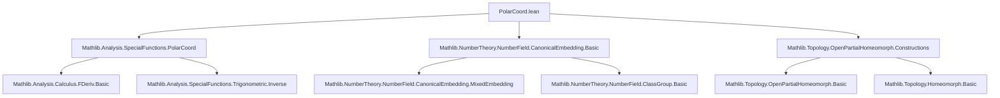

### Technical Brief: Polar Coordinate Change of Variables for Mixed Space of a Number Field

---

#### **1. Key Definitions & Theorems**

| Name | Type / Signature | Purpose |
|------|------------------|---------|
| `realMixedSpace K` | `({w // IsReal w} → ℝ) × ({w // IsComplex w} → ℝ × ℝ)` | Realification of the mixed space: replaces each complex embedding with two real coordinates. |
| `mixedSpaceToRealMixedSpace K` | `mixedSpace K ≃ₜ realMixedSpace K` | Natural homeomorphism between complex mixed space and its realified version. |
| `polarCoordReal K` | `OpenPartialHomeomorph (realMixedSpace K) (realMixedSpace K)` | Polar coordinate change on the realified space: identity on real part, `(r cos θ, r sin θ) ↦ (r, θ)` on complex part. |
| `polarCoord K` | `OpenPartialHomeomorph (mixedSpace K) (realMixedSpace K)` | Polar coordinate change on the original mixed space: identity on real embeddings, `(z ↦ (‖z‖, Arg z))` on complex embeddings. |
| `polarSpace K` | `((InfinitePlace K) → ℝ) × ({w // IsComplex w} → ℝ)` | Target space for full polar coordinates: real norms for all places, arguments only for complex places. |
| `homeoRealMixedSpacePolarSpace K` | `realMixedSpace K ≃ₜ polarSpace K` | Homeomorphism (and measurable equivalence) between realified space and polar space. |
| `polarSpaceCoord K` | `OpenPartialHomeomorph (mixedSpace K) (polarSpace K)` | Full polar coordinate map: sends `x` to `(w ↦ ‖x w‖)` for complex `w`, `(w ↦ x w)` for real `w`, and `(w ↦ Arg(x w))` for complex `w`. |
| `integral_comp_polarCoord_symm` | `∫ x in target, (∏_{w complex} r_w) • f(symm x) = ∫ x, f x` | Change-of-variables formula for `polarCoord`, with Jacobian determinant `∏ r_w`. |
| `integral_comp_polarSpaceCoord_symm` | `∫ x in target, (∏_{w complex} |x_w|) • f(symm x) = ∫ x, f x` | Change-of-variables formula for `polarSpaceCoord`, with Jacobian `∏ |x_w|`. |
| `volume_eq_two_pi_pow_mul_integral` | `volume A = (2π)^r₂ ∫_{N(A)} ∏ r_w` | Volume of norm-stable-at-complex sets computed via integral over image under `normAtComplexPlaces`. |
| `volume_eq_two_pow_mul_two_pi_pow_mul_integral` | `volume A = 2^{r₁} (2π)^{r₂} ∫_{N(A)} ∏ r_w` | Volume of fully norm-stable sets computed via integral over image under `normAtAllPlaces`. |

---

#### **2. Naming Conventions**

- **Prefixes**:
  - `polarCoord*`: polar coordinate maps (partial homeomorphisms).
  - `polarSpaceCoord*`: full polar coordinate maps into `polarSpace`.
  - `normAt*`: functions returning norms at specific places.
  - `mixedSpace*`, `realMixedSpace*`, `polarSpace*`: space definitions.
  - `homeo*`, `measurableEquiv*`: structural equivalences.

- **Suffixes**:
  - `*Real`: realified version (e.g., `polarCoordReal`).
  - `*Symm`: inverse maps (e.g., `polarCoord_symm_eq`).
  - `*Target`, `*Source`: domain/target properties.
  - `*Ae_eq_univ`: almost-everywhere surjectivity.

- **Functional style**:
  - `integral_comp_*_symm`: change-of-variables for composition with inverse.
  - `lintegral_*`: nonnegative extended-real-valued integrals.

---

#### **3. Tactic Stack**

| Tactic | Usage Frequency | Purpose |
|--------|-----------------|---------|
| `simp_rw` | Very High | Rewriting with definitional equalities (e.g., `polarCoord_symm_apply`, `normAtPlace_apply_*`). |
| `rw` | High | Applying lemmas like `integral_comp_polarCoord_symm`, `volume_preserving_*`. |
| `exact`, `refine`, `congr_arg` | High | Constructing proofs step-by-step, especially for integrals and measures. |
| `fun_prop`, `measurable_*` | Medium | Proving measurability and continuity (e.g., `measurable_polarCoord_symm`). |
| `split_ifs`, `cases` | Medium | Handling `if`-expressions in definitions like `homeoRealMixedSpacePolarSpace_apply`. |
| `ext`, `funext` | Medium | Extensionality for functions and sets. |
| `aesop` | Low | Not used in this file. |
| `ring`, `linarith` | Low | Used implicitly via `ENNReal` arithmetic simplifications. |

---

#### **4. Proof Logic**

- **Structure**:
  - **Step 1**: Define realified space and establish homeomorphism with mixed space.
  - **Step 2**: Define `polarCoordReal` and prove its derivative, determinant, and change-of-variables formula.
  - **Step 3**: Lift results to mixed space via `polarCoord = mixedSpaceToRealMixedSpace⁻¹ ∘ polarCoordReal`.
  - **Step 4**: Define measurable equivalence `realMixedSpace ↔ polarSpace`, then compose to get `polarSpaceCoord`.
  - **Step 5**: Prove change-of-variables for `polarSpaceCoord` using transitivity of `OpenPartialHomeomorph`.
  - **Step 6**: Use symmetry assumptions (`norm-stability`) to reduce volume computation to integrals over norm images.
  - **Step 7**: For full norm-stability, decompose via `plusPart A` and relate to complex-norm stability.

- **Common Proof Patterns**:
  - **Induction-free**: All arguments are measure-theoretic and rely on change-of-variables.
  - **Case analysis on `IsReal` / `IsComplex`** for place-wise properties.
  - **Almost-everywhere arguments** (e.g., `ae_eq_univ`) to ignore measure-zero boundaries.
  - **Product measure manipulations** using `volume_eq_prod`, `volume_pi`, `setLIntegral_prod`.

---

#### **5. Imports & Dependencies**

| Module | Role |
|--------|------|
| `Mathlib.Analysis.SpecialFunctions.PolarCoord` | Core polar coordinate definitions and calculus (`polarCoord`, `polarCoord_symm`, `hasFDerivAt_polarCoord_symm`, etc.). |
| `Mathlib.NumberTheory.NumberField.CanonicalEmbedding.Basic` | Definitions of `mixedSpace`, `realSpace`, `normAtPlace`, `normAtComplexPlaces`, `normAtAllPlaces`, `nrRealPlaces`, `nrComplexPlaces`. |
| `Mathlib.Topology.OpenPartialHomeomorph.Constructions` | Tools for constructing and manipulating `OpenPartialHomeomorph`, including `transHomeomorph`, `prod`, `pi`, etc. |
| `Mathlib.MeasureTheory.Measure.Volume` | Haar measure properties, volume preservation, change-of-variables. |
| `Mathlib.Analysis.Calculus.ParametricIntegral` | Used for `integral_image_eq_integral_abs_det_fderiv_smul`. |
| `Mathlib.Topology.PiOrder` | For product topology and measurability of `pi`-functions. |

---

#### **6. Mermaid Diagrams**

##### **Dependency Graph (Module-Level)**



##### **Overview of Theory Flow**

```mermaid
flowchart LR
  subgraph SpaceDefs
    M[mixedSpace K = ℝ^r₁ × ℂ^r₂]
    R[realMixedSpace K = ℝ^r₁ × (ℝ×ℝ)^r₂]
    P[polarSpace K = ℝ^{r₁+r₂} × ℝ^r₂]
  end

  subgraph Equivalences
    H1[M ↔ₜ R]  %% mixedSpace ↔ realMixedSpace
    H2[R ↔ₜ P]  %% realMixedSpace ↔ polarSpace
    H3[M ↔ₜ P]  %% via composition
  end

  subgraph CoordinateMaps
    PC[polarCoord K : M ⇢ R]
    PSC[polarSpaceCoord K : M ⇢ P]
  end

  subgraph ChangeOfVariables
    CV1[integral_comp_polarCoord_symm]
    CV2[integral_comp_polarSpaceCoord_symm]
  end

  subgraph VolumeFormulas
    VF1[volume_eq_two_pi_pow_mul_integral]
    VF2[volume_eq_two_pow_mul_two_pi_pow_mul_integral]
  end

  M --> H1
  R --> H2
  M -->|H1; H2| H3
  PC <-->|symm| CV1
  PSC <-->|symm| CV2
  VF1 <-->|norm-stable at complex| CV1
  VF2 <-->|fully norm-stable| CV2
```

---

#### **7. Summary**

This file formalizes polar coordinate change of variables for the mixed space of a number field, enabling volume computations for sets invariant under complex-unit-circle actions. It builds on:
- Classical analysis (`polarCoord`, Jacobians),
- Number-theoretic structure (`InfinitePlace`, `normAtPlace`),
- Measure-theoretic tools (`volume`, `lintegral`, change-of-variables).

The two main theorems (`volume_eq_two_pi_pow_mul_integral`, `volume_eq_two_pow_mul_two_pi_pow_mul_integral`) are foundational for analytic class number formula proofs and geometry of numbers in number fields.

--- 

Let me know if you'd like a formalized dependency graph (e.g., in `.lean` format) or a visualization of the `OpenPartialHomeomorph` composition chain.
