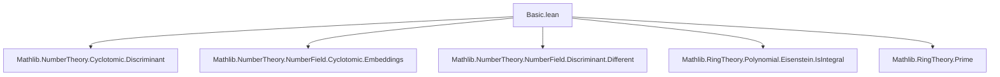

Here is the **technical metadata** extracted from the provided Lean 4 file `Basic.lean`, focusing on definitions, theorems, naming conventions, proof logic, imports, and theory structure.

---

### **1. Key Definitions & Theorems**

| Name | Type / Purpose |
|------|----------------|
| `IsCyclotomicExtension.Rat.isIntegralClosure_adjoin_singleton` | Theorem: If $ K/\mathbb{Q} $ is a cyclotomic extension of degree $ n $, then $ \mathbb{Z}[\zeta] $ is the integral closure of $ \mathbb{Z} $ in $ K $, where $ \zeta $ is a primitive $ n $-th root of unity. |
| `IsCyclotomicExtension.Rat.cyclotomicRing_isIntegralClosure` | Theorem: The integral closure of $ \mathbb{Z} $ in $ \mathbb{Q}(\zeta_n) $ is $ \mathbb{Z}[\zeta_n] = \texttt{CyclotomicRing}\ n\ \mathbb{Z}\ \mathbb{Q} $. |
| `IsCyclotomicExtension.Rat.discr_prime_pow'`, `discr_odd_prime'`, `discr_prime_pow_ne_two'` | Theorems computing the discriminant of the power basis $ \{1, \zeta - 1, (\zeta - 1)^2, \dots\} $ in terms of $ p, k $, using $ \zeta $ a primitive $ p^k $-th root of unity. |
| `IsCyclotomicExtension.Rat.discr_prime_pow_eq_unit_mul_pow'` | Theorem: The discriminant is of the form $ u \cdot p^n $ with $ u \in \mathbb{Z}^\times $. |
| `IsPrimitiveRoot.adjoinEquivRingOfIntegersOfPrimePow` | Definition: Algebra isomorphism $ \mathbb{Z}[\zeta] \xrightarrow{\sim} \mathcal{O}_K $, where $ K $ is a $ p^k $-th cyclotomic extension. |
| `IsPrimitiveRoot.integralPowerBasisOfPrimePow` | Definition: An integral power basis of $ \mathcal{O}_K $ over $ \mathbb{Z} $, generated by $ \zeta $. |
| `IsPrimitiveRoot.subOneIntegralPowerBasisOfPrimePow` | Definition: Integral power basis generated by $ \zeta - 1 $. |
| `IsPrimitiveRoot.zeta_sub_one_prime`, `zeta_sub_one_prime'` | Theorems: $ \zeta - 1 $ is a prime element in $ \mathcal{O}_K $, for $ \zeta $ a primitive $ p^k $-th or $ p $-th root of unity. |
| `IsPrimitiveRoot.norm_toInteger_sub_one_of_prime_ne_two`, `norm_toInteger_sub_one_of_eq_two`, etc. | Theorems: Explicit computation of $ N_{\mathcal{O}_K/\mathbb{Z}}(\zeta - 1) $, e.g., $ p $ if $ p \ne 2 $, $ -2 $ if $ p = 2 $, etc. |
| `IsPrimitiveRoot.not_exists_int_prime_dvd_sub_of_prime_ne_two` | Theorem: $ \zeta \not\equiv n \mod p $ for any $ n \in \mathbb{Z} $, i.e., $ \zeta $ is not congruent to an integer modulo $ p $. |
| `IsPrimitiveRoot.toInteger_sub_one_dvd_prime` | Theorem: $ \zeta - 1 \mid p $ in $ \mathcal{O}_K $. |
| `IsPrimitiveRoot.prime_dvd_of_dvd_norm_sub_one` | Theorem: If a prime $ p $ divides $ N(\zeta - 1) $, then $ p \mid n $, where $ \zeta $ is a primitive $ n $-th root of unity. |

---

### **2. Naming Conventions**

- **Prefixes**:
  - `isIntegralClosure_`: For results about integral closures.
  - `discr_`: Discriminant-related results.
  - `norm_`: Norm computations.
  - `zeta_sub_one_`: Properties of $ \zeta - 1 $.
  - `toInteger_`: Embedding of roots of unity into ring of integers.
  - `integralPowerBasis_`: Integral power bases.
  - `finite_quotient_`: Finiteness of quotient rings.

- **Suffixes**:
  - `_of_prime`, `_of_prime_pow`: Specialized to prime or prime-power order.
  - `_ne_two`, `_eq_two`: Cases distinction for $ p = 2 $.
  - `_sub_one`: Refers to $ \zeta - 1 $.
  - `_prime`: Indicates primality or prime-related behavior.

- **General patterns**:
  - `hζ : IsPrimitiveRoot ζ n` is a common hypothesis.
  - `hcycl : IsCyclotomicExtension {n} ℚ K` often appears as context.
  - `hodd : p ≠ 2`, `htwo : p^k ≠ 2` used to split cases.

---

### **3. Tactic Stack**

Frequently used tactics in proofs:

| Tactic | Role |
|--------|------|
| `rw` | Rewriting using equalities, especially discriminant/norm identities. |
| `simp` / `simp only` | Simplifying goals using lemmas like `norm_toInteger_sub_one_of_prime_ne_two`. |
| `exact`, `refine`, `obtain` | Constructing proofs and extracting witnesses. |
| `convert` | Matching goals up to definitional equality. |
| `cases` | Case analysis on natural numbers (e.g., $ k = 0 $) or hypotheses. |
| `have`, `suffices` | Introducing intermediate claims. |
| `apply`, `exact` | Applying lemmas or hypotheses. |
| `ring`, `linarith`, `lia` | Arithmetic reasoning. |
| `ext` | Extensionality for subtype equality (e.g., ring of integers elements). |
| `rwa`, `rw [...] at` | Rewriting in hypotheses. |
| `set_option linter.unusedVariables false` | Used to suppress warnings for named arguments like `hcycl`. |

---

### **4. Proof Logic**

- **Induction & case analysis**:
  - Many proofs split on whether $ p = 2 $ or $ p \ne 2 $, or whether $ k = 0 $.
  - Induction on $ k $ is implicit in prime-power results.

- **Structure of main proofs**:
  - Use of `IsCyclotomicExtension` infrastructure (e.g., `finrank`, `isIntegral`, `subOnePowerBasis`).
  - Discriminant computations often reduce to known lemmas (`discr_prime_pow`, `discr_odd_prime`) via `hζ.discr_zeta_eq_discr_zeta_sub_one`.
  - Primality of $ \zeta - 1 $ is shown via norm irreducibility: `Ideal.prime_of_irreducible_absNorm_span`.
  - Integral closure proofs use `adjoin_le_integralClosure` and `discr_mul_isIntegral_mem_adjoin`.
  - Power basis constructions use `PowerBasis.ofAdjoinEqTop'` or `adjoin.powerBasis'`.

- **Key logical flow**:
  1. Assume $ K $ is a cyclotomic extension of $ \mathbb{Q} $, $ \zeta $ primitive $ n $-th root.
  2. Show $ \zeta $ is integral over $ \mathbb{Z} $.
  3. Compute discriminant of $ \mathbb{Z}[\zeta] $ or $ \mathbb{Z}[\zeta - 1] $.
  4. Use discriminant to prove integrality closure or primality.
  5. Conclude structural results (e.g., ring of integers = $ \mathbb{Z}[\zeta] $).

---

### **5. Imports**

| Module | Purpose |
|--------|---------|
| `Mathlib.NumberTheory.Cyclotomic.Discriminant` | Discriminant formulas for cyclotomic polynomials. |
| `Mathlib.NumberTheory.NumberField.Cyclotomic.Embeddings` | Embeddings of cyclotomic fields. |
| `Mathlib.NumberTheory.NumberField.Discriminant.Different` | Discriminant and different ideals. |
| `Mathlib.RingTheory.Polynomial.Eisenstein.IsIntegral` | Eisenstein criterion and integrality. |
| `Mathlib.RingTheory.Prime` | Prime elements and ideals. |

---

### **6. Theory Overview & Dependencies**

#### **Mermaid Diagrams**

##### **Dependency Graph (Module Level)**



##### **Conceptual Overview**

```mermaid
graph LR
  subgraph Theory
    A[Cyclotomic Extensions] --> B[Discriminant Computations]
    A --> C[Integrality & Ring of Integers]
    A --> D[Power Bases]
    A --> E[Prime Elements ζ−1]
    C --> F[Integral Closure = ℤ[ζ]]
    D --> G[Integral Power Basis]
    E --> H[ζ−1 is Prime]
    E --> I[Norm(ζ−1) = p or −2]
  end
```

##### **Key Theory Path**

- Start with $ \mathbb{Q} \subseteq K $, $ K = \mathbb{Q}(\zeta_n) $.
- Use `IsCyclotomicExtension` to encode $ K $ as a cyclotomic extension.
- Prove $ \zeta $ is integral over $ \mathbb{Z} $.
- Compute discriminant of $ \mathbb{Z}[\zeta] $ or $ \mathbb{Z}[\zeta - 1] $.
- Use discriminant to show $ \mathcal{O}_K = \mathbb{Z}[\zeta] $.
- Study arithmetic of $ \zeta - 1 $: primality, norm, divisibility.
- Derive consequences: finiteness of $ \mathcal{O}_K / (\zeta - 1) $, congruence properties.

---

Let me know if you'd like a **dependency graph of definitions** (e.g., `adjoinEquivRingOfIntegersOfPrimePow` → `integralPowerBasisOfPrimePow`) or a **proof dependency DAG**.
