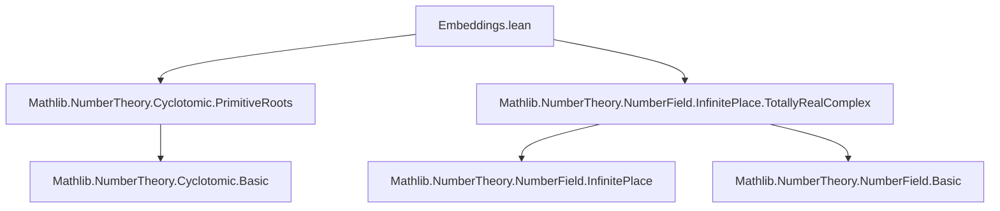

**Technical Brief: `Embeddings.lean` — Cyclotomic Extensions of ℚ are Totally Complex**

---

### 1. **Key Definitions & Theorems**

| Name | Type / Signature | Purpose |
|------|------------------|---------|
| `nrRealPlaces_eq_zero` | `∀ {n : ℕ} [NeZero n] {K : Type u} [Field K] [CharZero K], IsCyclotomicExtension {n} ℚ K → 2 < n → nrRealPlaces K = 0` | Proves that if $ K/\mathbb{Q} $ is an $ n $-th cyclotomic extension with $ n > 2 $, then $ K $ has **no real places**. |
| `isTotallyComplex` | `∀ {n : ℕ} [NeZero n] {K : Type u} [Field K] [CharZero K], IsCyclotomicExtension {n} ℚ K → 2 < n → IsTotallyComplex K` | Derives total complexity of $ K $ (i.e., all embeddings into ℂ are non-real) from `nrRealPlaces_eq_zero`. |
| `nrComplexPlaces_eq_totient_div_two` | `∀ {n : ℕ} [NeZero n] {K : Type u} [Field K] [CharZero K], IsCyclotomicExtension {n} ℚ K → nrComplexPlaces K = φ n / 2` | Computes the number of complex places of $ K $ as $ \varphi(n)/2 $, handling small $ n = 1,2 $ via $ \varphi(1)=\varphi(2)=1 $ and $ 1/2 = 0 $ in `ℕ`. |

**Auxiliary facts used:**
- `IsCyclotomicExtension.zeta_spec n ℚ K`.`nrRealPlaces_eq_zero_of_two_lt hn`: core lemma from the cyclotomic extension spec.
- `IsCyclotomicExtension.finrank K (cyclotomic.irreducible_rat _) = φ n`: finite rank of cyclotomic field over ℚ.
- `totient_even hn`: for $ n > 2 $, $ \varphi(n) $ is even.
- `card_add_two_mul_card_eq_rank K`: relation $ \# \text{real places} + 2 \cdot \# \text{complex places} = \text{rank}_\mathbb{Q} K $.

---

### 2. **Naming Conventions**

- **Prefixes:**
  - `nrRealPlaces_`, `nrComplexPlaces_`: denote counts of real/complex places.
  - `isTotallyComplex`: predicate-style name for a field property.
- **Suffixes:**
  - `_eq_zero`, `_eq_totient_div_two`: indicate equality to a specific value.
- **Module/namespace:**
  - `IsCyclotomicExtension.Rat`: restricts to extensions of ℚ (rational base field).
- **Variables:**
  - `n`: cyclotomic degree.
  - `K`: extension field.
  - `hn : 2 < n`: key hypothesis distinguishing the nontrivial case.

---

### 3. **Tactic Stack**

| Tactic | Usage |
|--------|-------|
| `haveI := ...` | Introduces typeclass instances (e.g., `numberField`). |
| `apply ...` | Applies lemmas like `nrRealPlaces_eq_zero_of_two_lt`. |
| `by_cases hn : 2 < n` | Splits proof into $ n > 2 $ and $ n \le 2 $ cases. |
| `obtain ⟨k, hk⟩` | Extracts witness for evenness of $ \varphi(n) $. |
| `rw [...]` | Rewrites using lemmas (e.g., `nrRealPlaces_eq_zero`, `finrank`, `totient_even`). |
| `simp [...]` | Simplifies arithmetic expressions (e.g., `two_mul`, `zero_add`). |
| `convert ...` | Unifies goals up to definitional equality (e.g., `totient_two`, `totient_one`). |
| `exact ...` | Finishes with direct application (e.g., `nrComplexPlaces_eq_zero_of_finrank_eq_one`). |

---

### 4. **Proof Logic**

The proofs follow a **case analysis on $ n $**:

- **Main case $ n > 2 $:**
  1. Use `totient_even` to write $ \varphi(n) = 2k $.
  2. Apply the rank formula:  
     $$
     \# \text{real places} + 2 \cdot \# \text{complex places} = \text{finrank}_\mathbb{Q} K = \varphi(n)
     $$
  3. Show $ \# \text{real places} = 0 $ via `zeta_spec`.
  4. Solve for $ \# \text{complex places} = \varphi(n)/2 $.

- **Small $ n $ ($ n = 1,2 $):**
  1. Show $ \varphi(n) = 1 $.
  2. Use `finrank = 1` to deduce $ K = \mathbb{Q} $, hence no complex places.
  3. Conclude $ \# \text{complex places} = 0 = \varphi(n)/2 $ (since $ 1/2 = 0 $ in $ \mathbb{N} $).

The `isTotallyComplex` proof is a direct corollary using `nrRealPlaces_eq_zero_iff`.

---

### 5. **Imports & Dependencies**

| Import | Role |
|--------|------|
| `Mathlib.NumberTheory.Cyclotomic.PrimitiveRoots` | Defines cyclotomic polynomials, primitive roots, and basic properties (`zeta_spec`, `irreducible_rat`, `finrank`). |
| `Mathlib.NumberTheory.NumberField.InfinitePlace.TotallyRealComplex` | Defines `nrRealPlaces`, `nrComplexPlaces`, `IsTotallyComplex`, and key lemmas like `nrRealPlaces_eq_zero_iff`, `card_add_two_mul_card_eq_rank`. |

---

### 6. **Mermaid Diagrams**

#### **Dependency Graph (Module Level)**



#### **Overview of Theory Flow**

```mermaid
flowchart LR
  A[IsCyclotomicExtension {n} ℚ K] -->|hn : 2 < n| B[nrRealPlaces_eq_zero]
  B --> C[IsTotallyComplex K]
  A --> D[nrComplexPlaces_eq_totient_div_two]
  D -->|case split| E[n > 2]
  D -->|case split| F[n ≤ 2]
  E --> G[totient_even + rank formula]
  F --> H[φ(1)=φ(2)=1 + finrank=1]
```

---

### 7. **Summary**

This module formalizes a foundational result in algebraic number theory: **cyclotomic extensions of ℚ of degree $ n > 2 $ are totally complex**, i.e., have no real embeddings. It leverages:
- Structural properties of cyclotomic fields (`finrank = φ(n)`, irreducibility),
- Arithmetic facts about Euler’s totient function (`φ(n)` even for $ n > 2 $),
- The fundamental identity linking place counts to field rank.

The formalization is concise, modular, and uses Lean’s typeclass inference and `simp`-based automation effectively.
