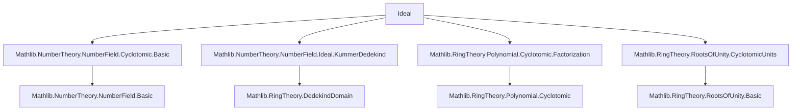

**Technical Brief: `Ideal.lean` — Ideals in Cyclotomic Fields**

---

### **1. Key Definitions & Theorems**

| Name | Type / Signature | Purpose |
|------|------------------|---------|
| `isPrime_span_zeta_sub_one` | `IsPrime (span {ζ - 1})` | Shows the ideal generated by a primitive root minus 1 is prime in the ring of integers of a cyclotomic field. |
| `associated_norm_zeta_sub_one` | `Associated (Algebra.norm ℤ (ζ - 1)) p` | Relates the norm of `ζ - 1` to the rational prime `p`. |
| `absNorm_span_zeta_sub_one` | `absNorm (span {ζ - 1}) = p` | Computes the absolute norm of the prime ideal `(ζ - 1)` as `p`. |
| `p_mem_span_zeta_sub_one` | `(p : 𝓞 K) ∈ span {ζ - 1}` | Shows `p` lies in the ideal `(ζ - 1)`. |
| `liesOver_span_zeta_sub_one` | `(span {ζ - 1}).LiesOver 𝒑` | Verifies that `(ζ - 1)` lies over the rational prime ideal `𝒑 = (p)`. |
| `inertiaDeg_span_zeta_sub_one` | `inertiaDeg 𝒑 (span {ζ - 1}) = 1` | Inertia degree of `(ζ - 1)` over `p` is 1 in the prime-power case. |
| `ramificationIdx_span_zeta_sub_one` | `ramificationIdx 𝒑 (span {ζ - 1}) = p^k * (p - 1)` | Ramification index of `(ζ - 1)` over `p` in `ℚ(ζ_{p^{k+1}})`. |
| `map_eq_span_zeta_sub_one_pow` | `𝒑 𝓞 K = (span {ζ - 1})^[K:ℚ]` | Describes the extension of `𝒑` in terms of the power of the prime ideal `(ζ - 1)`. |
| `ncard_primesOver_of_prime_pow` | `(primesOver 𝒑 (𝓞 K)).ncard = 1` | Uniqueness of the prime ideal above `p` in `ℚ(ζ_{p^{k+1}})`. |
| `eq_span_zeta_sub_one_of_liesOver` | `P = span {ζ - 1}` | All primes over `p` coincide with `(ζ - 1)` in the prime-power case. |
| `inertiaDeg_eq_of_prime_pow`, `ramificationIdx_eq_of_prime_pow` | `inertiaDeg 𝒑 P = 1`, `ramificationIdx 𝒑 P = p^k(p-1)` | Global versions for any prime `P` over `p`. |
| `inertiaDegIn_eq_of_prime_pow`, `ramificationIdxIn_eq_of_prime_pow` | `inertiaDegIn = 1`, `ramificationIdxIn = p^k(p-1)` | Intrinsic (Galois-averaged) invariants. |
| `inertiaDeg_eq_of_not_dvd` | `inertiaDeg 𝒑 P = orderOf (p : ZMod m)` | Inertia degree equals multiplicative order of `p mod m` when `p ∤ m`. |
| `ramificationIdx_eq_of_not_dvd` | `ramificationIdx 𝒑 P = 1` | Unramified case: `p ∤ m ⇒ e = 1`. |
| `inertiaDegIn_eq_of_not_dvd`, `ramificationIdxIn_eq_of_not_dvd` | Same as above, intrinsic. |
| `inertiaDegIn_eq`, `ramificationIdxIn_eq` | `inertiaDegIn = orderOf(p mod m)`, `ramificationIdxIn = p^k(p-1)` | General decomposition for arbitrary `n = p^{k+1} m`, `p ∤ m`. |
| `inertiaDegIn_ramificationIdxIn_aux` | `∧`-conjunction of the above two | Core technical lemma for the general case, via intermediate fields `ℚ(ζₘ)`, `ℚ(ζ_{p^{k+1}})`. |

---

### **2. Naming Conventions**

- **Prefixes**:
  - `isPrime_`: proves primality of an ideal.
  - `absNorm_`, `ramificationIdx_`, `inertiaDeg_`: computes invariants.
  - `eq_span_zeta_sub_one_`: identifies a prime ideal with `(ζ - 1)`.
  - `liesOver_`: verifies lying-over condition.
  - `ncard_primesOver_`: counts primes above a rational prime.
  - `map_`: describes extension of ideals under algebra maps.
  - `mem_`: membership in an ideal.

- **Suffixes**:
  - `_of_prime_pow`: case `n = p^{k+1}`.
  - `_of_prime`: case `n = p`.
  - `_of_not_dvd`: case `p ∤ m`.
  - `_in`: intrinsic invariants (`inertiaDegIn`, `ramificationIdxIn`).
  - `_span_zeta_sub_one`: explicit reference to the generator `(ζ - 1)`.

- **Notation**:
  - `𝒑` := `Ideal.span {(p : ℤ)}` — the rational prime ideal.
  - `ζ`, `ζₘ`, `ζₚ`: primitive roots of unity in various subfields.

---

### **3. Tactic Stack**

| Tactic | Frequency | Role |
|--------|-----------|------|
| `rw` | Very High | Rewriting definitions, lemmas, and equalities (e.g., `inertiaDeg`, `ramificationIdx`, `finrank`). |
| `simp` / `simpa` | High | Simplifying goals using algebraic properties (norms, cyclotomic polynomials, Galois groups). |
| `exact` / `refine` | High | Constructing proofs by applying known lemmas. |
| `aesop` | Medium | Solving simple logical goals (e.g., uniqueness from singleton cardinality). |
| `convert` | Medium | Matching goals up to definitional equality (e.g., `absNorm_mem`). |
| `have`, `suffices` | High | Introducing intermediate claims (especially in `inertiaDegIn_ramificationIdxIn_aux`). |
| `convert` + `span_singleton_eq_span_singleton.mpr` | Medium | Identifying principal ideals via associated elements. |
| `apply` / `exact` + `ne_zero` / `ne_top` | Medium | Verifying non-degeneracy of ideals. |
| `field_simp`, `ring` | Low | Simplifying arithmetic in `ℕ`, `ℤ`, or `ℚ`. |
| `mul_right_inj'`, `Nat.eq_one_of_mul_eq_one_*` | Medium | Cancelling and solving multiplicative equations over `ℕ`. |

---

### **4. Proof Logic**

The proofs follow a **structured decomposition strategy**, leveraging:

1. **Local analysis at `(ζ - 1)`**:
   - Prove primality, compute norm, absolute norm, ramification, inertia.
   - Use properties of primitive roots (`hζ.toInteger`, `hζ.zeta_sub_one_prime`, `hζ.norm_toInteger_sub_one_*`).

2. **Galois-theoretic symmetry**:
   - Use `IsGalois` to relate global invariants (`inertiaDeg`, `ramificationIdx`) to intrinsic ones (`inertiaDegIn`, `ramificationIdxIn`).
   - Apply `ncard_primesOver_mul_ramificationIdxIn_mul_inertiaDegIn` to relate degree factorization to group order.

3. **Intermediate field decomposition** (for general `n = p^{k+1} m`):
   - Construct compositum diagram:
     ```
     ℚ(ζₙ) = ℚ(ζ_{p^{k+1}}, ζₘ)
        /      \
   ℚ(ζ_{p^{k+1}})  ℚ(ζₘ)
        \      /
         ℚ
     ```
   - Use multiplicativity of ramification indices and inertia degrees in towers.
   - Apply known results from the coprime (`p ∤ m`) and prime-power (`n = p^{k+1}`) cases.

4. **Induction / case analysis**:
   - Separate cases `p = 2`, `p ≠ 2`, `k = 0`, etc., using `cases k` or `by_cases`.
   - Use `hp.out.coprime_iff_not_dvd` to switch between divisibility and coprimality.

---

### **5. Imports & Dependencies**

| Module | Role |
|--------|------|
| `Mathlib.NumberTheory.NumberField.Cyclotomic.Basic` | Cyclotomic extensions, primitive roots, basic algebraic number theory. |
| `Mathlib.NumberTheory.NumberField.Ideal.KummerDedekind` | Dedekind domain structure, prime decomposition, ramification/inertia. |
| `Mathlib.RingTheory.Polynomial.Cyclotomic.Factorization` | Factorization of cyclotomic polynomials, connection to minimal polynomials. |
| `Mathlib.RingTheory.RootsOfUnity.CyclotomicUnits` | Units like `ζ - 1`, norms, integrality. |

**Core theories used**:
- Dedekind domains, localization, fractional ideals.
- Galois theory of number fields.
- Cyclotomic polynomials, primitive roots of unity.
- Ramification theory: `inertiaDeg`, `ramificationIdx`, `absNorm`, `multiplicity`.

---

### **6. Mermaid Diagrams**

#### **Dependency Graph (Module-Level)**



#### **Overview of Theoretical Flow**

```mermaid
flowchart LR
  A[Primitive root ζₙ] --> B[Ring of integers 𝓞 K]
  B --> C[Ideal (ζₙ - 1)]
  C --> D[IsPrime?]
  C --> E[absNorm = p?]
  C --> F[LiesOver (p)?]
  D --> G[Unique prime above p in prime-power case]
  E --> H[ramification index = p^k(p-1)]
  F --> I[inertia degree = 1]
  G & H & I --> J[General case via ℚ(ζₘ) ⊗ ℚ(ζ_{p^{k+1}})]
  J --> K[Final formulas for inertia/ramification]
```

#### **Compositum Diagram (General Case)**

```mermaid
flowchart TD
  ℚ(ζₙ) -->|degree φ(m)| ℚ(ζₘ)
  ℚ(ζₙ) -->|degree φ(p^{k+1})| ℚ(ζ_{p^{k+1}})
  ℚ(ζₘ) -->|degree φ(m)| ℚ
  ℚ(ζ_{p^{k+1}}) -->|degree φ(p^{k+1})| ℚ
  ℚ(ζₙ) -->|φ(n) = φ(p^{k+1})φ(m)| ℚ
```

---

### **7. Summary**

This file formalizes the **decomposition of rational primes in cyclotomic fields**, with full control over:
- **Uniqueness** of the prime above `p` in `ℚ(ζ_{p^{k+1}})`,
- **Inertia and ramification indices** in both the *totally ramified* (`p ∣ n`) and *unramified* (`p ∤ n`) cases,
- **General decomposition** via coprime factorization `n = p^{k+1} m`.

It leverages deep interactions between:
- Cyclotomic units (`ζ - 1`),
- Galois groups (`Gal(ℚ(ζₙ)/ℚ) ≅ (ℤ/nℤ)^×`),
- Local algebra (Dedekind domains, multiplicity),
- Modular arithmetic (`orderOf(p mod m)`).

The structure is highly modular, with clear separation of cases and reuse of lemmas across settings.

--- 

*End of Technical Brief.*
