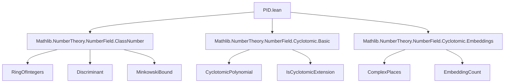
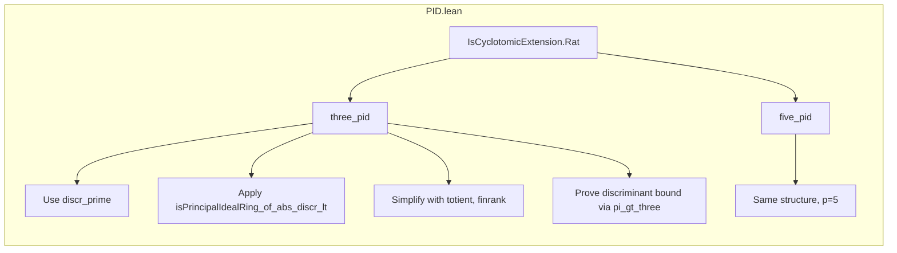

**Technical Brief: PID.lean — Cyclotomic Fields with PID Ring of Integers**

---

### 1. **Key Definitions & Theorems**

| Name | Type / Signature | Purpose |
|------|------------------|---------|
| `IsCyclotomicExtension.Rat.three_pid` | `[IsCyclotomicExtension {3} ℚ K] → IsPrincipalIdealRing (𝓞 K)` | Proves that the ring of integers of a degree-2 extension $K/\mathbb{Q}$ generated by a primitive 3rd root of unity is a PID. |
| `IsCyclotomicExtension.Rat.five_pid` | `[IsCyclotomicExtension {5} ℚ K] → IsPrincipalIdealRing (𝓞 K)` | Proves the same for primitive 5th roots of unity (degree 4 extension). |
| `RingOfIntegers.isPrincipalIdealRing_of_abs_discr_lt` | *(imported lemma)* | A criterion: if the absolute value of the discriminant is strictly less than a certain analytic bound (Minkowski bound), then $\mathcal{O}_K$ is a PID. |
| `discr_prime` | *(imported lemma)* | Computes the discriminant of the cyclotomic field $\mathbb{Q}(\zeta_p)$ for prime $p$: $\pm p^{p-2}$. |
| `totient_prime` | `Nat.totient p = p - 1` for prime $p$ | Used to simplify $\varphi(p) = p-1$. |
| `nrComplexPlaces_eq_totient_div_two` | `nrComplexPlaces K = φ(n)/2` for totally complex extensions | Relates number of complex places to Euler’s totient. |
| `pi_gt_three` | `π > 3` | A real analysis fact used in inequality comparisons. |

---

### 2. **Naming Conventions**

- **Prefixes**:
  - `is_...`: Predicate-style (e.g., `isPrincipalIdealRing`, `IsCyclotomicExtension`).
  - `discr_`, `nr_`, `totient_`, `finrank_`: Standard mathematical notation abbreviations.
- **Suffixes**:
  - `_pid`: Denotes PID-ness of the ring of integers.
  - `_prime`: Indicates application to prime $p$ (e.g., `discr_prime`, `totient_prime`).
- **Module/namespace**:
  - `IsCyclotomicExtension.Rat`: Localized to extensions of $\mathbb{Q}$.

---

### 3. **Tactic Stack**

| Tactic | Usage |
|--------|-------|
| `apply` | To invoke `isPrincipalIdealRing_of_abs_discr_lt`. |
| `rw` | Rewriting discriminant, rank, place count, totient formulas. |
| `simp only [...]` | Heavy simplification using algebraic identities (factorials, powers, casts, signs). |
| `suffices ... from` | To reduce inequality proof to a simpler one. |
| `lt_trans (by norm_num) this` | Chain inequality via numeric normalization. |
| `gcongr` | To prove inequality by comparing components (e.g., $\pi > 3$). |
| `exact` | Final step to supply known facts (`pi_gt_three`). |

---

### 4. **Proof Logic**

- **High-level strategy**:
  1. Use Minkowski bound criterion (`isPrincipalIdealRing_of_abs_discr_lt`) to reduce PID-ness to discriminant inequality.
  2. Compute discriminant via `discr_prime`, simplify using:
     - `finrank`, `nrComplexPlaces_eq_totient_div_two`, `totient_prime`.
     - `simp only` with explicit arithmetic (e.g., `4! = 24`, `2^2 = 4`, etc.).
  3. Reduce inequality to comparing two expressions:
     $$
     \left(2 \cdot \frac{3^{2}}{4^{2}} \cdot \frac{4^{4}}{24}\right)^2 < \left(2 \cdot \frac{\pi^{2}}{4^{2}} \cdot \frac{4^{4}}{24}\right)^2
     $$
     (for $p=5$; similar for $p=3$).
  4. Apply `gcongr` and use `pi_gt_three` to conclude.

- **Induction?** None — purely algebraic + analytic inequality.

---

### 5. **Imports & Dependencies**

| Import | Role |
|--------|------|
| `Mathlib.NumberTheory.NumberField.ClassNumber` | Provides `RingOfIntegers.isPrincipalIdealRing_of_abs_discr_lt`, discriminant & class number tools. |
| `Mathlib.NumberTheory.NumberField.Cyclotomic.Basic` | Defines cyclotomic extensions, roots of unity, basic properties (`IsCyclotomicExtension`, `finrank`, etc.). |
| `Mathlib.NumberTheory.NumberField.Cyclotomic.Embeddings` | Supplies `nrComplexPlaces_eq_totient_div_two`, embeddings count. |

---

### 6. **Mermaid Diagrams**

#### **Dependency Graph (Theories)**

#### **Overview of File Structure**

---

### 7. **Mathematical Context**

- For prime $p$, the ring of integers of $\mathbb{Q}(\zeta_p)$ is $\mathbb{Z}[\zeta_p]$.
- The discriminant of $\mathbb{Q}(\zeta_p)$ is $(-1)^{(p-1)/2} p^{p-2}$.
- Minkowski bound $M_K = \left(\frac{4}{\pi}\right)^{r_2} \frac{n!}{n^n} \sqrt{|\mathrm{disc}(K)|}$.
- For $p = 3, 5$, the bound is small enough that the discriminant inequality holds, implying class number 1 ⇒ PID.

---

### 8. **Notes**

- The proof is *explicit* and *computational* — no abstract class field theory.
- Extends to $p \le 19$ in principle, but complexity grows (e.g., more `simp` lemmas, tighter bounds).
- Relies on `pi_gt_three`, a classical real analysis fact formalized in Mathlib.

--- 

Let me know if you'd like the same analysis for the $p=7$ or $p=11$ cases (if they exist in the codebase).
