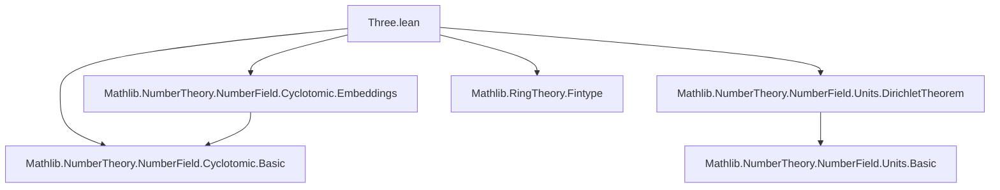

### Technical Brief: `Three.lean` — Third Cyclotomic Field in Lean 4

---

#### **1. Key Definitions & Theorems**

| Name | Type / Signature | Purpose |
|------|------------------|---------|
| `η` | `η : (𝓞 K)ˣ` (unit) | Unit corresponding to a primitive 3rd root of unity `ζ`, i.e., `η = ζ` viewed as a unit in the ring of integers `𝓞 K`. Defined via `IsPrimitiveRoot.isUnit`. |
| `λ` | `λ := η - 1 : 𝓞 K` | A key element used to study congruences modulo powers of the prime ideal `(λ)`. |
| `Units.mem` | `u ∈ [1, -1, η, -η, η^2, -η^2]` | Describes all units in `𝓞 K` when `K` is the 3rd cyclotomic field: there are exactly 6 units. |
| `lambda_sq` | `λ^2 = -3 * η` | Relates `λ^2` to `η`, crucial for translating divisibility by `λ^2` to divisibility by `3`. |
| `eta_sq` | `η^2 = -η - 1` | Minimal polynomial relation for `η` over `ℤ`. |
| `eq_one_or_neg_one_of_unit_of_congruent` | `∃ n : ℤ, λ^2 ∣ (u - n) → u = ±1` | Special case of **Kummer’s Lemma** for `p = 3`. |
| `lambda_dvd_or_dvd_sub_one_or_dvd_add_one` | `λ ∣ x ∨ λ ∣ x - 1 ∨ λ ∣ x + 1` | Structural lemma about divisibility by `λ` in `𝓞 K`. |
| `cube_sub_one_eq_mul` | `x^3 - 1 = (x - 1)(x - η)(x - η^2)` | Factorization of `X^3 - 1` over `K`, using `η`. |
| `lambda_dvd_mul_sub_one_mul_sub_eta_add_one` | `λ ∣ x(x - 1)(x - (η + 1))` | Intermediate step in proving higher divisibility of `x^3 ± 1`. |
| `lambda_pow_four_dvd_cube_sub_one_or_add_one_of_lambda_not_dvd` | `¬ λ ∣ x ⇒ λ^4 ∣ x^3 - 1 ∨ λ^4 ∣ x^3 + 1` | Core technical lemma used in proofs of Kummer-type results. |

---

#### **2. Naming Conventions**

- **Prefixes**:
  - `lambda_`: properties involving `λ = η - 1`.
  - `eta_`: algebraic identities involving `η`.
  - `cube_`: identities related to `x^3 ± 1`.
  - `Units.mem`: unit classification.
- **Suffixes**:
  - `_sq`: square identities (`λ^2`, `η^2`).
  - `_eq_mul`: factorization lemmas.
  - `_dvd_...`: divisibility statements.
  - `_of_...`: conditional lemmas (e.g., `of_dvd_sub_one`, `of_lambda_not_dvd`).
- **Notation**:
  - `η`, `λ`: locally scoped notations.
  - `𝓞 K`: ring of integers.
  - `(𝓞 K)ˣ`: unit group.

---

#### **3. Tactic Stack**

| Tactic | Usage Frequency | Purpose |
|--------|-----------------|---------|
| `simp` / `simp only` | Very High | Simplify using definitions (`eta_sq`, `lambda_sq`, `cube_sub_one_eq_mul`). |
| `ring` | High | Prove polynomial identities (e.g., `eta_sq`, `cube_sub_one_eq_mul`). |
| `ext` | Medium | Extensionality for ring elements (e.g., proving equality in `𝓞 K`). |
| `fin_cases` | Medium | Case analysis on finite sets (`r ∈ Ico 0 3`, `u ∈ [...]`). |
| `rcases` / `obtain` | High | Extract witnesses from existential hypotheses. |
| `rw` / `rw_mod_cast` | High | Rewrite using equalities, including casting between `𝓞 K` and `K`. |
| `convert` | Medium | Partial unification for congruence arguments. |
| `exact` / `refine` | Medium | Finish proofs with known terms or partially applied lemmas. |
| `have`, `replace` | High | Introduce intermediate facts. |
| `intro`, `intro h`, `intro n, hx` | Medium | Hypothesis introduction. |
| `apply`, `apply hζ.not_exists_int_prime_dvd_sub_of_prime_ne_two'` | Medium | Apply known negative results about divisibility. |

---

#### **4. Proof Logic**

- **Structure**:
  - **Induction-free**: proofs rely on algebraic structure (cyclotomic field, units, ideals).
  - **Case analysis** on finite sets (e.g., `r ∈ [0,1,2]`, `u ∈ [1, -1, η, -η, η^2, -η^2]`).
  - **Divisibility chaining**: use `lambda_sq` to translate `λ^2 ∣ x` to `3 ∣ x`, then apply known lemmas about primes not dividing norms.
  - **Ideal-theoretic reasoning**: use `Ideal.Quotient` and `Fintype.card` to reduce modulo `λ`.
  - **Polynomial factorization**: factor `X^3 - 1` and use minimal polynomial of `η`.

- **Typical flow**:
  1. Use `Units.mem` to reduce to finite cases.
  2. For each case, either conclude directly (`u = ±1`) or derive contradiction via `not_exists_int_prime_dvd_sub_of_prime_ne_two'`.
  3. For divisibility lemmas: factor expressions, use `lambda_dvd_or_dvd_sub_one_or_dvd_add_one`, then lift via `lambda_pow_four_dvd_*`.

---

#### **5. Imports & Dependencies**

| Module | Role |
|--------|------|
| `Mathlib.NumberTheory.NumberField.Cyclotomic.Embeddings` | Embeddings of cyclotomic fields, used for structural facts (e.g., `nrRealPlaces_eq_zero`, `nrComplexPlaces_eq_totient_div_two`). |
| `Mathlib.NumberTheory.NumberField.Cyclotomic.Basic` | Basic definitions: `IsPrimitiveRoot`, `toInteger`, `cyclotomic_polynomial`, norms, etc. |
| `Mathlib.NumberTheory.NumberField.Units.DirichletTheorem` | Rank formula for unit group: `rank K = r1 + r2 - 1`, used to show `rank K = 0` for 3rd cyclotomic field. |
| `Mathlib.RingTheory.Fintype` | Finite type tools: `Fintype.card`, `Finset.univ_of_card_le_three`. |

---

#### **6. Mermaid Diagrams**

##### **Dependency Graph (Module-Level)**



##### **Overview of Theory Flow**

```mermaid
graph LR
  A[IsCyclotomicExtension {3} ℚ K] --> B[Primitive 3rd root ζ ∈ K]
  B --> C[η = ζ ∈ (𝓞 K)ˣ]
  C --> D[λ = η - 1]
  D --> E[Unit classification: Units.mem]
  D --> F[Divisibility lemmas: lambda_sq, lambda_dvd_*]
  E & F --> G[Kummer’s Lemma: eq_one_or_neg_one_of_unit_of_congruent]
  F --> H[Applications: higher divisibility of x^3 ± 1]
```

---

#### **7. Summary**

This file formalizes the arithmetic of the third cyclotomic field, focusing on:
- Classification of units (`Units.mem`).
- Key algebraic identities (`eta_sq`, `lambda_sq`, `cube_sub_one_eq_mul`).
- A special case of **Kummer’s Lemma** (`eq_one_or_neg_one_of_unit_of_congruent`).
- Technical divisibility lemmas (`lambda_pow_four_dvd_*`) foundational for proofs in Iwasawa theory or class group computations.

It leverages:
- Cyclotomic field structure (`IsPrimitiveRoot`, `toInteger`).
- Dirichlet’s unit theorem to bound rank.
- Ideal-theoretic and finite-type reasoning (`Ideal.Quotient`, `Fintype`).

The proofs are constructive and heavily rely on case analysis over small finite sets, polynomial algebra, and norm/divisibility properties.

--- 

Let me know if you'd like a dependency graph for *all* related files in the cyclotomic library or a formalization roadmap for Kummer’s Lemma generalizations.
