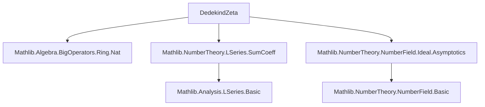
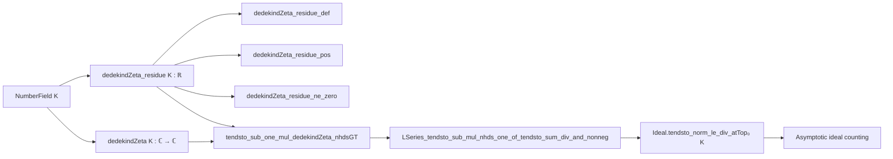

### Technical Brief: `DedekindZeta.lean`

---

#### **1. Key Definitions & Theorems**

| Name | Type | Purpose |
|------|------|---------|
| `dedekindZeta` | `ℂ → ℂ` | Dedekind zeta function of a number field $K$, defined as the $L$-series with coefficients counting integral ideals of given absolute norm. |
| `dedekindZeta_residue` | `ℝ` | Explicit real-valued expression for the residue of $\zeta_K(s)$ at $s = 1$, given by the Dirichlet class number formula. |
| `dedekindZeta_residue_def` | `=` | Definitional equality for `dedekindZeta_residue`. |
| `dedekindZeta_residue_pos` | `0 < dedekindZeta_residue K` | Positivity of the residue (crucial for non-vanishing and analytic behavior). |
| `dedekindZeta_residue_ne_zero` | `dedekindZeta_residue K ≠ 0` | Immediate corollary of positivity. |
| `tendsto_sub_one_mul_dedekindZeta_nhdsGT` | `Tendsto ...` | **Dirichlet class number formula**: $(s-1)\zeta_K(s) \to \operatorname{Res}_{s=1} \zeta_K(s)$ as $s \to 1^+$ in $\mathbb{R}$. |

---

#### **2. Naming Conventions**

- **Prefixes**:
  - `dedekindZeta_`: for definitions and properties of the zeta function and its residue.
  - `nrRealPlaces`, `nrComplexPlaces`: count real/complex embeddings.
  - `absNorm`: absolute norm of an ideal.
  - `torsionOrder`, `regulator`, `classNumber`, `discr`: standard arithmetic invariants.

- **Suffixes**:
  - `_def`: definitional lemmas.
  - `_pos`: positivity results.
  - `_ne_zero`: non-vanishing results.

- **Notable patterns**:
  - `tendsto_sub_one_mul_..._nhdsGT`: limit behavior from the right at $s = 1$.
  - `finite_setOf_absNorm_eq`: finiteness of ideals of bounded norm.

---

#### **3. Tactic Stack**

| Tactic | Usage |
|--------|-------|
| `refine` | Structured proof construction, especially for `tendsto` and positivity. |
| `simp only`, `simp` | Simplification using definitional equalities and basic arithmetic. |
| `congr` | Equality of sums/integrals via congruence of summands. |
| `rw [...]` | Rewriting using lemmas like `card_norm_le_eq_card_norm_le_add_one`, `Finset.Icc_succ_left_eq_Ioc`, etc. |
| ` positivity` | Automated positivity proofs (e.g., for products of positive terms). |
| `exact`, `apply` | Used implicitly via `refine`. |
| `finite_setOf_absNorm_eq` | Finiteness lemma used in rewriting sums over ideals. |

---

#### **4. Proof Logic**

The main theorem `tendsto_sub_one_mul_dedekindZeta_nhdsGT` proceeds as follows:

1. **Reduction to known $L$-series result**:  
   Apply `LSeries_tendsto_sub_mul_nhds_one_of_tendsto_sum_div_and_nonneg`, requiring:
   - Non-negativity of coefficients (trivial since counts).
   - Asymptotic equivalence of partial sums of ideal counts to the expected main term.

2. **Asymptotics of ideal counting function**:  
   Use `Ideal.tendsto_norm_le_div_atTop₀ K`, which gives:
   $$
   \#\{I \subseteq \mathcal{O}_K \mid N(I) \le n\} \sim \frac{2^{r_1}(2\pi)^{r_2}}{w\sqrt{|d_K|}} \cdot n
   $$
   where $r_1 = \text{nrRealPlaces}(K), r_2 = \text{nrComplexPlaces}(K), w = \text{torsionOrder}(K), d_K = \text{discr}(K)$.

3. **Rewriting sums over norms**:  
   Convert sums over $n$ to sums over ideals via:
   - `Finset.card_preimage_eq_sum_card_image_eq`
   - `finite_setOf_absNorm_eq` (finiteness of ideals of fixed norm)
   - `card_norm_le_eq_card_norm_le_add_one` (relating counting functions)

4. **Simplification & conclusion**:  
   Simplify using `Finset.sum_Ioc_add_eq_sum_Icc`, `Finset.Icc_succ_left_eq_Ioc`, and `show 1 = Nat.card {I // N(I) = 0}` (only zero ideal has norm 0).

---

#### **5. Imports & Dependencies**

| Module | Role |
|--------|------|
| `Mathlib.Algebra.BigOperators.Ring.Nat` | Summation over finite sets, especially cardinalities. |
| `Mathlib.NumberTheory.LSeries.SumCoeff` | General theory of $L$-series, especially convergence and residue behavior. |
| `Mathlib.NumberTheory.NumberField.Ideal.Asymptotics` | Asymptotic counting of ideals (key input for class number formula). |

---

#### **6. Mermaid Diagrams**

##### **Dependency Graph (Module-Level)**

##### **Overview of File Structure**

---

#### **7. Theory Context**

This file sits at the intersection of:
- **Algebraic number theory**: number fields, rings of integers, ideal theory.
- **Analytic number theory**: $L$-series, analytic continuation, residues.
- **Lean-specific formalization**: use of `NumberField`, `Ideal.absNorm`, `regulator`, `classNumber`, etc.

It culminates in a formal proof of the **Dirichlet class number formula**, a cornerstone result linking analytic behavior of $\zeta_K(s)$ at $s=1$ to arithmetic invariants of $K$.

---

#### **8. Future Work (from TODO)**

- **Generalization**: Extend construction beyond number fields (e.g., global fields, function fields).
- **Analytic continuation & functional equation**: Not yet formalized.
- **Special values at other integers**: e.g., $\zeta_K(0), \zeta_K(-n)$.

--- 

Let me know if you'd like a formalization of the functional equation or special values next.
