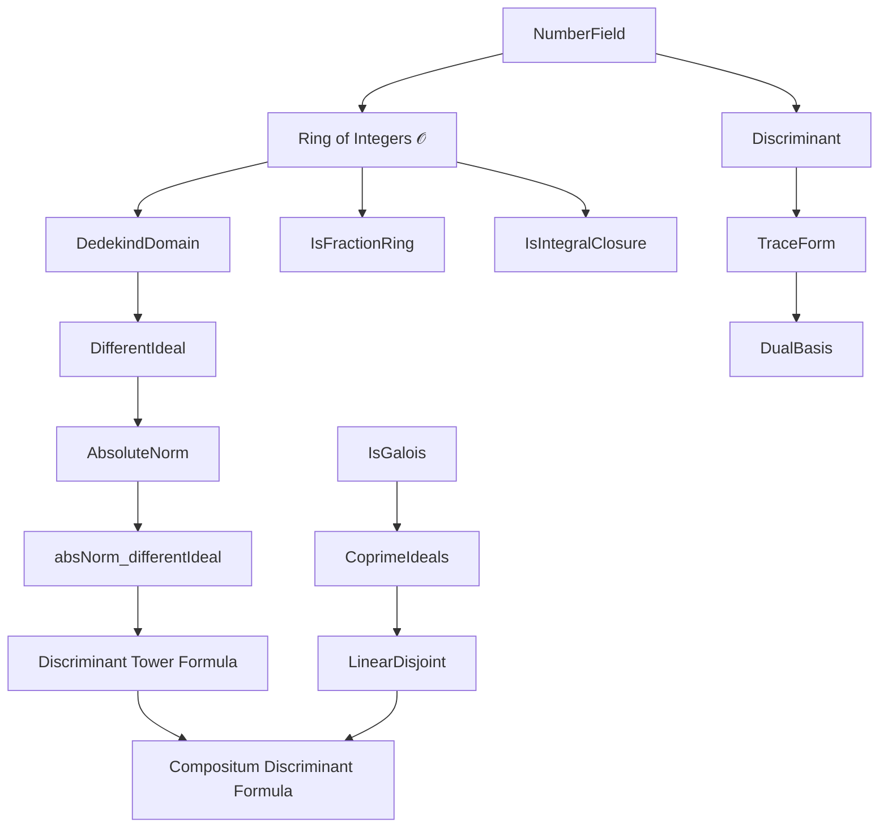
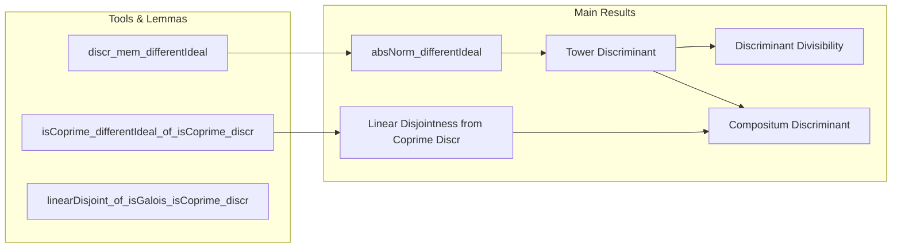

**Technical Brief: `Different.lean` — Discriminant and Different Ideal in Number Fields**

---

### **1. Key Definitions & Theorems**

| Name | Type / Signature | Purpose |
|------|------------------|---------|
| `differentIdeal ℤ 𝒪` | `Ideal 𝒪` | The *different ideal* of the ring of integers $\mathcal{O}_K$ over $\mathbb{Z}$; dual to the trace form. |
| `discr K` | `ℤ` | The *discriminant* of the number field $K$, defined via the determinant of the trace pairing on an integral basis. |
| `absNorm_differentIdeal` | `(differentIdeal ℤ 𝒪).absNorm = (discr K).natAbs` | Relates the *absolute norm* of the different ideal to the *absolute value* of the discriminant. |
| `discr_mem_differentIdeal` | `↑(discr K) ∈ differentIdeal ℤ 𝒪` | Shows the discriminant lies in the different ideal. |
| `natAbs_discr_eq_absNorm_differentIdeal_mul_natAbs_discr_pow` | `(discr L).natAbs = Ideal.absNorm (differentIdeal 𝒪 𝒪') * (discr K).natAbs ^ [L:K]` | Discriminant formula in a tower $L/K/\mathbb{Q}$, factoring via the relative different. |
| `discr_dvd_discr` | `discr K ∣ discr L` | Discriminant divisibility in extensions: discriminant of base divides discriminant of extension. |
| `isCoprime_differentIdeal_of_isCoprime_discr` | `IsCoprime (discr K₁) (discr K₂) → IsCoprime (differentIdeal K₁ → L) (differentIdeal K₂ → L)` | Coprimality of discriminants implies coprimality of mapped different ideals. |
| `linearDisjoint_of_isGalois_isCoprime_discr` | `IsGalois ℚ K₁ → IsCoprime (discr K₁) (discr K₂) → K₁.LinearDisjoint K₂` | Coprime discriminants + Galois ⇒ linear disjointness (key for compositum discriminant formula). |
| `natAbs_discr_eq_natAbs_discr_pow_mul_natAbs_discr_pow` | `(discr L).natAbs = (discr K₁).natAbs^[K₂:ℚ] * (discr K₂).natAbs^[K₁:ℚ]` | Main discriminant formula for compositum $L = K₁K₂$ under linear disjointness and coprime different ideals. |

---

### **2. Naming Conventions**

- **Prefixes**:
  - `absNorm_`: absolute norm of an ideal.
  - `discr_`: discriminant-related.
  - `differentIdeal_`: different ideal constructions or properties.
  - `isCoprime_`: coprimality lemmas.
  - `linearDisjoint_`: linear disjointness results.

- **Suffixes**:
  - `_eq_`: equality statements (e.g., `absNorm_differentIdeal`).
  - `_dvd_`: divisibility (e.g., `discr_dvd_discr`).
  - `_mem_`: membership (e.g., `discr_mem_differentIdeal`).
  - `_pow_`: exponentiation in formulas (e.g., `natAbs_discr_eq_absNorm_differentIdeal_mul_natAbs_discr_pow`).

- **Variable naming**:
  - `K`, `L`: number fields.
  - `𝒪`, `𝒪'`: rings of integers (often `𝓞 K`, `𝓞 L`).
  - `K₁`, `K₂`: subfields / intermediate fields.

---

### **3. Tactic Stack**

Frequent tactics used in proofs:

| Tactic | Role |
|--------|------|
| `rw` / `rwa` | Rewriting using equalities, often with assumptions (`a` for auto-use). |
| `simp` / `simp only` | Simplification, especially with `linearMap`, `traceForm`, `integralBasis`, `differentIdeal`. |
| `refine` / `exact` | Constructing proofs stepwise; often with intermediate lemmas. |
| `congr!` | Congruence reasoning (e.g., for determinant equality). |
| `ext` | Extensionality for ideals, submodules, functions. |
| `qify` | Convert integers to rationals for field-theoretic arguments. |
| `apply` / `apply_instance` | Applying lemmas or instances (e.g., `isCoprime_iff_exists`). |
| `have` / `suffices` | Introducing intermediate claims. |
| `cases` | Case analysis on `natAbs_eq`. |
| `convert` / `congr` | Aligning expressions (e.g., determinants). |

---

### **4. Proof Logic**

- **Structure of main proofs**:
  1. **Reduction to fractional ideals / trace duals**:
     - Use `differentIdeal` as dual of `𝒪` under trace form.
     - Express norms via `relIndex`, `det`, and bases (`integralBasis`, `dualBasis`).
  2. **Tower law for different**:
     - `differentIdeal_eq_differentIdeal_mul_differentIdeal` (relative different factorization).
     - Combine with `absNorm_differentIdeal` to get discriminant tower formula.
  3. **Coprime different ideals ⇒ linear disjointness**:
     - Use `isCoprime_differentIdeal_of_isCoprime_discr` + known criterion (e.g., Dedekind’s theorem).
     - For Galois case, use `linearDisjoint_of_isGalois_isCoprime_discr`.
  4. **Compositum discriminant**:
     - Apply tower formula to both subextensions.
     - Use linear disjointness to identify `finrank` and `sup/inf` behavior.
     - Use coprimality to simplify `absNorm` of product ideal.

- **Common pattern**:
  > *Induction on field extensions via relative different, reduce to trace/determinant computations, then apply algebraic number theory lemmas (e.g., Dedekind, linear disjointness criteria).*

---

### **5. Imports & Dependencies**

| Module | Role |
|--------|------|
| `Mathlib.NumberTheory.NumberField.Discriminant.Basic` | Core discriminant definitions, trace form, integral basis. |
| `Mathlib.RingTheory.DedekindDomain.LinearDisjoint` | Linear disjointness, compositum, and coprimality criteria. |
| `Mathlib.RingTheory.Ideal.Norm.RelNorm` | Absolute norm of ideals, especially in Dedekind domains. |

**Key auxiliary theories used**:
- `FractionalIdeal`, `TraceForm`, `IntegralClosure`, `IsLocalization`, `AddSubgroup.relIndex`, `Module.finrank`, `IntermediateField`.

---

### **6. Mermaid Diagrams**

#### **Dependency Graph (Theoretical)**

#### **File Overview (Code Structure)**

---

### **7. Summary**

This file formalizes foundational relationships between the **different ideal**, **discriminant**, and **field extensions** in algebraic number theory. It culminates in a clean formula for the discriminant of a compositum of linearly disjoint number fields with coprime different ideals — a key ingredient in class field theory and arithmetic geometry.

The proofs rely heavily on:
- The trace form and dual bases,
- Properties of fractional ideals and absolute norms,
- Linear disjointness criteria (especially via coprimality),
- Dedekind domain structure of rings of integers.

The formalization is highly structured, with clear separation of relative vs. absolute constructions and careful handling of algebraic towers and intermediate fields.

--- 

Let me know if you'd like a **dependency graph of Lean modules** or a **proof sketch in natural language** for any specific theorem.
