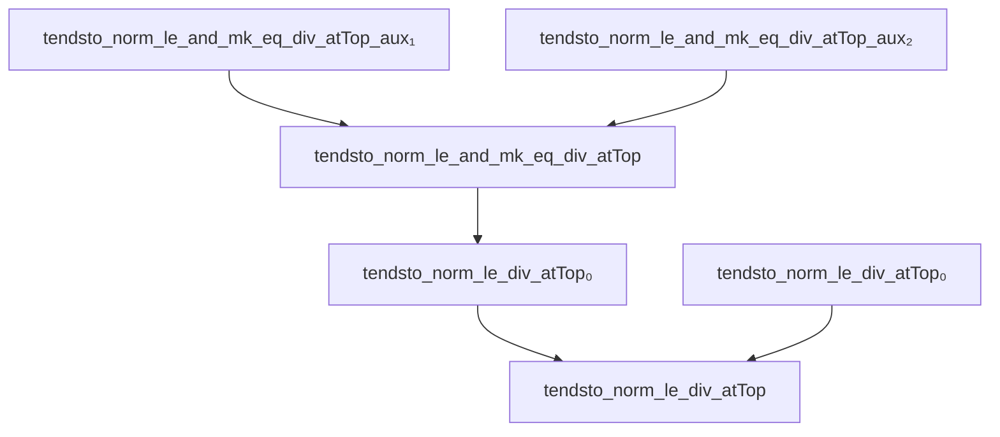
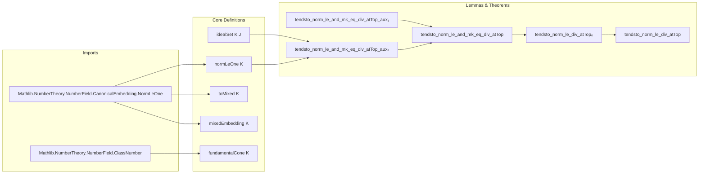

### Technical Brief: Asymptotics on Integral Ideals of a Number Field (Lean 4)

---

#### **1. Key Definitions & Theorems**

| Name | Type / Signature | Purpose |
|------|------------------|---------|
| `tendsto_norm_le_and_mk_eq_div_atTop_aux₁` | `theorem` | Establishes a bijection between integral ideals in a fixed class `C` of bounded norm and principal ideals divisible by a fixed lift `J` of `C⁻¹`, with scaled norm bound. |
| `tendsto_norm_le_and_mk_eq_div_atTop_aux₂` | `def` (classical) | Constructs an explicit equivalence between a lattice slice (preimage of fundamental cone intersected with a norm ball) and a set of fractional ideals `idealSet K J` with bounded norm. |
| `tendsto_norm_le_and_mk_eq_div_atTop` | `theorem` | Main asymptotic: number of nonzero integral ideals of norm ≤ `s` in a fixed class `C`, divided by `s`, tends to a constant depending on geometry of numbers (regulator, discriminant, places, torsion). |
| `tendsto_norm_le_div_atTop₀` | `theorem` | Asymptotic for *all* nonzero integral ideals (sum over all classes in class group). |
| `tendsto_norm_le_div_atTop` | `theorem` | Asymptotic for *all* integral ideals (including zero ideal); differs from `tendsto_norm_le_div_atTop₀` by an additive `1/s` term vanishing at infinity. |
| `idealSet K J` | `Set (mixedSpace K)` | Set of elements in the mixed embedding space corresponding to fractional ideals divisible by `J`. |
| `normLeOne K` | `Set (mixedSpace K)` | Unit ball in the norm topology inside the fundamental cone. |
| `ClassGroup.mk0` | `Ideal (𝓞 K)⁰ → ClassGroup (𝓞 K)` | Canonical map from nonzero integral ideals to class group. |
| `absNorm` | `Ideal (𝓞 K) → ℕ` | Absolute norm of an integral ideal. |

---

#### **2. Naming Conventions**

- **Prefixes**:
  - `tendsto_..._atTop`: Asymptotic statements as `s → +∞`.
  - `norm_le_...`: Norm-bounded sets or conditions.
  - `mk0`: Canonical projection to class group (zero-ary version of `mk`).
  - `idealSet`, `idealLattice`: Lattice-theoretic constructions related to ideals.
  - `fundamentalCone`, `toMixed`, `mixedEmbedding`: Geometry-of-numbers objects.

- **Suffixes**:
  - `_aux₁`, `_aux₂`: Intermediate lemmas used in main proof.
  - `_div_atTop`: Division by `s` and limit at `atTop`.
  - `_eq_div`: Equality of counts up to division (i.e., asymptotic density).

- **Other patterns**:
  - `nrReal_places`, `nrComplex_places`: Number of real/complex embeddings.
  - `regulator`, `torsionOrder`, `discr`, `classNumber`: Standard arithmetic invariants.

---

#### **3. Tactic Stack**

| Tactic | Usage Frequency | Purpose |
|--------|-----------------|---------|
| `simp_rw` | Very High | Rewriting with definitional equalities, especially for set membership, subtype equivalences, and norm properties. |
| `rw` | High | Rewriting using lemmas (e.g., `inv_mul_cancel₀`, `covolume_idealLattice`). |
| `convert` | Medium | Matching goals up to definitional equality or known equivalences. |
| `exact`, `refine`, `apply` | Medium | Constructing proofs via known equivalences or lemmas. |
| `classical` | Low (once per proof) | To enable classical choice (e.g., surjectivity of `ClassGroup.mk0`). |
| `ring`, `ring_nf` | Medium | Simplifying algebraic expressions involving real scalars. |
| `filter_upwards` | Medium | Handling eventual behavior in filters (e.g., `atTop`). |
| `congr'` | Medium | Proving equality of functions via filter convergence. |
| `apply_congr` / `congr` | Low | For functional extensionality or equality of limits. |
| ` measurableSet_*`, ` measurable_*` | Low | Verifying measurability for volume computations. |

---

#### **4. Proof Logic**

- **Structure**:
  1. **Reduction via algebraic equivalence** (`aux₁`): Replace counting in class `C` with counting principal ideals divisible by a fixed `J` lifting `C⁻¹`, scaling the norm bound.
  2. **Geometric reinterpretation** (`aux₂`): Identify the set of such principal ideals with a lattice slice in the mixed embedding space (preimage of fundamental cone ∩ norm ball).
  3. **Apply geometry-of-numbers result** (`ZLattice.covolume.tendsto_card_le_div'`): Use known asymptotics for lattice points in dilated convex bodies.
  4. **Compute constants**: Simplify using:
     - Volume of `normLeOne K` (depends on regulator, discriminant, places).
     - Covolume of `idealLattice K (FractionalIdeal.mk0 K J)`.
     - Index of units (torsion order).
     - Change of variables via `absNorm J`.
  5. **Sum over classes** (for `tendsto_norm_le_div_atTop₀`): Use finite sum over class group and `classNumber = Fintype.card (ClassGroup K)`.
  6. **Include zero ideal** (for `tendsto_norm_le_div_atTop`): Add contribution of zero ideal (constant `1`), negligible asymptotically.

- **Induction / recursion**: None.
- **Case analysis**: Minimal; mostly algebraic case distinctions (e.g., nonzero divisors, positivity of norms).
- **Key logical flow**:
  > *Algebraic reduction → Lattice embedding → Geometry-of-numbers asymptotic → Arithmetic simplification → Summation over classes.*

---

#### **5. Imports & Dependencies**

| Module | Role |
|--------|------|
| `Mathlib.NumberTheory.NumberField.CanonicalEmbedding.NormLeOne` | Defines `normLeOne K`, volume computations, and properties of the mixed embedding. |
| `Mathlib.NumberTheory.NumberField.ClassNumber` | Defines class group, class number, and related constructions (`ClassGroup`, `mk0`, `torsionOrder`, etc.). |
| `Mathlib.MeasureTheory.Measure.Volume` | For volume computations (via `volume`, `measureReal_def`, etc.). |
| `Mathlib.Data.Set.Image` / `Preimage` | Set-theoretic manipulations (e.g., `Set.mem_image`, `Set.mem_preimage`). |
| `Mathlib.Data.Fintype.Basic` / `Finset` | Counting finite sets, fiberwise sums over classes. |
| `Mathlib.Algebra.Module.Submodule.Lattice` | For `idealLattice`, `comap`, and lattice constructions. |
| `Mathlib.NumberTheory.NumberField.MixedEmbedding` | Core definitions of `toMixed`, `mixedEmbedding`, `fundamentalCone`. |
| `Mathlib.Data.Real.Basic`, `Filter`, `TopologicalGroup` | For `Tendsto`, `atTop`, continuity, and topological arguments. |

---

#### **6. Mermaid Diagrams**

##### **Dependency Graph (Theorems & Lemmas)**

##### **Overview of File Structure**

---

#### **7. Mathematical Constant in Asymptotics**

The limiting constant is:

$$
\frac{2^{r_1} \cdot (2\pi)^{r_2} \cdot R_K}{w_K \cdot \sqrt{|\Delta_K|}}
$$

Where:
- $r_1 = \texttt{nrReal\_places}\ K$, $r_2 = \texttt{nrComplex\_places}\ K$
- $R_K = \texttt{regulator}\ K$
- $w_K = \texttt{torsionOrder}\ K$ (size of unit group torsion)
- $\Delta_K = \texttt{discr}\ K$ (field discriminant)

For the full ideal count (including all classes), multiply by $\texttt{classNumber}\ K$.

---

#### **8. Notes on Formalization Quality**

- **Noncomputability**: Required due to reliance on class group and real embeddings.
- **Classical choice**: Used only to pick a lift `J` of `C⁻¹`; no functional choice needed.
- **Measurability & volume**: Carefully handled via `volumePreserving_toMixed`, `measurableSet_*`, and `nullMeasurableSet`.
- **Scaling & normalization**: Precise handling of `absNorm`, `FractionalIdeal`, and `idealLattice` ensures correct covolume computation.

--- 

Let me know if you'd like a **proof sketch in natural language**, **dependency graph in DOT format**, or **export of constants for external use**.
