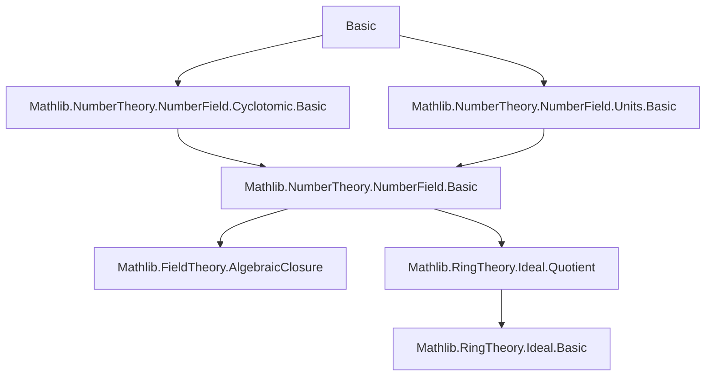

**Technical Brief: Basic.lean — Integral Ideals and Roots of Unity in Number Fields**

---

### 1. **Key Definitions & Theorems**

| Name | Type / Signature | Purpose |
|------|------------------|---------|
| `Ideal.rootsOfUnityMapQuot` | `def Ideal.rootsOfUnityMapQuot (n : ℕ) : (rootsOfUnity n (𝓞 K)) →* ((𝓞 K) ⧸ I)ˣ` | Constructs a group homomorphism from the multiplicative group of $n$-th roots of unity in the ring of integers $\mathcal{O}_K$ to the unit group of the quotient ring $\mathcal{O}_K / I$. |
| `Ideal.rootsOfUnityMapQuot_apply` | `∀ {x : (𝓞 K)ˣ} (hx : x ∈ rootsOfUnity n (𝓞 K)), rootsOfUnityMapQuot I n ⟨x, hx⟩ = Ideal.Quotient.mk I x` | Describes the action of the map on elements: reduction modulo $I$. |
| `Ideal.torsionMapQuot` | `def Ideal.torsionMapQuot : (Units.torsion K) →* ((𝓞 K) ⧸ I)ˣ` | Same as above, but for the full torsion subgroup of $K^\times$ (i.e., all roots of unity). |
| `Ideal.torsionMapQuot_apply` | `∀ {x : (𝓞 K)ˣ} (hx : x ∈ torsion K), torsionMapQuot I ⟨x, hx⟩ = Ideal.Quotient.mk I x` | Action of torsion map on torsion units. |
| `Ideal.rootsOfUnityMapQuot_injective` | `∀ n [NeZero n], absNorm I ≠ 1 → (absNorm I).Coprime n → Function.Injective (rootsOfUnityMapQuot I n)` | Injectivity criterion: if the norm of $I$ is coprime to $n$, then the reduction map on $n$-th roots of unity is injective. |
| `Ideal.torsionMapQuot_injective` | `absNorm I ≠ 1 → (absNorm I).Coprime (torsionOrder K) → Function.Injective (torsionMapQuot I)` | Injectivity of the torsion map under coprimality with the torsion order. |
| `NumberField.torsionOrder_dvd_absNorm_sub_one` | `P ≠ ⊥ → P.IsPrime → (absNorm P).Coprime (torsionOrder K) → torsionOrder K ∣ absNorm P - 1` | Main arithmetic consequence: under coprimality, the norm of a prime ideal $P$ is congruent to $1 \mod \text{torsionOrder}(K)$. |
| `IsPrimitiveRoot.not_coprime_norm_of_mk_eq_one` | `absNorm I ≠ 1 → 2 ≤ n → IsPrimitiveRoot ζ n → ζ ≡ 1 \pmod{I} ⇒ ¬(absNorm I).Coprime n` | Key technical lemma: a primitive root reducing to 1 modulo $I$ forces the norm of $I$ to share a factor with $n$. |

---

### 2. **Naming Conventions**

- **Prefixes**:
  - `rootsOfUnityMapQuot`, `torsionMapQuot`: indicate maps induced by quotienting.
  - `not_coprime_norm_of_...`: negative result (non-coprimality) derived from congruence condition.
- **Suffixes**:
  - `_injective`: injectivity statement.
  - `_apply`: application/simp lemma for the map.
- **Variables**:
  - `I`, `P`: integral ideals (often prime or maximal).
  - `n`: natural number (often order of root of unity).
  - `ζ`, `x`, `y`: units or roots of unity.
  - `hI₁`, `hI₂`, `hP₀`, etc.: standard hypothesis naming.

---

### 3. **Tactic Stack**

Frequently used tactics in proofs:

| Tactic | Role |
|--------|------|
| `intro`, `refine`, `exact`, `rw`, `rwa` | Basic proof structure and rewriting. |
| `obtain ⟨p, hp, h₂⟩ := ...` | Extraction of prime divisor from nonzero norm. |
| `have : Fact (p.Prime) := ⟨hp⟩` | Upgrade divisibility to prime fact. |
| `simp [show t = 1 by grind]` | Simplification using derived equalities. |
| `grind` | Custom tactic (likely from Mathlib’s `grind` module) for solving equalities in rings/fields. |
| `exact hζ.prime_dvd_of_dvd_norm_sub_one ...` | Use known lemmas about primitive roots and norms. |
| `rwa [...]` | Rewrite + apply; used to finish with known equivalences. |
| `have h := Subgroup.card_dvd_of_injective _ (...)` | Apply group-theoretic cardinality divisibility. |

---

### 4. **Proof Logic Flow**

The logical structure follows a standard pattern in algebraic number theory:

1. **Reduction to quotient**: Define maps via universal property of units and quotients.
2. **Injectivity via contradiction**:
   - Assume kernel nontrivial ⇒ existence of nontrivial root of unity ≡ 1 mod $I$.
   - Use `IsPrimitiveRoot.not_coprime_norm_of_mk_eq_one` to derive non-coprimality.
3. **Cardinality argument**:
   - Injective map ⇒ $|\text{domain}|$ divides $|\text{codomain}|$.
   - Identify codomain size via finite field structure (quotient by maximal ideal).
4. **Arithmetic conclusion**:
   - For prime $P$, $\#(\mathcal{O}_K / P)^\times = \#(\mathcal{O}_K / P) - 1 = \text{absNorm}(P) - 1$.
   - Torsion group injects ⇒ its order divides $\text{absNorm}(P) - 1$.

Induction is *not* used; the arguments are mostly algebraic and rely on:
- Structure of roots of unity,
- Properties of norms and coprimality,
- Group actions and injectivity.

---

### 5. **Imports & Dependencies**

| Import | Role |
|--------|------|
| `Mathlib.NumberTheory.NumberField.Cyclotomic.Basic` | Roots of unity, cyclotomic polynomials, primitive roots. |
| `Mathlib.NumberTheory.NumberField.Units.Basic` | Torsion subgroup of units, ring of integers, unit group structure. |
| `Ideal`, `NumberField`, `Units` | Open namespaces for local use. |

The file builds on:
- Theory of number fields (`NumberField`),
- Ring of integers (`𝓞 K`),
- Ideal theory (norm, primality, maximality),
- Group theory (torsion, injective homomorphisms, cardinality divisibility).

---

### 6. **Mermaid Diagrams**

#### **Dependency Graph (Module-Level)**



#### **Overview of File Structure**

```mermaid
flowchart LR
  A[Number Field K] --> B[Ring of Integers 𝓞 K]
  B --> C[Ideal I ⊆ 𝓞 K]
  C --> D[Quotient Ring 𝓞 K ⧸ I]
  D --> E[Unit Group (𝓞 K ⧸ I)ˣ]
  
  F[Roots of Unity μₙ(𝓞 K)] --> D1[rootsOfUnityMapQuot]
  G[Torsion Subgroup torsion(K)] --> D2[torsionMapQuot]
  
  D1 --> E
  D2 --> E
  
  H[absNorm I] --> I[Coprime to n / torsionOrder]
  I --> J[Injectivity of maps]
  J --> K[Divisibility: torsionOrder ∣ absNorm(P) − 1]
```

---

### 7. **Summary**

This module formalizes foundational results linking the arithmetic of ideals (especially norms and coprimality) with the group-theoretic structure of roots of unity and torsion in number fields. The key insight is that reduction modulo an ideal $I$ yields injective maps on roots of unity when $\text{absNorm}(I)$ avoids shared factors with the root order — a crucial ingredient for local-global principles and class field theory developments.

The results are used to prove that for a prime ideal $P$ with norm coprime to the torsion order, $\#(\mathcal{O}_K / P) \equiv 1 \mod \text{torsionOrder}(K)$, a number-field analogue of Fermat’s little theorem for torsion units.
