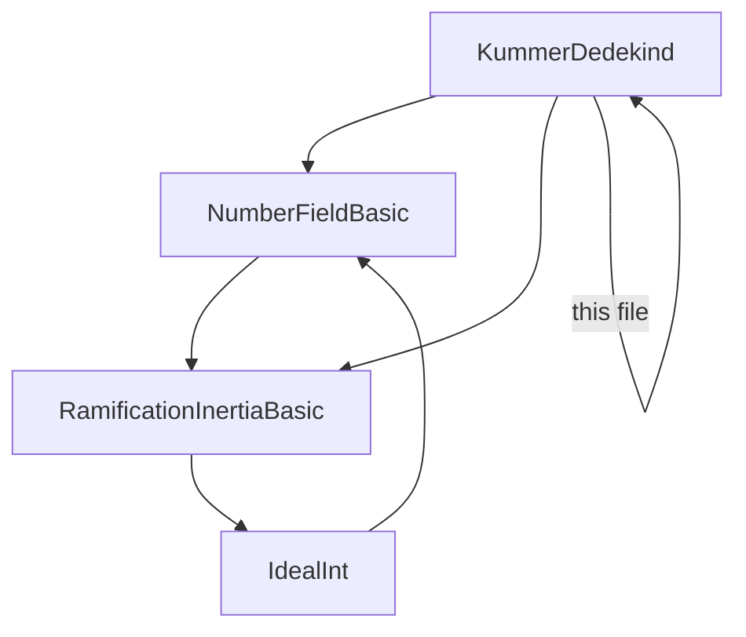
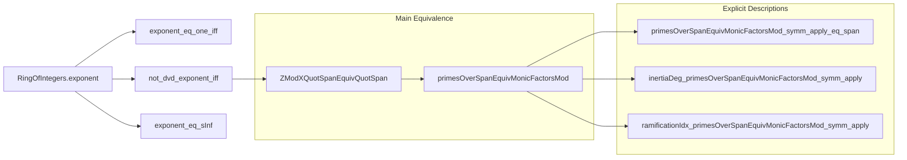

### Technical Brief: `KummerDedekind.lean`

---

#### **1. Key Definitions & Theorems**

| Name | Type / Signature | Purpose |
|------|------------------|---------|
| `RingOfIntegers.exponent θ` | `ℕ` | Smallest positive integer `d` such that `d • 𝓞 K ⊆ ℤ[θ]`; measures failure of `θ` to generate the full ring of integers. |
| `RingOfIntegers.exponent_eq_one_iff` | `exponent θ = 1 ↔ Algebra.adjoin ℤ {θ} = ⊤` | Characterizes when `θ` generates the full ring of integers. |
| `RingOfIntegers.not_dvd_exponent_iff` | `¬ p ∣ exponent θ ↔ Codisjoint (conductor ℤ θ) (span {p})` | Links coprimality of `p` with the conductor to ideal-theoretic disjointness. |
| `RingOfIntegers.ZModXQuotSpanEquivQuotSpan hp` | `(ZMod p)[X] / (minpoly θ mod p) ≃+* 𝓞 K / p𝓞 K` | Fundamental isomorphism under condition `¬ p ∣ exponent θ`. |
| `RingOfIntegers.monicFactorsMod θ p` | `Finset ((ZMod p)[X])` | Finite set of monic irreducible factors of `minpoly ℤ θ` modulo `p`. |
| `RingOfIntegers.ZModXQuotSpanEquivQuotSpanPair hp hQ` | `(ZMod p)[X]/(Q) ≃+* 𝓞 K / (p, Q(θ))` | Local isomorphism for each monic irreducible factor `Q`. |
| `NumberField.Ideal.primesOverSpanEquivMonicFactorsMod hp` | `primesOver (p) ≃ monicFactorsMod θ p` | Main bijection: prime ideals above `p` ↔ monic irreducible factors of `minpoly θ mod p`. |
| `NumberField.Ideal.primesOverSpanEquivMonicFactorsMod_symm_apply_eq_span` | `((primesOverSpanEquivMonicFactorsMod hp).symm ⟨Q, hQ⟩) = span {p, Q(θ)}` | Explicit description of the ideal corresponding to `Q`. |
| `NumberField.Ideal.inertiaDeg_primesOverSpanEquivMonicFactorsMod_symm_apply` | `inertiaDeg = natDegree (Q mod p)` | Relates residual degree to degree of factor `Q`. |
| `NumberField.Ideal.ramificationIdx_primesOverSpanEquivMonicFactorsMod_symm_apply` | `ramificationIdx = multiplicity (Q mod p) in minpoly θ mod p` | Relates ramification index to multiplicity of factor `Q`. |

---

#### **2. Naming Conventions**

- **Prefixes:**
  - `exponent_`, `ZModXQuotSpanEquivQuotSpan`, `monicFactorsMod`, `primesOverSpanEquivMonicFactorsMod`: module-specific naming.
  - `primesOver_`, `inertiaDeg_`, `ramificationIdx_`: standard algebraic number theory terminology.
- **Suffixes:**
  - `_eq_span`, `_symm_apply`, `_symm_apply'`: indicate explicit descriptions or variants for lifted vs. mod-p polynomials.
  - `_pair`: used for localized isomorphisms (e.g., for a pair `(p, Q)`).
- **Logical structure:**
  - `hp : ¬ p ∣ exponent θ` is the central hypothesis; all main results assume this.
  - `hQ : Q ∈ monicFactorsMod θ p` is used to select a factor.

---

#### **3. Tactic Stack**

| Tactic | Usage Frequency | Purpose |
|--------|------------------|---------|
| `simp` | Very High | Simplification of ideal maps, quotients, polynomial maps, and `ZMod` constructions. |
| `rw` | High | Rewriting using equivalences, definitions, and lemmas like `exponent_eq_sInf`, `mem_primesOver_iff_mem_normalizedFactors`. |
| `exact` / `refine` | Medium | Completing proofs with known equalities or structured goals. |
| `congr_arg` | Medium | Proving equality of images under constructions like `aeval`, `map`, `quotientEquiv`. |
| `ext` | Medium | Extensionality for ideals and sets. |
| `apply` / `apply_fun` | Low | Rarely used for function application or injectivity. |
| `aesop` / `linarith` | Not present | Not used — proofs are mostly algebraic and constructive. |
| `ring` / `field_simp` | Not present | Not needed; arithmetic is handled via `Int`, `ZMod`, and polynomial ring properties. |

---

#### **4. Proof Logic**

- **Structure:**  
  Proofs follow a *constructive algebraic* pattern:
  1. **Setup**: Introduce `hp : ¬ p ∣ exponent θ`, which ensures the conductor condition and allows the key isomorphism.
  2. **Isomorphism Construction**: Build `ZModXQuotSpanEquivQuotSpan` using:
     - `quotientEquivAlgOfEq`
     - `quotMapEquivQuotQuotMap`
     - `mapEquiv`
     - `Int.quotientSpanNatEquivZMod`
  3. **Factorization Analysis**: Use `normalizedFactors` to extract monic irreducible factors modulo `p`.
  4. **Bijection Construction**: Use `Equiv.setCongr`, `normalizedFactorsMapEquivNormalizedFactorsMinPolyMk`, and `primesOverSpanEquivMonicFactorsModAux` to relate primes above `p` and monic factors.
  5. **Explicit Descriptions**: Derive ideal generators, inertia degrees, and ramification indices via:
     - `inertiaDeg_algebraMap`
     - `finrank_quotient_span_eq_natDegree`
     - `ramificationIdx_eq_multiplicity`
     - `multiplicity_eq_of_emultiplicity_eq`
     - `emultiplicity_map_eq`

- **Induction**: Not used — all arguments are algebraic and rely on properties of Dedekind domains, normalized factorizations, and finite field extensions.

---

#### **5. Imports & Dependencies**

| Module | Role |
|--------|------|
| `Mathlib.NumberTheory.KummerDedekind` | Core theory of the Kummer–Dedekind criterion. |
| `Mathlib.NumberTheory.NumberField.Basic` | Number fields, ring of integers, minimal polynomials, `aeval`. |
| `Mathlib.NumberTheory.RamificationInertia.Basic` | Definitions and basic properties of inertia and ramification indices. |
| `Mathlib.RingTheory.Ideal.Int` | Ideals in `ℤ`, especially `span {p}`, `Int.ideal_span_isMaximal_of_prime`. |

---

#### **6. Mermaid Diagrams**

##### **Dependency Graph (Module Level)**



##### **Overview of File Structure**



##### **Conceptual Flow of Main Theorem**

```mermaid
flowchart LR
  hp[hp : ¬ p ∣ exponent θ] --> iso[Equiv: primesOver(p) ≃ monicFactorsMod]
  iso --> gen[Explicit ideal: span {p, Q(θ)}]
  gen --> deg[Inertia degree = deg(Q mod p)]
  gen --> ram[Ramification index = mult(Q mod p, minpoly θ mod p)]
```

---

#### **7. Summary**

This file formalizes a *specialized version* of the Kummer–Dedekind criterion for splitting rational primes in number fields. It introduces the **exponent** of an algebraic integer `θ`, which measures how far `ℤ[θ]` is from being the full ring of integers. When a prime `p` does **not** divide this exponent, the criterion gives a clean bijection between:

- Prime ideals of `𝓞 K` lying above `p`, and  
- Monic irreducible factors of `minpoly ℤ θ` modulo `p`.

The file then computes the **inertia degree** and **ramification index** of each such prime ideal in terms of the degree and multiplicity of the corresponding factor.

This is foundational for explicit computations in algebraic number theory (e.g., factorization of primes in number fields), and is used extensively in class field theory and computational implementations (e.g., in SageMath, PARI/GP).
