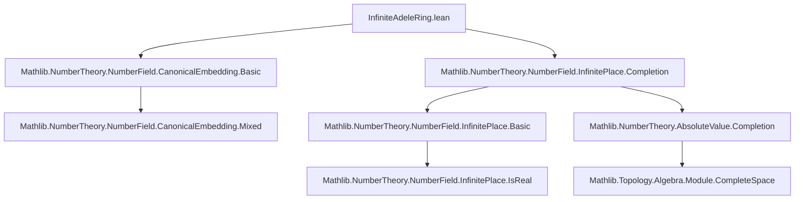
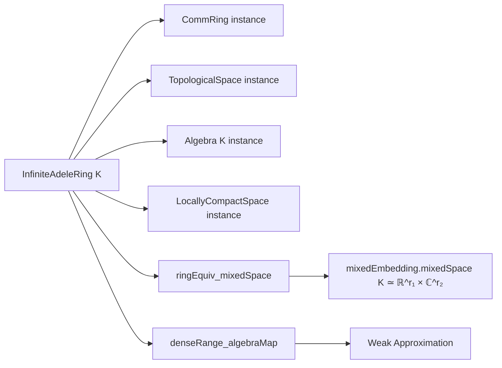

### Technical Brief: `InfiniteAdeleRing.lean`

---

#### **1. Key Definitions & Theorems**

| Name | Type / Signature | Purpose |
|------|------------------|---------|
| `InfiniteAdeleRing K` | `Type u → [Field K] → Type u` | Product over all infinite places `v` of `K` of their completions `v.Completion`. |
| `ringEquiv_mixedSpace K` | `InfiniteAdeleRing K ≃+* mixedEmbedding.mixedSpace K` | Ring isomorphism between the infinite adele ring and the mixed embedding space `ℝ ^ r₁ × ℂ ^ r₂`, where `(r₁, r₂)` is the signature of `K`. |
| `locallyCompactSpace` | `LocallyCompactSpace (InfiniteAdeleRing K)` | Proves the infinite adele ring is locally compact (uses finiteness of infinite places for number fields). |
| `denseRange_algebraMap` | `DenseRange (algebraMap K (InfiniteAdeleRing K))` | Weak approximation: the number field embeds densely into its infinite adele ring. |
| `algebraMap_apply` | `algebraMap K _ x v = x` | Describes the action of the algebra map pointwise. |
| `mixedEmbedding_eq_algebraMap_comp` | `mixedEmbedding K x = ringEquiv_mixedSpace K (algebraMap K _ x)` | Relates the standard mixed embedding to the algebra map via the ring isomorphism. |

---

#### **2. Naming Conventions**

- **Prefixes**:
  - `ringEquiv_`: Indicates a ring isomorphism (`≃+*`).
  - `algebraMap_`: Standard algebra map from base field to algebra.
  - `infinite_` / `InfiniteAdeleRing`: Domain-specific naming for infinite adele-related objects.
  - `mixedEmbedding_`: Refers to the canonical embedding into `ℝ ^ r₁ × ℂ ^ r₂`.

- **Suffixes**:
  - `_apply`: Function application form of a definition/lemma.
  - `_comp`: Composition with another map.
  - `_ofIsReal` / `_ofIsComplex`: Constructors depending on whether a place is real or complex.

- **Type variables**:
  - `K`: Number field.
  - `v`: Infinite place.
  - `⟨_, hv⟩`: Dependent pair for subtype (e.g., `{w // IsReal w}`).

---

#### **3. Tactic Stack**

Frequently used tactics in this file:

| Tactic | Usage |
|--------|-------|
| `ext` | Extensionality for functions/products (e.g., proving equality of maps). |
| `simp` / `simp_rw` | Simplification using definitional equalities and lemmas like `algebraMap_apply`, `ringEquiv_mixedSpace_apply`. |
| ` rfl` | Trivial equalities (e.g., in `algebraMap_apply`). |
| `exact` / `apply` | Used in `denseRange_algebraMap` to chain density results. |
| `trans` | Chaining equivalences/isomorphisms (e.g., in `ringEquiv_mixedSpace`). |
| `cases` / `subtypeEquivRight` | Handling subtype equivalences (e.g., splitting real/complex places). |
| `Pi.*` tactics (`Pi.commRing`, `Pi.locallyCompactSpace_of_finite`, etc.) | Leveraging `Pi`-type infrastructure from Mathlib. |

---

#### **4. Proof Logic**

- **Structure of `ringEquiv_mixedSpace`**:
  - Decomposes the product over `InfinitePlace K` into real and complex parts using `piEquivPiSubtypeProd`.
  - Uses `RingEquiv.prodCongr` to combine:
    - For real places: `Completion.ringEquivRealOfIsReal`.
    - For complex places: `Completion.ringEquivComplexOfIsComplex` composed with equivalence between complex places and non-real ones.
  - Uses `Equiv.subtypeEquivRight` to reindex complex places.

- **Proof of `denseRange_algebraMap`**:
  - Uses two known density results:
    - `InfinitePlace.denseRange_algebraMap_pi`: `K` is dense in the product of completions (before taking infinite places).
    - `UniformSpace.Completion.denseRange_coe`: The canonical map into the completion is dense.
  - Combines them via `DenseRange.piMap` and composition.

- **Proof of `locallyCompactSpace`**:
  - Relies on `Pi.locallyCompactSpace_of_finite`, which requires that the index type (`InfinitePlace K`) is finite — true for number fields.

---

#### **5. Imports & Dependencies**

| Import | Purpose |
|--------|---------|
| `Mathlib.NumberTheory.NumberField.CanonicalEmbedding.Basic` | Defines canonical/mixed embeddings and related structure. |
| `Mathlib.NumberTheory.NumberField.InfinitePlace.Completion` | Defines completions at infinite places and their basic properties. |
| `InfinitePlace`, `AbsoluteValue.Completion`, `IsDedekindDomain` | Infrastructure for places, absolute values, completions, and Dedekind domains. |

---

#### **6. Mermaid Diagrams**

##### **Dependency Graph (Module Level)**

##### **Overview of File Structure**

---

#### **7. Theory Context**

This file formalizes the *infinite part* of the adele ring of a number field $K$, which is central in class field theory. While the full adele ring is a restricted product over *all* places (finite and infinite), the infinite adele ring only involves the archimedean completions. It serves as the ambient space for the *mixed embedding*, and the density result (`denseRange_algebraMap`) is a key ingredient in proofs of weak approximation and in the construction of the idele class group.

The ring isomorphism `ringEquiv_mixedSpace` identifies the infinite adele ring with the concrete product space $\mathbb{R}^{r_1} \times \mathbb{C}^{r_2}$, where $(r_1, r_2)$ is the signature of $K$, making it amenable to analysis (e.g., topology, measure theory).

---

Let me know if you'd like a formalization roadmap for extending this to the *full* adele ring or idele group.
