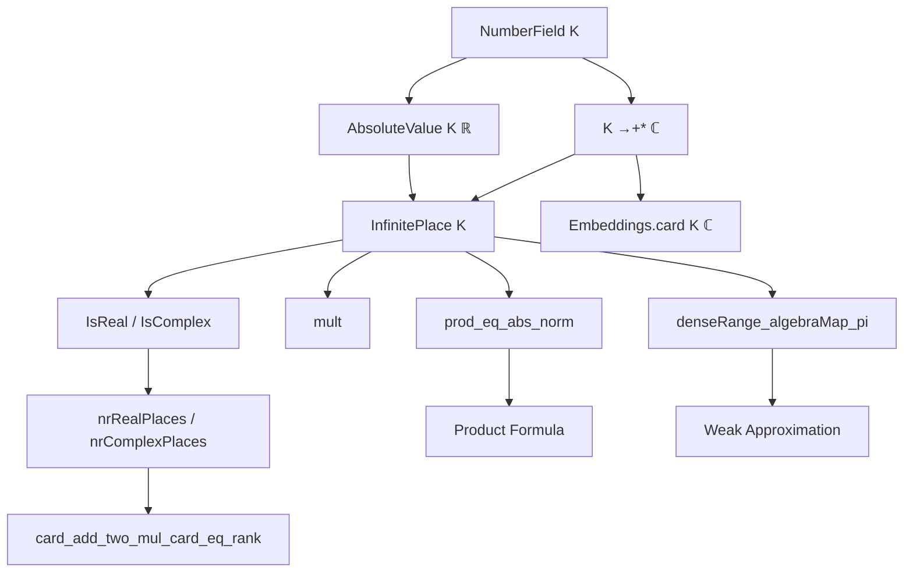
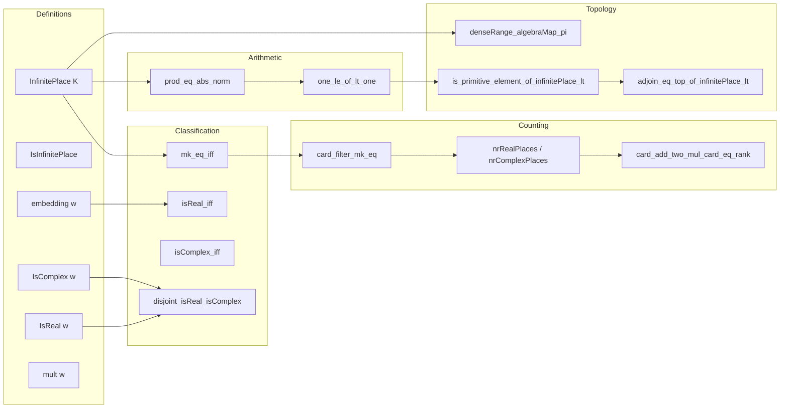

Here is a structured technical brief based on the provided Lean 4 file `Basic.lean`:

---

## **1. Key Definitions & Theorems**

| Name | Type / Signature | Purpose |
|------|------------------|---------|
| `InfinitePlace K` | `Type u` | Type of infinite places of a number field `K`, defined as equivalence classes of complex embeddings via `place φ`. |
| `InfinitePlace.mk φ` | `K →+* ℂ → InfinitePlace K` | Maps a complex embedding to its associated infinite place. |
| `IsInfinitePlace w` | `AbsoluteValue K ℝ → Prop` | Predicate saying `w` is an infinite place (i.e., `w = place φ` for some `φ`). |
| `embedding w` | `InfinitePlace K → K →+* ℂ` | Returns a complex embedding defining `w` (using choice). |
| `IsReal w` | `InfinitePlace K → Prop` | Says `w` is real: defined by a real embedding. |
| `IsComplex w` | `InfinitePlace K → Prop` | Says `w` is complex: defined by a non-real embedding. |
| `mult w` | `InfinitePlace K → ℕ` | Multiplicity: `1` if real, `2` if complex. |
| `prod_eq_abs_norm x` | `x : K → ∏ w, w x ^ mult w = |norm(x)|` | Infinite part of the product formula. |
| `card_add_two_mul_card_eq_rank` | `nrRealPlaces + 2 * nrComplexPlaces = finrank ℚ K` | Degree decomposition into real and complex places. |
| `denseRange_algebraMap_pi` | `[NumberField K] → DenseRange (algebraMap K ((w : InfinitePlace K) → WithAbs w.1))` | Weak approximation: diagonal embedding of `K` into product of completions is dense. |
| `mk_eq_iff` | `mk φ = mk ψ ↔ φ = ψ ∨ conjugate φ = ψ` | Characterizes when two embeddings define the same infinite place. |
| `nrRealPlaces K`, `nrComplexPlaces K` | `ℕ` | Counts of real and complex infinite places. |

---

## **2. Naming Conventions**

- **Prefixes**:
  - `isReal`, `isComplex`: predicates on places.
  - `mk`: construction from embeddings to places.
  - `embedding`: projection from place to defining embedding.
  - `mult`: multiplicity.
  - `nrRealPlaces`, `nrComplexPlaces`: count abbreviations.

- **Suffixes**:
  - `_eq_iff`: biconditional characterizations (e.g., `mk_eq_iff`, `isReal_iff`).
  - `_iff`: equivalence lemmas (e.g., `isReal_iff`, `isComplex_iff`).
  - `_of_isReal`, `_of_isComplex`: projections from subtype data.

- **Notable patterns**:
  - `embedding_of_isReal`, `mkReal`, `mkComplex`: constructions using subtypes.
  - `card_filter_mk_eq`: relates fiber cardinalities to multiplicity.

---

## **3. Tactic Stack**

Frequently used tactics in proofs:

| Tactic | Usage |
|--------|-------|
| `simp` / `simp_rw` | Simplification with definitional lemmas, especially `mk`, `embedding`, `apply`. |
| `rw` / `congr_arg` / `ext` | Equality reasoning, especially for subtype/extensivity. |
| `aesop` / `grind` | Automated reasoning for arithmetic, positivity, inequalities. |
| `cases` / `rcases` | Case analysis on `IsReal w`, `IsComplex w`, or `mk_eq_iff`. |
| `convert` / `exact` | Proof transfer via `prod_eq_abs_norm`, `norm_eq_prod_embeddings`. |
| `have` / `suffices` / `contrapose!` | Intermediate lemma introduction and contradiction reasoning. |
| `finset` tactics (`Finset.sum_congr`, `Finset.prod_congr`, `Finset.card_eq_sum_ones`) | Handling finite sums/products over embeddings/places. |
| `equiv` / `equiv.ofBijective` | Constructing equivalences (e.g., `mkReal`, `mkComplex`). |
| `tendsto` / `Metric.denseRange_iff` | Topological arguments (weak approximation). |

---

## **4. Proof Logic**

- **Structure of proofs**:
  - **Induction/Case analysis** on `IsReal w` / `IsComplex w` is common.
  - **Choice + subtype elimination**: many proofs use `embedding w` and `mk_embedding w`.
  - **Equivalence classification**: `mk_eq_iff` is central; proofs often reduce to checking equality or conjugacy of embeddings.
  - **Cardinality arguments**: many results (e.g., `card_filter_mk_eq`, `card_add_two_mul_card_eq_rank`) use fiber counting over `mk`.
  - **Topological arguments**: `denseRange_algebraMap_pi` uses weak approximation via construction of a sequence `yₙ` and analysis of convergence per place.

- **Key logical flow**:
  1. Define objects (`InfinitePlace`, `IsReal`, `IsComplex`, `mult`).
  2. Prove classification lemmas (`mk_eq_iff`, `isReal_iff`, `isComplex_iff`).
  3. Count embeddings/places (`card_filter_mk_eq`, `card_add_two_mul_card_eq_rank`).
  4. Derive arithmetic consequences (`prod_eq_abs_norm`).
  5. Apply to approximation/density results (`denseRange_algebraMap_pi`).

---

## **5. Imports**

| Module | Purpose |
|--------|---------|
| `Mathlib.Analysis.AbsoluteValue.Equivalence` | Theory of absolute values and their equivalence (`place`, `IsEquiv`). |
| `Mathlib.Analysis.Normed.Field.WithAbs` | Topology of absolute values (`WithAbs`). |
| `Mathlib.NumberTheory.NumberField.InfinitePlace.Embeddings` | Complex embeddings of number fields. |
| `Mathlib.NumberTheory.NumberField.Norm` | Field norm and its relation to embeddings. |
| `Mathlib.RingTheory.RootsOfUnity.PrimitiveRoots` | Primitive roots of unity (used in `IsPrimitiveRoot` lemmas). |
| `Mathlib.Topology.Instances.Complex` | Topology of `ℂ`, including conjugation and norm. |

---

## **6. Mermaid Diagrams**

### **Dependency Graph (High-Level)**

### **Overview of File Structure**

---

Let me know if you'd like a formalized dependency graph in `lean4` format or a visualization of the `InfinitePlace` subtype lattice.
