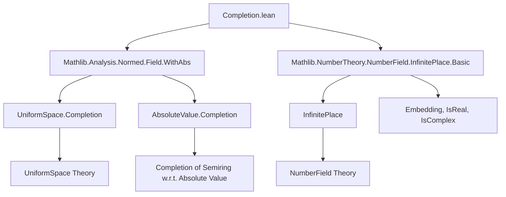

**Technical Brief: Completion.lean — Completion of a Number Field at an Infinite Place**

---

### 1. **Key Definitions & Theorems**

| Name | Type / Signature | Purpose |
|------|------------------|---------|
| `Completion` | `v.Completion := v.1.Completion` | Completion of `K` w.r.t. the absolute value induced by infinite place `v`. |
| `extensionEmbedding` | `v.Completion →+* ℂ` | Extension of the complex embedding `v.embedding : K →+* ℂ` to the completion. |
| `extensionEmbeddingOfIsReal` | `IsReal v → v.Completion →+* ℝ` | Extension of the real embedding `v.embedding_of_isReal` to the completion. |
| `ringEquivRealOfIsReal` | `IsReal v → v.Completion ≃+* ℝ` | Ring isomorphism between the completion and `ℝ` for real places. |
| `ringEquivComplexOfIsComplex` | `IsComplex v → v.Completion ≃+* ℂ` | Ring isomorphism between the completion and `ℂ` for complex places. |
| `isometry_extensionEmbedding` | `Isometry (extensionEmbedding v)` | The extended embedding is an isometry. |
| `isometry_extensionEmbeddingOfIsReal` | `IsReal v → Isometry (extensionEmbeddingOfIsReal hv)` | Real embedding extension is an isometry. |
| `bijective_extensionEmbedding_of_isComplex` | `IsComplex v → Function.Bijective (extensionEmbedding v)` | Surjectivity + injectivity of complex embedding extension. |
| `bijective_extensionEmbeddingOfIsReal` | `IsReal v → Function.Bijective (extensionEmbeddingOfIsReal hv)` | Bijectivity of real embedding extension. |
| `locallyCompactSpace` | `LocallyCompactSpace (v.Completion)` | Completion is locally compact (key for Haar measure, Pontryagin duality). |
| `isClosed_image_extensionEmbedding` | `IsClosed (Set.range (extensionEmbedding v))` | Image of the extended embedding is closed (used in surjectivity proofs). |
| `norm_coe` | `‖(x : v.Completion)‖ = v (WithAbs.equiv v.1 x)` | Norm of a lifted element equals the absolute value. |
| `Rat.norm_infinitePlace_completion` | `‖(x : v.Completion)‖ = |x|` | Norm on `ℚ`-completion matches usual absolute value. |

---

### 2. **Naming Conventions**

- **Prefixes**:
  - `extensionEmbedding*`: extensions of embeddings to completions.
  - `ringEquiv*`: ring isomorphisms derived from bijective embeddings.
  - `isometryEquiv*`: isometric ring isomorphisms.
  - `isReal`, `isComplex`: predicates on infinite places.
- **Suffixes**:
  - `OfIsReal`, `OfIsComplex`: conditional versions depending on the nature of the place.
  - `equiv`: for isomorphisms (e.g., `ringEquivRealOfIsReal`).
  - `isometry*`: for isometric maps or equivalences.
- **Type synonyms**:
  - `WithAbs v.1`: semiring with absolute value `v.1`, used to guide instance inference.
  - `Completion`: defined as `v.1.Completion`, i.e., completion w.r.t. the absolute value.

---

### 3. **Tactic Stack**

- `simp` / `simp_rw`: for rewriting using definitional equalities and lemmas like `extensionEmbedding_coe`.
- `rw [← ...]`: to rewrite using ring homomorphism properties or field range characterizations.
- `simpa using ...`: to simplify goals using a hypothesis (e.g., `norm_embedding_eq`).
- `contrapose!`: used in `subfield_ne_real_of_isComplex` to flip implication and simplify.
- `ext x`: extensionality for ring homomorphisms or set equality.
- `resolve_left`, `isClosed_image_*`: for closed-subfield arguments in `ℂ`/`ℝ`.
- `letI := ...; inferInstanceAs`: to introduce and infer structure instances (e.g., `NormedField`).
- `aesop`: likely used implicitly in `norm_coe`, `Rat.norm_infinitePlace_completion`, etc., though not explicit.

---

### 4. **Proof Logic**

- **Structure**:  
  1. **Setup**: Use `WithAbs` to encode absolute value-dependent structure, enabling correct instance inference.
  2. **Isometry**: Prove that the original embedding is an isometry (`isometry_embedding`, `isometry_embedding_of_isReal`) using `AddMonoidHomClass.isometry_of_norm`.
  3. **Extension**: Apply `UniformSpace.Completion.extensionHom` to extend the isometric embedding to the completion.
  4. **Properties**: Derive properties (isometry, closed range, bijectivity) from the original embedding’s properties via lemmas like `completion_extension`, `isClosedEmbedding.isClosed_range`.
  5. **Surjectivity**: For complex places, use `Complex.subfield_eq_of_closed` + `subfield_ne_real_of_isComplex` to show image = `ℂ`. For real places, use `Real.subfield_eq_of_closed`.
  6. **Isomorphisms**: Construct ring/ isometric isomorphisms via `RingEquiv.ofBijective`, `isometryEquivOfBijective`-style constructors.

- **Induction/Case Analysis**: Not used directly; relies on case distinction on `IsReal v` / `IsComplex v`.

---

### 5. **Imports & Dependencies**

- **Core Imports**:
  - `Mathlib.Analysis.Normed.Field.WithAbs`: provides `WithAbs`, `AbsoluteValue.Completion`, and basic theory.
  - `Mathlib.NumberTheory.NumberField.InfinitePlace.Basic`: defines infinite places, embeddings, `IsReal`, `IsComplex`.

- **Key Theories Leveraged**:
  - `UniformSpace.Completion`: for constructing the completion and extension of uniformly continuous maps.
  - `NormedField` and `NormedSpace`: for normed field structure on completion.
  - `Real.subfield_eq_of_closed`, `Complex.subfield_eq_of_closed`: characterization of `ℝ`, `ℂ` as maximal closed subfields.

---

### 6. **Mermaid Diagrams**

#### **Dependency Graph (Module-Level)**



#### **Overview of Theory Flow**

```mermaid
flowchart LR
  K[Field K] --> v[InfinitePlace K]
  v --> abs[Absolute Value v.1]
  abs --> WithAbs[WithAbs v.1]
  WithAbs --> Completion[UniformSpace.Completion]
  Completion --> ext[extensionEmbedding : v.Completion →+* ℂ]
  ext --> isom[ringEquivComplexOfIsComplex / ringEquivRealOfIsReal]
  v -->|IsReal?| real[extensionEmbeddingOfIsReal : →+* ℝ]
  v -->|IsComplex?| comp[extensionEmbedding : →+* ℂ]
  real -->|surjective| ≃R[≃+* ℝ]
  comp -->|surjective| ≃C[≃+* ℂ]
  ≃R & ≃C --> locallyCompact[LocallyCompactSpace]
```

---

### 7. **Summary**

This file formalizes the **completion of a number field at an infinite place**, leveraging:
- `WithAbs` to encode absolute-value-dependent structures,
- `AbsoluteValue.Completion` to construct the completed space,
- Uniform space theory to extend embeddings,
- Real/complex subfield rigidity to prove surjectivity.

It culminates in:
- Ring (and isometric) isomorphisms `v.Completion ≃+* ℝ` or `ℂ`,
- Local compactness of the completion,
- Isometric embeddings into `ℝ`/`ℂ`.

This is foundational for adeles, ideles, and local class field theory in Lean.

--- 

Let me know if you'd like a **dependency graph of definitions** or a **proof sketch for a specific theorem** (e.g., `surjective_extensionEmbedding_of_isComplex`).
