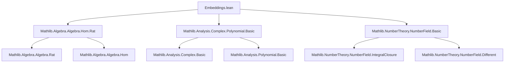

**Technical Brief: `Embeddings.lean` — Number Field Embeddings in Lean 4**

---

### 1. **Key Definitions & Theorems**

| Name | Type / Signature | Purpose |
|------|------------------|---------|
| `NumberField.Embeddings.card` | `Fintype.card (K →+* A) = finrank ℚ K` | Counts embeddings of a number field $K$ into an algebraically closed field $A$ of char. 0; equals $\mathbb{Q}$-dimension of $K$. |
| `NumberField.Embeddings.range_eval_eq_rootSet_minpoly` | `range (φ ↦ φ x) = (minpoly ℚ x).rootSet A` | Images of $x \in K$ under all embeddings into $A$ are precisely the roots of its minimal polynomial over $\mathbb{Q}$ in $A$. |
| `NumberField.Embeddings.pow_eq_one_of_norm_le_one` (Kronecker’s Theorem) | `x ≠ 0 ∧ IsIntegral ℤ x ∧ ∀ φ, ‖φ x‖ ≤ 1 ⇒ ∃ n > 0, x^n = 1` | Nonzero algebraic integer with all conjugates in closed unit disk is a root of unity. |
| `NumberField.Embeddings.pow_eq_one_of_norm_eq_one` | `IsIntegral ℤ x ∧ ∀ φ, ‖φ x‖ = 1 ⇒ ∃ n > 0, x^n = 1` | Algebraic integer with all conjugates on unit circle is a root of unity. |
| `NumberField.Embeddings.finite_of_norm_le` | `{x : K | IsIntegral ℤ x ∧ ∀ φ, ‖φ x‖ ≤ B}.Finite` | Finiteness of algebraic integers in $K$ with bounded conjugate norms. |
| `NumberField.place` | `K →+* A ⇒ AbsoluteValue K ℝ` | Embedding into normed field induces an absolute value (place) on $K$. |
| `NumberField.ComplexEmbedding.lift` | `k →+* ℂ ⇒ K →+* ℂ` (for algebraic extension $K/k$) | Lifts complex embeddings along algebraic extensions using algebraic closure of $\mathbb{C}$. |
| `NumberField.ComplexEmbedding.conjugate` | `K →+* ℂ ⇒ K →+* ℂ` | Complex conjugation on embeddings: $\overline{\varphi}(x) = \overline{\varphi(x)}$. |
| `NumberField.ComplexEmbedding.IsReal` | `Prop` | Embedding is *real* if invariant under conjugation. |
| `NumberField.ComplexEmbedding.IsReal.embedding` | `IsReal φ ⇒ K →+* ℝ` | Real embedding factors through $\mathbb{R}$. |
| `NumberField.ComplexEmbedding.IsConj` | `Prop` | $\sigma \in \mathrm{Gal}(K/k)$ is the conjugation under $\varphi$ iff $\varphi \circ \sigma = \overline{\varphi}$. |
| `NumberField.ComplexEmbedding.IsMixed`, `IsUnmixed` | `Prop` | Distinguish embeddings of an extension $L/K$ based on reality of restriction to $K$. |

---

### 2. **Naming Conventions**

- **Prefixes**:
  - `is_`: predicates (e.g., `IsReal`, `IsMixed`, `IsUnmixed`, `IsConj`)
  - `pow_eq_one_of_...`: theorems about roots of unity under norm conditions
  - `range_eval_eq_rootSet_minpoly`: describes image of evaluation map
  - `finite_of_norm_le`: finiteness under norm bounds
- **Suffixes**:
  - `_comp`: composition with algebra maps (e.g., `lift_comp_algebraMap`)
  - `_apply`: evaluation at element (e.g., `place_apply`, `conjugate_coe_eq`)
  - `_iff`: equivalence characterizations (e.g., `isReal_iff`, `isConj_one_iff`)
- **Structure**:
  - `NumberField.Embeddings.*`, `NumberField.ComplexEmbedding.*`: modular organization by context.

---

### 3. **Tactic Stack**

Frequently used tactics in proofs:

| Tactic | Usage |
|--------|-------|
| `rw` / `simp_rw` | Rewriting definitions, especially for `minpoly`, `norm`, `comp`, `conjugate` |
| `aesop` | Automated reasoning for propositional logic + simp lemmas (e.g., `isReal_iff`, `isUnmixed.isReal_iff_isReal`) |
| `ext` / `ext1` | Extensionality for functions, ring homs, absolute values |
| `convert` | Matching goals up to definitional equality (e.g., `range_eval_eq_rootSet_minpoly`) |
| `obtain ⟨a, -, b, -, habne, h⟩` | Extracting witnesses from `Set.Infinite.exists_ne_map_eq_of_mapsTo` |
| `wlog` | Without loss of generality (e.g., ordering $a > b$ in Kronecker proof) |
| `simp_all` | Simplifying all hypotheses + goal (e.g., in `conjugate_comp_ne`) |
| `exact`, `refine`, `apply` | Direct proof steps, especially with `IsAlgClosed.lift`, `AlgHom.restrictNormal'` |
| `ring`, `linarith` | Arithmetic manipulations (norm bounds, coefficients) |
| `convert` + `using 1` | Adjusting proof obligations in `range_eval_eq_rootSet_minpoly` |

---

### 4. **Proof Logic**

- **Structure**:
  - **Fintype & Cardinality**: Use algebraic closure and algebra homs to reduce to `AlgHom.card`.
  - **Roots ↔ Embeddings**: Show inclusion both ways via `range_eval_eq_rootSet_minpoly`, using `IsAlgClosed.splits` and separability.
  - **Kronecker-type theorems**:
    - Use `finite_of_norm_le` to bound set of candidates.
    - Apply infinitary pigeonhole (`Set.Infinite.exists_ne_map_eq_of_mapsTo`) to get $x^a = x^b$, deduce $x^{a-b} = 1$.
    - Handle zero case separately (e.g., `norm_zero` contradiction).
  - **Conjugation & Galois action**:
    - Use `AlgEquiv.ext`, `RingHom.congr_fun`, `injective` to reason about equality of embeddings.
    - `IsConj` links Galois group elements to complex conjugation.
    - `IsMixed`/`IsUnmixed` mirror local behavior (ramified/unramified places) in embedding language.

- **Common pattern**:
  > *Induction or finiteness + pigeonhole + injectivity + norm estimates*  
  > e.g., Kronecker: bounded algebraic integers ⇒ finite set ⇒ repetition in powers ⇒ root of unity.

---

### 5. **Imports & Dependencies**

| Module | Role |
|--------|------|
| `Mathlib.Algebra.Algebra.Hom.Rat` | Homomorphisms over $\mathbb{Q}$, `AlgHom`, `RingHom.equivRatAlgHom` |
| `Mathlib.Analysis.Complex.Polynomial.Basic` | Complex numbers, polynomials, roots, `minpoly`, `rootSet` |
| `Mathlib.NumberTheory.NumberField.Basic` | `NumberField`, `IsIntegral`, `finrank`, `minpoly`, `IsSeparable`, `IsAlgClosed.lift` |
| `Mathlib.Module` | `finrank`, `Module`-theoretic facts |
| `Mathlib.Set` | `Finite`, `rootSet`, `Icc`, `mem_iUnion`, `finite_Icc` |
| `Mathlib.NormedField.Basic` | Normed fields, `norm`, `normed_algebra`, `AbsoluteValue` |
| `Mathlib.Algebra.Star` | `star`, `IsSelfAdjoint`, complex conjugation |

---

### 6. **Mermaid Diagrams**

#### **Dependency Graph (Top-Level Modules)**



#### **Overview of Theory Flow**

```mermaid
flowchart LR
  subgraph Setup
    NF[NumberField K] --> AlgHom[K →+* A]
    AC[IsAlgClosed A] --> AlgHom
    Fin[Fintype K →+* A] --> Card[card = finrank ℚ K]
  end

  subgraph Roots
    x[K] --> minpoly[minpoly ℚ x]
    AlgHom --> eval[φ x]
    eval --> roots[roots of minpoly]
    roots --> Eq[range_eval_eq_rootSet_minpoly]
  end

  subgraph Norms
    Norm[NormedField A] --> Bdd[coeff_bdd_of_norm_le]
    Bdd --> Finite[finite_of_norm_le]
    Finite --> Kronecker[pow_eq_one_of_norm_le_one]
    Kronecker --> RootUnity[roots of unity]
  end

  subgraph Complex
    ℂ[ℂ] --> Lift[Lift k →+* ℂ to K →+* ℂ]
    Conj[conjugate] --> IsReal[IsReal φ]
    IsReal --> Embed[→+* ℝ]
    Gal[Gal(K/k)] --> IsConj[IsConj φ σ]
    IsConj --> Mixed[IsMixed / IsUnmixed]
  end
```

---

### 7. **Summary**

This file formalizes foundational results on embeddings of number fields, especially into $\mathbb{C}$. It bridges algebra (minimal polynomials, integrality), analysis (norms, boundedness), and topology (places, absolute values), with key applications like Kronecker’s theorem. The structure reflects a modular, theorem-first approach, with heavy use of `IsAlgClosed.lift`, `minpoly`, and Galois-theoretic reasoning. The naming and tactic usage are consistent with Mathlib conventions, emphasizing clarity and reuse.
