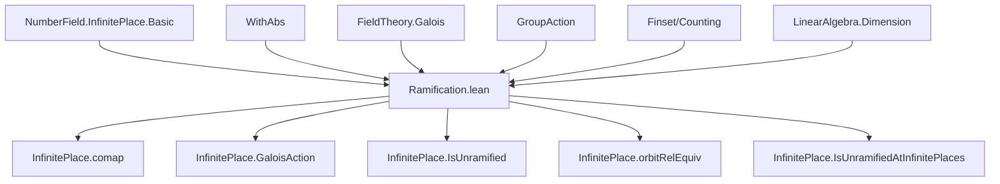

### Technical Brief: Ramification of Infinite Places in Number Fields (Lean 4)

---

#### **1. Key Definitions & Theorems**

| Name | Type / Signature | Purpose |
|------|------------------|---------|
| `comap` | `InfinitePlace K → (k →+* K) → InfinitePlace k` | Restricts an infinite place along a ring homomorphism (embedding). |
| `IsUnramified` | `InfinitePlace K → Prop` | An infinite place `w` is *unramified* if `mult (w.comap algebraMap) = mult w`. |
| `IsRamified` | `¬ IsUnramified` | Ramified = not unramified. |
| `IsUnramifiedIn` | `InfinitePlace k → Prop` | A base infinite place `w` is *unramified in* `K/k` if *all* places `v` over `w` are unramified. |
| `IsUnramifiedAtInfinitePlaces` | `Prop` | The extension `K/k` is unramified at infinite places if *every* infinite place of `K` is unramified over `k`. |
| `orbitRelEquiv` | `Quotient (orbitRel) ≃ InfinitePlace k` | Bijection between Galois orbits of infinite places in `K` and infinite places in `k`, under `IsGalois k K`. |
| `not_isUnramified_iff` | `¬ IsUnramified k w ↔ IsComplex w ∧ IsReal (w.comap algebraMap)` | Characterizes ramified infinite places: complex places lying over real ones. |
| `isRamified_iff` | `w.IsRamified k ↔ w.IsComplex ∧ (w.comap algebraMap).IsReal` | Equivalent formulation of ramification. |
| `isUnramified_mk_iff_isUnmixed` | `(mk φ).IsUnramified k ↔ IsUnmixed k φ` | Links unramifiedness of a place defined via embedding `φ` to the `IsUnmixed` property of `φ`. |
| `isRamified_mk_iff_isMixed` | `(mk φ).IsRamified k ↔ IsMixed k φ` | Links ramifiedness to `IsMixed` (i.e., neither real nor purely complex over `k`). |
| `isUnramified_iff_stabilizer_eq_bot` | `IsUnramified k w ↔ Stab w = ⊥` | Under `IsGalois`, unramified ⇔ trivial stabilizer in Galois group. |
| `isUnramified_iff_card_stabilizer_eq_one` | `IsUnramified k w ↔ Nat.card (Stab w) = 1` | Unramified ⇔ stabilizer has size 1. |
| `not_isUnramified_iff_card_stabilizer_eq_two` | `¬ IsUnramified k w ↔ Nat.card (Stab w) = 2` | Ramified ⇔ stabilizer has size 2 (only possible sizes are 1 or 2). |
| `card_isUnramified` | `#{w : InfinitePlace K | w.IsUnramified k} = #{w : InfinitePlace k | w.IsUnramifiedIn K} * finrank k K` | Counts unramified places in terms of base and degree. |
| `card_eq_card_isUnramifiedIn` | `#InfinitePlace K = #UnramifiedIn * [K:k] + #UnramifiedInᶜ * ([K:k]/2)` | Global count of infinite places decomposed by ramification behavior. |
| `IsUnramifiedAtInfinitePlaces.id` | Instance | Trivial extension `k/k` is unramified at infinite places. |
| `IsUnramifiedAtInfinitePlaces.trans` | Instance | Transitivity of unramifiedness in towers. |
| `IsUnramifiedAtInfinitePlaces_of_odd_card_aut` | `[IsGalois k K] → Odd (Nat.card Gal(K/k)) → IsUnramifiedAtInfinitePlaces k K` | Odd Galois group order ⇒ unramified at all infinite places. |

---

#### **2. Naming Conventions**

- **Prefixes**:
  - `is_`: Predicate definitions (`isUnramified`, `isRamified`, `isReal`, `isComplex`).
  - `comap_`: Properties of restriction (`comap_id`, `comap_comp`, `comap_apply`, `comap_surjective`).
  - `smul_`: Galois action properties (`smul_eq_comap`, `smul_apply`, `smul_mk`).
  - `mem_`: Membership in stabilizer/orbit (`mem_orbit_iff`, `mem_stabilizer_mk_iff`).
  - `card_`: Cardinality lemmas (`card_mono`, `card_stabilizer`, `card_isUnramified`, etc.).
  - `even_`, `odd_`: Parity results (`even_card_aut_of_not_isUnramified`, `IsUnramifiedAtInfinitePlaces_of_odd_card_aut`).

- **Suffixes**:
  - `_iff`: Biconditional characterizations (`not_isUnramified_iff`, `isUnramified_iff`, `isRamified_iff`, `isUnramified_mk_iff_isMixed`).
  - `_le`: Inequalities (`mult_comap_le`).
  - `_comp`: Composition-related (`comap_comp`, `embedding_comp_eq_or_conjugate_embedding_comp_eq`).
  - `_of_`: Implications (`isReal_of_isReal_over`, `isComplex_of_isComplex_under`).

---

#### **3. Tactic Stack**

Frequently used tactics in proofs:

| Tactic | Usage |
|--------|-------|
| `simp` / `simp_rw` | Simplification of `mk`, `comap`, `smul`, `embedding`, `isReal`, `isComplex`. |
| `rw` / `congr` / `ext` | Rewriting definitions, extensionality for functions/structures. |
| `split_ifs` | Case analysis on `if ... then ... else ...` in multiplicity definitions. |
| `aesop` | Automated reasoning for first-order logic + algebraic simplifications. |
| `decide` | Closing trivial goals (e.g., arithmetic, `IsEmpty`, `Nonempty`). |
| `grind` | Goal-driven simplification (used in `exists_isConj_of_isRamified`). |
| `rcases` / `cases` | Decomposing `Or`, `Exists`, `Quotient`, `Finset` elements. |
| `obtain ⟨...⟩` | Extracting witnesses from `Exists` or `Quotient.mk`. |
| `trans` + `exact` | Chaining inequalities/equalities (e.g., `mult_comap_le`). |
| `convert` | Matching goals up to definitional equality (e.g., `even_finrank_of_not_isUnramified`). |
| `by_cases` | Splitting on decidable propositions (e.g., `Finite`, `IsGalois`). |

---

#### **4. Proof Logic**

- **Structure of proofs**:
  - **Induction/Case analysis** on `IsReal` / `IsComplex` via `split_ifs` and `embedding_mk_eq`.
  - **Galois-theoretic lifting**: Use `exists_smul_eq_of_comap_eq` to lift equality of comaps to Galois orbit.
  - **Stabilizer analysis**: Use `mem_stabilizer_mk_iff` to reduce to `IsConj` conditions; then apply `isUnramified_mk_iff_isMixed`.
  - **Cardinality arguments**: Use orbit-stabilizer (`MulAction.card_orbit_mul_card_stabilizer_eq_card_group`) and parity lemmas (`even_nat_card_aut_of_not_isUnramified`).
  - **Counting arguments**: Decompose `InfinitePlace K` into fibers over `InfinitePlace k` via `Finset.card_eq_sum_card_fiberwise`.

- **Typical flow**:
  1. Unfold definitions (`IsUnramified`, `comap`, `mult`).
  2. Reduce to statements about embeddings (`mk_embedding`, `embedding_mk_eq`).
  3. Use Galois action (`smul`, `orbit`, `stabilizer`) to relate places.
  4. Apply parity or orbit-stabilizer to conclude.

---

#### **5. Imports & Dependencies**

| Module | Purpose |
|--------|---------|
| `Mathlib.Analysis.Normed.Ring.WithAbs` | Absolute values, multiplicity, infinite places as equivalence classes of absolute values. |
| `Mathlib.NumberTheory.NumberField.InfinitePlace.Basic` | Core definitions: `InfinitePlace`, `mk`, `embedding`, `isReal`, `isComplex`, `mult`. |
| `Mathlib.GroupTheory.GroupAction` | Galois group action, orbits, stabilizers. |
| `Mathlib.FieldTheory.Galois` | `IsGalois`, `Gal(K/k)`, `ComplexEmbedding.lift`, `exists_comp_symm_eq_of_comp_eq`. |
| `Mathlib.LinearAlgebra.Dimension.Finite` | `finrank`, `Module.Finite`, `IsScalarTower`. |
| `Mathlib.Data.Fintype.Card` | Cardinal arithmetic, `Nat.card`, `Even`, `Odd`. |

---

#### **6. Mermaid Diagrams**

##### **Dependency Graph (High-Level)**



##### **Overview of Theory Flow**

```mermaid
flowchart LR
  A[InfinitePlace k / K] --> B[comap: restriction along algebraMap]
  B --> C[Stabilizer in Gal(K/k)]
  C --> D[Orbit-Stabilizer]
  D --> E[Cardinality formulas]
  C --> F[IsConj(φ, σ)]
  F --> G[Unramified ⇔ trivial stabilizer]
  G --> H[Odd group order ⇒ unramified]
  E --> I[Counting unramified/ramified places]
  I --> J[Global formula: #InfinitePlace K = ...]
```

##### **Ramification Classification**

```mermaid
graph LR
  A[w : InfinitePlace K] -->|IsReal?| B[Yes]
  A -->|IsComplex?| C[No]
  B --> D[w.comap algebraMap is Real]
  C --> E[w.comap algebraMap is Real?]
  E -->|Yes| F[w is Ramified]
  E -->|No| G[w is Unramified]
  F --> H[Stab(w) = {1, σ}, |Stab| = 2]
  G --> I[Stab(w) = {1}, |Stab| = 1]
```

---

#### **7. Summary**

This file formalizes the *local* ramification theory of infinite places in number field extensions. It establishes:

- A clean Galois-theoretic characterization of ramification (via stabilizers and `IsConj`).
- A precise counting formula for unramified/ramified places in terms of field degree.
- A dichotomy: infinite places are either unramified (real or complex over complex) or ramified (complex over real), with stabilizer size 1 or 2.
- Applications: odd-degree Galois extensions are always unramified at infinite places.

The formalization leverages Lean’s `InfinitePlace` as equivalence classes of absolute values, and connects them to complex embeddings via `mk`, `embedding`, and `isReal`/`isComplex`. The interplay between algebraic structure (Galois group), analytic structure (embeddings into ℂ), and combinatorial structure (orbits, stabilizers) is central to the theory.
