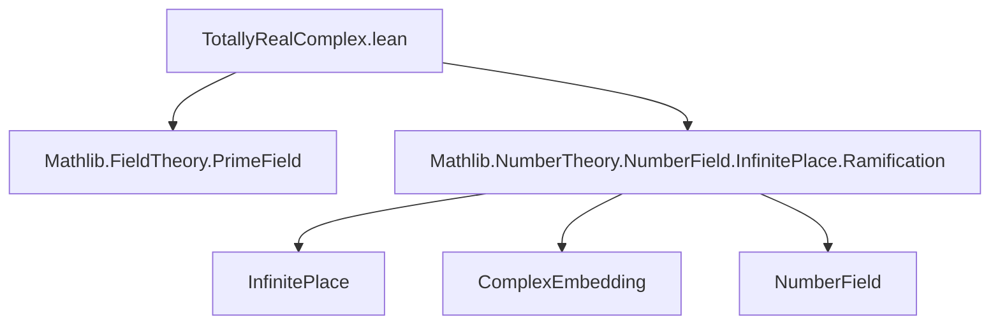
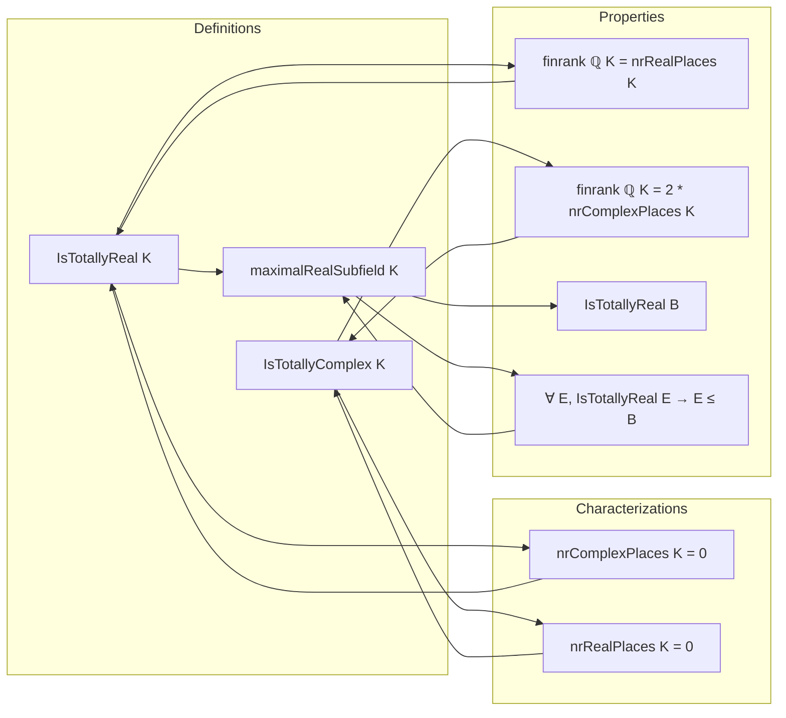

**Technical Brief: `TotallyRealComplex.lean`**

---

### 1. **Key Definitions & Theorems**

| Name | Type / Signature | Purpose |
|------|------------------|---------|
| `IsTotallyReal K` | `class (K : Type*) [Field K]` | Defines $K$ as *totally real*: all infinite places are real (i.e., every ring homomorphism $K \to \mathbb{C}$ has image in $\mathbb{R}$). |
| `IsTotallyComplex K` | `class (K : Type*) [Field K]` | Defines $K$ as *totally complex*: all infinite places are complex (i.e., no real embeddings). |
| `nrComplexPlaces K` | `ℕ` | Number of complex infinite places of $K$. |
| `nrRealPlaces K` | `ℕ` | Number of real infinite places of $K$. |
| `mult w` | `ℕ` | Multiplicity of an infinite place $w$ (1 for real, 2 for complex). |
| `maximalRealSubfield K` | `Subfield K` | Largest subfield of $K$ that is totally real: $\{x \in K \mid \forall \varphi : K \hookrightarrow \mathbb{C},\ \overline{\varphi(x)} = \varphi(x)\}$. |
| `nrComplexPlaces_eq_zero_iff` | `nrComplexPlaces K = 0 ↔ IsTotallyReal K` | Characterizes totally real fields via vanishing complex places. |
| `nrRealPlaces_eq_zero_iff` | `nrRealPlaces K = 0 ↔ IsTotallyComplex K` | Characterizes totally complex fields via vanishing real places. |
| `IsTotallyReal.finrank` | `finrank ℚ K = nrRealPlaces K` | For totally real $K$, degree over $\mathbb{Q}$ equals number of real places. |
| `IsTotallyComplex.finrank` | `finrank ℚ K = 2 * nrComplexPlaces K` | For totally complex $K$, degree over $\mathbb{Q}$ is twice number of complex places. |
| `isTotallyReal_iff_le_maximalRealSubfield` | `IsTotallyReal E ↔ E ≤ maximalRealSubfield K` | Universal property of the maximal real subfield. |
| `maximalRealSubfield_eq_top_iff_isTotallyReal` | `maximalRealSubfield K = ⊤ ↔ IsTotallyReal K` | $K$ is totally real iff it equals its maximal real subfield. |

---

### 2. **Naming Conventions**

- **Class names**: `IsTotallyReal`, `IsTotallyComplex` — predicate-style naming (`is_` prefix).
- **Theorems**:
  - `nr*Places_eq_zero_iff`: equivalence between vanishing count and totality condition.
  - `*mult_eq`: simplifies multiplicity under totality assumptions (`1` for real, `2` for complex).
  - `le_*`: inclusion lemmas (e.g., `le_maximalRealSubfield`).
  - `*_iff_*`: biconditional characterizations.
  - `of_*`: structural propagation (e.g., `ofRingEquiv`, `of_algebra`).
- **Definitions**:
  - `maximalRealSubfield`: noun phrase, no prefix/suffix beyond descriptive.
  - `mk_iff`: used in class declaration to generate `mk_iff` lemmas.

---

### 3. **Tactic Stack**

Frequent tactics used in proofs:

| Tactic | Role |
|--------|------|
| `simp` | Simplify using `mk_iff`, `isReal_mk_iff`, `isComplex_iff`, `mem_maximalRealSubfield_iff`, etc. |
| `rw` | Rewrite using equivalences (e.g., `nrComplexPlaces_eq_zero_iff`) or definitions. |
| `ext` | Extensionality for functions/sets (e.g., proving equality of ring homs or sets). |
| `exact`, `intro`, `apply` | Basic proof structure. |
| `cases` / `obtain` | Eliminate existential quantifiers (e.g., `obtain ⟨W, rfl⟩`). |
| `ring` / `linarith` | Arithmetic simplifications (e.g., in `finrank` proofs). |
| `infer_instance` | Solve typeclass goals (e.g., algebraicity assumptions). |
| `top_unique` | Prove equality to top element via inclusion. |
| `lift_algebraMap_apply` | Lift algebra maps along field extensions. |

---

### 4. **Proof Logic**

- **Induction**: Not used (no inductive types involved).
- **Case analysis**: On `w : InfinitePlace K` (e.g., `isReal w` or `isComplex w`).
- **Equational reasoning**: Heavy use of `mk_iff`-generated equivalences to switch between predicate and embedding conditions.
- **Universal property arguments**: For `maximalRealSubfield`, proofs rely on:
  - Showing any totally real subfield embeds into it (`le_maximalRealSubfield`).
  - Showing it is itself totally real (`isTotallyReal_maximalRealSubfield`).
- **Algebraic propagation**: Use of `Algebra.IsAlgebraic.tower_*` and `of_algebra` to descend/ascend totality along algebra maps.
- **Set-theoretic reasoning**: For `maximalRealSubfield`, verify subfield axioms via `mem_maximalRealSubfield_iff`.

---

### 5. **Imports & Dependencies**

| Import | Purpose |
|--------|---------|
| `Mathlib.FieldTheory.PrimeField` | Basic field theory, prime subfields, characteristic. |
| `Mathlib.NumberTheory.NumberField.InfinitePlace.Ramification` | Infinite places, real/complex classification, multiplicity, ramification theory. |

**Core dependencies**:
- `InfinitePlace`, `ComplexEmbedding`, `Subfield`, `IntermediateField`
- `nrRealPlaces`, `nrComplexPlaces`, `mult`, `isReal`, `isComplex`
- `Algebra.IsAlgebraic`, `IsScalarTower`

---

### 6. **Mermaid Diagrams**

#### **Dependency Graph (Module-Level)**

#### **Conceptual Overview**

#### **Theory Context**

- **Domain**: Algebraic number theory.
- **Scope**: Classification of number fields by behavior of infinite places.
- **Complements**:
  - `Ramification.lean`: finite places (primes, decomposition groups).
  - `InfinitePlace.lean`: foundational infrastructure for places.
  - `NumberField.lean`: general number field theory (degree, embeddings, etc.).

---

**Summary**: This module formalizes the dichotomy between *totally real* and *totally complex* number fields via infinite places, introduces the *maximal real subfield* as a universal construction, and connects cardinalities of place sets to field degrees. The proofs rely heavily on equivalence principles (`mk_iff`), algebraic propagation, and universal properties.
