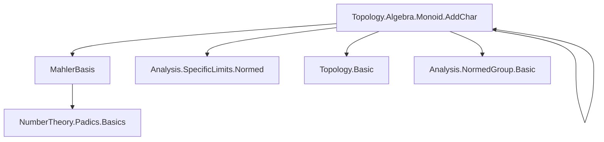

### Technical Brief: `AddChar.lean`

---

#### **1. Key Definitions & Theorems**

| Name | Type / Signature | Purpose |
|------|------------------|---------|
| `addChar_of_value_at_one` | `R → (Tendsto (r ^ ·) atTop (𝓝 0)) → AddChar ℤ_[p] R` | Constructs a continuous additive character on `ℤ_[p]` mapping `1 ↦ 1 + r`, using Mahler series. |
| `continuousAddCharEquiv` | `{κ : AddChar ℤ_[p] R // Continuous κ} ≃ {r : R // Tendsto (r ^ ·) atTop (𝓝 0)}` | Bijection between continuous additive characters and topologically nilpotent elements (i.e., `r^n → 0`). |
| `continuousAddCharEquiv_of_norm_mul` | `{κ : AddChar ℤ_[p] R // Continuous κ} ≃ {r : R // ‖r‖ < 1}` | Refinement of the above when `R` has strictly multiplicative norm (`NormMulClass R`). |
| `AddChar.tendsto_eval_one_sub_pow` | `Continuous κ → Tendsto (fun n ↦ (κ 1 - 1) ^ n) atTop (𝓝 0)` | Shows that for any continuous additive character `κ`, the element `κ 1 - 1` is topologically nilpotent. |
| `eq_addChar_of_value_at_one` | `κ 1 = 1 + r ⇒ κ = addChar_of_value_at_one r hr` | Uniqueness: any continuous additive character is determined by its value at `1`. |
| `addChar_of_value_at_one_def` | `addChar_of_value_at_one r hr 1 = 1 + r` | Verifies that the constructed character sends `1` to `1 + r`. |

---

#### **2. Naming Conventions**

- **Prefixes**:
  - `addChar_`: for constructions involving additive characters.
  - `continuousAddChar_`: for equivalences involving *continuous* additive characters.
  - `coe_`, `fun_prop`, `map_`: for coercion and continuity properties.
- **Suffixes**:
  - `_of_value_at_one`: construction based on prescribed value at `1`.
  - `_def`: definition lemmas (e.g., `addChar_of_value_at_one_def`).
  - `_apply`, `_symm_apply`: lemmas about application and inverse of equivalences.
- **Variables**:
  - `κ` for additive characters.
  - `r` for the “deviation” element (`κ 1 - 1`).
  - `hr`, `hκ` for hypotheses about continuity or nilpotence.

---

#### **3. Tactic Stack**

Frequently used tactics in this file:

| Tactic | Role |
|--------|------|
| `simp` / `simp_rw` | Simplification using definitional equalities and lemmas like `addChar_of_value_at_one_def`. |
| `rw` | Rewriting using key lemmas (e.g., Mahler series evaluation on naturals). |
| `congr_fun` / `congr_arg` | Proving equality of functions or values. |
| `fun_prop` | Propagating continuity properties (e.g., continuity of Mahler series). |
| `aesop` / `abel` | Automated reasoning for algebraic identities (e.g., `abel` in `left_inv`). |
| `refine` / `exact` | Structured proof construction, especially in `map_add_eq_mul'`. |
| `have` / `set` | Introducing intermediate definitions (e.g., `F := mahlerSeries (r ^ ·)`). |
| `denseRange_natCast.*` | Density arguments to extend identities from `ℕ` to `ℤ_[p]`. |
| `tendsto_*` lemmas | Reasoning about convergence (e.g., `tendsto_pow_atTop_nhds_zero_iff_norm_lt_one`). |

---

#### **4. Proof Logic**

The logical flow follows a standard pattern for constructing and classifying additive characters:

1. **Construction**:
   - Given `r` with `r^n → 0`, define `F := mahlerSeries (r ^ ·)` and show it is an additive character.
   - Use Mahler expansion and binomial identities to verify `F(a + b) = F(a)F(b)`:
     - First prove for `a, b ∈ ℕ` using `add_pow` and Mahler series evaluation.
     - Extend to all `a, b ∈ ℤ_[p]` via density of `ℕ` and continuity.

2. **Uniqueness**:
   - Show any continuous additive character `κ` is determined by `κ 1`, via `eq_addChar_of_value_at_one`.

3. **Equivalence**:
   - Define forward map: `κ ↦ κ 1 - 1`.
   - Define inverse: `r ↦ addChar_of_value_at_one r hr`.
   - Prove `left_inv` and `right_inv` using uniqueness and definition lemmas.

4. **Refinement under `NormMulClass`**:
   - Use `tendsto_pow_atTop_nhds_zero_iff_norm_lt_one` to replace topological nilpotence with `‖r‖ < 1`.

---

#### **5. Imports & Dependencies**

| Module | Role |
|--------|------|
| `Mathlib.NumberTheory.Padics.MahlerBasis` | Provides Mahler series and its properties (e.g., evaluation on `ℕ`, convergence). |
| `Mathlib.Topology.Algebra.Monoid.AddChar` | General theory of additive characters and continuity. |
| `Mathlib.Analysis.SpecificLimits.Normed` | Tools for limits in normed spaces, especially `tendsto_pow_atTop_nhds_zero_iff_norm_lt_one`. |
| `PadicInt` namespace | Local context for `ℤ_[p]`-algebras and their properties. |

---

#### **6. Mermaid Diagrams**

##### **Dependency Graph (Module-Level)**



##### **Overview of File Structure**

```mermaid
flowchart LR
  A[Setup: p prime, R complete ultrametric ℤ_[p]-algebra] --> B[Define addChar_of_value_at_one]
  B --> C[Prove it's an additive character]
  C --> D[Prove continuity]
  D --> E[Show κ ↦ κ 1 - 1 gives inverse]
  E --> F[Define continuousAddCharEquiv]
  F --> G[Refine under NormMulClass]
  G --> H[Define continuousAddCharEquiv_of_norm_mul]
```

##### **Equivalence Diagram**

```mermaid
flowchart LR
  {κ : AddChar ℤ_[p] R // Continuous κ} 
    <->["continuousAddCharEquiv"] 
  {r : R // Tendsto (r ^ ·) atTop (𝓝 0)}

  subgraph NormMulClass
    {r : R // ‖r‖ < 1}
  end

  {r : R // Tendsto (r ^ ·) atTop (𝓝 0)} 
    <->["tendsto_pow_atTop_nhds_zero_iff_norm_lt_one"] 
    {r : R // ‖r‖ < 1}
```

---

#### **7. Summary**

This file establishes a foundational classification of continuous additive characters of the `p`-adic integers `ℤ_[p]` valued in a complete ultrametric normed `ℤ_[p]`-algebra `R`. The key insight is that such characters are in bijection with topologically nilpotent elements (`r^n → 0`), or (under stricter norm conditions) with elements of norm `< 1`. This is a crucial step toward defining the Mahler transform for `p`-adic measures, and sets the stage for further work on topological properties (e.g., homeomorphism status, mentioned in TODO).
