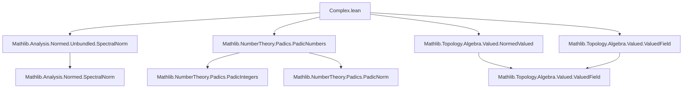

**Technical Brief: `Complex.lean` — The Field of $p$-adic Complex Numbers $\mathbb{C}_p$**

---

### 1. **Key Definitions & Theorems**

| Name | Type / Signature | Purpose |
|------|------------------|---------|
| `PadicAlgCl p` | `Type u` (abbrev) | Fixed algebraic closure of $\mathbb{Q}_p$ |
| `PadicComplex p` | `Type u` (abbrev) | Completion of `PadicAlgCl p` w.r.t. $p$-adic norm — i.e., $\mathbb{C}_p$ |
| `PadicComplexInt p` | `ValuationSubring ℂ_[p]` | Ring of integers $\mathcal{O}_{\mathbb{C}_p} = \{x : \mathbb{C}_p \mid v(x) \le 1\}$ |
| `PadicAlgCl.isAlgebraic` | `Algebra.IsAlgebraic ℚ_[p] (PadicAlgCl p)` | `PadicAlgCl p` is algebraic over $\mathbb{Q}_p$ |
| `PadicAlgCl.normedField` | `NormedField (PadicAlgCl p)` | Endows algebraic closure with spectral norm |
| `PadicAlgCl.isNonarchimedean` | `IsNonarchimedean ‖·‖` | Norm on $\overline{\mathbb{Q}_p}$ is ultrametric |
| `PadicAlgCl.spectralNorm_eq` | `spectralNorm ℚ_[p] (PadicAlgCl p) x = ‖x‖` | Identifies norm with spectral norm |
| `PadicAlgCl.norm_extends` | `‖(x : PadicAlgCl p)‖ = ‖x‖` for $x \in \mathbb{Q}_p$ | Norm extends from base field |
| `PadicAlgCl.valuation_p` | `v(p) = 1/p` | Valuation of $p$ in algebraic closure |
| `PadicAlgCl.RankOne` | `RankOne v` | Valuation has rank 1 (i.e., value group is dense in $\mathbb{R}_{>0}$) |
| `PadicComplex.valued` | `Valued ℂ_[p] ℝ≥0` | $\mathbb{C}_p$ is a valued field |
| `PadicComplex.norm_extends` | `‖(x : ℂ_[p])‖ = ‖x‖` for $x \in \overline{\mathbb{Q}_p}$ | Norm extends from algebraic closure |
| `PadicComplex.isNonarchimedean` | `IsNonarchimedean ‖·‖` | $\mathbb{C}_p$ is ultrametric |
| `PadicComplexInt.integers` | `Valuation.Integers v 𝓞_ℂ_[p]` | $\mathcal{O}_{\mathbb{C}_p}$ is the valuation ring |

---

### 2. **Naming Conventions**

- **Prefixes**:
  - `Padic*`: for constructions over $\mathbb{Q}_p$ or its algebraic closure.
  - `norm_*`, `valuation_*`, `isNonarchimedean`: for properties of the norm/valuation.
  - `coe_*`, `map_*`: for coercion and map properties.
  - `ext_*`: for extension properties (e.g., norm extends from subfield).
- **Suffixes**:
  - `_def`: definitions (e.g., `valuation_def`).
  - `_eq`: equalities involving canonical maps (e.g., `spectralNorm_eq`).
  - `_p`: parameterized by prime $p$, often implicit via `variable (p : ℕ) [Fact (Nat.Prime p)]`.
- **Notation**:
  - `ℂ_[p]` for `PadicComplex p`
  - `𝓞_ℂ_[p]` for `PadicComplexInt p`

---

### 3. **Tactic Stack**

| Tactic | Usage Frequency | Purpose |
|--------|-----------------|---------|
| `rw` | Very High | Rewriting definitions, extension lemmas, coercion lemmas |
| `simp` / `simp only` | High | Simplifying using `[simp]` lemmas (e.g., `norm_extends`, `valuation_p`) |
| `ext` | Medium | Extensionality for functions/valuations |
| `apply UniformSpace.Completion.ext'` | Medium | Proving equalities in completions via density of `coe` |
| `induction_on`, `induction_on₂` | Medium | Induction over completion elements (e.g., `isNonarchimedean`) |
| `exact`, `refine`, `intro` | Medium | Standard proof structure |
| `ring`, `norm_num` | Low | Arithmetic in $\mathbb{R}_{\ge 0}$ or $\mathbb{R}$ |
| `fun_prop`, `continuous_*` | Low | Continuity proofs (e.g., `continuous_const_smul`) |

---

### 4. **Proof Logic**

- **Structure**:
  1. **Algebraic closure** (`PadicAlgCl`):
     - Constructed as `AlgebraicClosure ℚ_[p]`.
     - Equipped with **spectral norm** (from `Mathlib.Analysis.Normed.Unbundled.SpectralNorm`).
     - Prove it’s a **normed field**, **nonarchimedean**, and **valued field**.
     - Show valuation extends from $\mathbb{Q}_p$, compute $v(p) = 1/p$, and prove **rank 1**.
  2. **Completion** (`PadicComplex`):
     - Defined as `UniformSpace.Completion (PadicAlgCl p)`.
     - Induces **valued field** and **normed field** structures via `Valued.toNormedField`.
     - Use **density of coercion** (`coe : PadicAlgCl p → ℂ_[p]`) to extend properties:
       - Norm/valuation extension lemmas via `induction_on` or `ext'`.
       - Nonarchimedean property via continuity and density.
  3. **Ring of integers** (`PadicComplexInt`):
     - Defined as `valuationSubring` of the valuation.
     - Verified to be the integer ring via `Valuation.integer.integers`.

- **Common proof pattern**:
  > *Reduce to the dense subspace (`PadicAlgCl p`) using continuity or induction, then apply known lemmas there.*

---

### 5. **Imports & Dependencies**

| Module | Role |
|--------|------|
| `Mathlib.Analysis.Normed.Unbundled.SpectralNorm` | Provides `spectralNorm`, `spectralNorm.normedField`, `isNonarchimedean_spectralNorm` |
| `Mathlib.NumberTheory.Padics.PadicNumbers` | Defines $\mathbb{Q}_p$, its norm, `Padic.norm_p`, etc. |
| `Mathlib.Topology.Algebra.Valued.NormedValued` | Links normed fields and valued fields (`Valued`, `toNormedField`) |
| `Mathlib.Topology.Algebra.Valued.ValuedField` | General theory of valued fields, rank, valuation subrings |

---

### 6. **Mermaid Diagrams**

#### **Dependency Graph (Module-Level)**



#### **Conceptual Overview of Construction**

```mermaid
flowchart LR
  Qp[ℚ_[p]] -->|algebraic closure| Qp_bar[PadicAlgCl p = \overline{ℚ_[p]}]
  Qp_bar -->|completion| C_p[ℂ_[p] = \widehat{\overline{ℚ_[p]}}
  Qp -->|norm| Qp_norm["p-adic norm"]
  Qp_bar -->|spectral norm| Qp_bar_norm["‖x‖ = sup_n |σ(x)|^{1/n}"]
  C_p -->|induced norm| C_p_norm["nonarchimedean norm"]
  Qp_bar -->|valuation| Qp_bar_val["v(x) = ‖x‖"]
  C_p -->|valuation| C_p_val["v extends to ℂ_[p]"]
  C_p -->|valuation subring| O_Cp["𝓞_ℂ_[p] = {x : v(x) ≤ 1}"]
```

#### **Layered Theory Stack**

```mermaid
graph TB
  subgraph Base
    Qp[ℚ_[p]]
  end

  subgraph Algebraic Closure
    Qp_bar[PadicAlgCl p]
    Qp -- algebraic --> Qp_bar
    Qp_bar -- spectral norm --> norm_bar["‖·‖ on \overline{ℚ_[p]}"]
    norm_bar -- nonarchimedean --> UA["Ultrametric inequality"]
  end

  subgraph Completion
    C_p[ℂ_[p]]
    Qp_bar -- uniform completion --> C_p
    norm_bar -- extends --> norm_Cp["‖·‖ on ℂ_[p]"]
    norm_Cp -- nonarchimedean --> UC["Ultrametric on ℂ_[p]"]
  end

  subgraph Valuation Theory
    v_bar["v : \overline{ℚ_[p]} → ℝ≥0"]
    v_Cp["v : ℂ_[p] → ℝ≥0"]
    v_bar -- extends --> v_Cp
    v_Cp -- rank 1 --> RG["Value group = ℝ_{>0}"]
    RG --> VR["Valuation ring = 𝓞_ℂ_[p]"]
  end
```

---

### 7. **Tags & Keywords**

`p-adic`, `padic`, `completion`, `algebraic closure`, `spectral norm`, `valued field`, `nonarchimedean`, `valuation`, `rank one`, `ring of integers`, `Cauchy completion`, `uniform space completion`

--- 

Let me know if you'd like a formalized dependency graph (e.g., for `leanproject`), or a summary of how this file fits into the broader `Mathlib` theory of $p$-adic Hodge theory.
