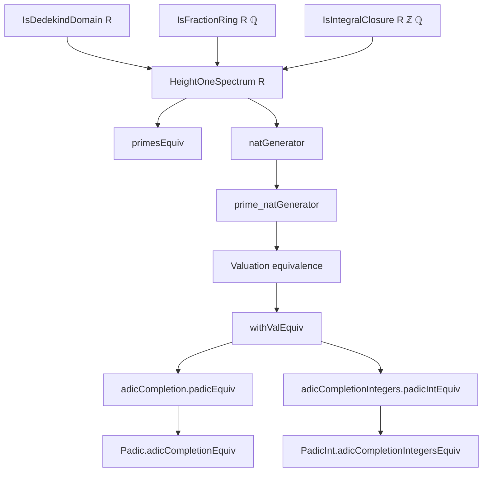

### Technical Brief: `HeightOneSpectrum.lean`

---

#### **1. Key Definitions & Theorems**

| Name | Type / Signature | Purpose |
|------|------------------|---------|
| `Rat.int_algebraMap_injective` | `Function.Injective (algebraMap ℤ R)` | Shows the inclusion $\mathbb{Z} \to R$ is injective under integral closure. |
| `Rat.int_algebraMap_surjective` | `Function.Surjective (algebraMap ℤ R)` | Under fraction field assumption, shows $\mathbb{Z} \to R$ is surjective ⇒ $R \cong \mathbb{Z}$. |
| `Rat.IsIntegralClosure.intEquiv` | `R ≃+* ℤ` | Isomorphism between $R$ and $\mathbb{Z}$ when $R$ is the integral closure of $\mathbb{Z}$ in $\mathbb{Q}$. |
| `natGenerator` | `HeightOneSpectrum R → ℕ` | Maps a height-one prime ideal $v$ to the positive integer generator of its contraction to $\mathbb{Z}$. |
| `span_natGenerator` | `Ideal.span {(natGenerator v)} = v.asIdeal.map intEquiv` | Relates the ideal $v$ to the principal ideal generated by `natGenerator v`. |
| `prime_natGenerator` | `Nat.Prime (natGenerator v)` | Proves the generator is a prime number. |
| `primesEquiv` | `HeightOneSpectrum R ≃ Nat.Primes` | Equivalence between height-one primes of $R$ and prime numbers. |
| `valuation_equiv_padicValuation` | `(v.valuation ℚ).IsEquiv (padicValuation (primesEquiv v))` | Shows $v$-adic valuation is equivalent to the $p$-adic valuation where $p = \text{primesEquiv}(v)$. |
| `withValEquiv` | `WithVal (v.valuation ℚ) ≃ᵤ WithVal (padicValuation (primesEquiv v))` | Uniform space isomorphism induced by valuation equivalence. |
| `adicCompletion.padicEquiv` | `v.adicCompletion ℚ ≃A[ℚ] ℚ_[primesEquiv v]` | Continuous $\mathbb{Q}$-algebra isomorphism between $v$-adic and $p$-adic completions. |
| `adicCompletionIntegers.padicIntEquiv` | `v.adicCompletionIntegers ℚ ≃A[ℤ] ℤ_[primesEquiv v]` | Continuous $\mathbb{Z}$-algebra isomorphism between rings of integers. |
| `Padic.adicCompletionEquiv` | `ℚ_[p] ≃A[ℚ] (primesEquiv.symm p).adicCompletion ℚ` | Inverse direction of the above isomorphism. |
| `PadicInt.adicCompletionIntegersEquiv` | `ℤ_[p] ≃A[ℤ] (primesEquiv.symm p).adicCompletionIntegers ℚ` | Inverse direction for integer rings. |
| `adicCompletionIntegers.coe_padicIntEquiv_apply` | Commutativity of inclusion diagram | Ensures compatibility of integer and full completion isomorphisms. |

---

#### **2. Naming Conventions**

- **Prefixes**:
  - `padicEquiv`, `padicIntEquiv`: Isomorphisms involving $p$-adic completions.
  - `intEquiv`, `natGenerator`: Relating to $\mathbb{Z}$ or $\mathbb{N}$.
  - `coe_...`: Coercion compatibility lemmas (e.g., `coe_padicIntEquiv_apply`).
- **Suffixes**:
  - `_equiv`: Equivalences/isomorphisms (e.g., `primesEquiv`, `adicCompletionEquiv`).
  - `_integers`: Refers to rings of integers (e.g., `adicCompletionIntegers`).
- **Structure**:
  - `Rat.HeightOneSpectrum.*`: Definitions tied to $R$ with $\mathrm{Frac}(R) = \mathbb{Q}$.
  - `Padic.*`, `PadicInt.*`: Definitions indexed by prime $p$.

---

#### **3. Tactic Stack**

Frequently used tactics:
- `simp` / `simp only`: Simplification with local hypotheses and definitions.
- `congr`: To prove equality of structures (e.g., ideals).
- `rw`: Rewriting using lemmas like `span_natGenerator`, `padicValuation_le_one_iff`.
- `exact`, `refine`: For direct proof construction.
- `have`, `obtain`: Intermediate lemma introduction.
- `apply`, `trans`: For chaining equivalences/isomorphisms.
- `ring`, `aesop`: For algebraic simplifications (less frequent, but present).
- `simpa`: Simplify and discharge goal using assumptions.

---

#### **4. Proof Logic**

- **Structure**: Most proofs follow a pattern:
  1. **Reduction to $\mathbb{Z}$**: Use `intEquiv` to translate $R$-ideals to $\mathbb{Z}$-ideals.
  2. **Principal generator**: Use `Submodule.IsPrincipal.generator` and properties of Dedekind domains.
  3. **Valuation equivalence**: Show $v$-adic and $p$-adic valuations are equivalent via `valuation_equiv_padicValuation`.
  4. **Uniform/Algebra isomorphism**: Lift valuation equivalence to completions via `withValEquiv`, then apply `Padic.withValRingEquiv`.
  5. **Compatibility**: Use `coe_...` lemmas to ensure integer and full completion diagrams commute.

- **Induction**: Not used directly; relies on structural properties of Dedekind domains and completions.

- **Key logical flow**:
  ```
  HeightOneSpectrum R  ↔ Nat.Primes
        ↓                     ↓
  v-adic completion ℚ ↔ ℚ_[p]
        ↓                     ↓
  v-adic integers ↔ ℤ_[p]
  ```

---

#### **5. Imports**

- `Mathlib.NumberTheory.Padics.WithVal`: For `WithVal`, uniform structure, and `withValRingEquiv`.
- `Mathlib.RingTheory.DedekindDomain.AdicValuation`: For `HeightOneSpectrum`, valuations, and adic completions.
- `Mathlib.RingTheory.Int.Basic`: For `algebraMap ℤ R`, integral closure, and ring of integers.
- `Mathlib.Topology.Algebra.Algebra.Equiv`: For `ContinuousAlgEquiv`, `mapRingEquiv`, etc.

---

#### **6. Mermaid Diagrams**

##### **Dependency Diagram**



##### **Overview Diagram (as described in docstring)**

```mermaid
graph LR
  A[HeightOneSpectrum R] -- primesEquiv --> B[Nat.Primes]
  A -- adicCompletion --> C[v.adicCompletion ℚ]
  B -- ℚ_[p] --> C
  A -- adicCompletionIntegers --> D[v.adicCompletionIntegers ℚ]
  B -- ℤ_[p] --> D
  D -->|incl| C
  D -->|padicIntEquiv| E[ℤ_[p]]
  C -->|padicEquiv| F[ℚ_[p]]
  E -->|incl| F
```

---

#### **7. Summary**

This file establishes a bridge between two constructions of completions of $\mathbb{Q}$:
- **Adic completions** via height-one primes of a Dedekind domain $R \subseteq \mathbb{Q}$,
- **$p$-adic completions** indexed by prime numbers.

It constructs explicit, continuous algebra isomorphisms in both directions, compatible with the inclusion of integer rings, and verifies commutativity of the associated diagrams. The key insight is that under the assumptions $R$ is the integral closure of $\mathbb{Z}$ in $\mathbb{Q}$ and a Dedekind domain with fraction field $\mathbb{Q}$, $R \cong \mathbb{Z}$, and height-one primes correspond bijectively to prime numbers.

The TODO suggests future abstraction via a universal property for adic completions, likely after `Valued` and `IsValuativeTopology` refactorings.

--- 

Let me know if you'd like a formalized dependency graph or a proof sketch for a specific theorem.
