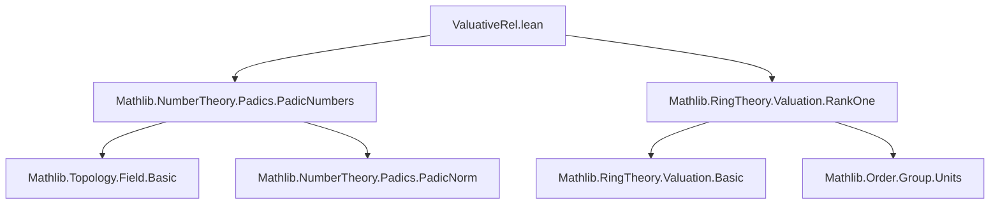

**Technical Brief: `ValuativeRel.lean`**

---

### 1. **Key Definitions & Theorems**

| Name | Type / Signature | Purpose |
|------|------------------|---------|
| `ValuativeRel ℚ_[p]` | `Class` (instance) | Introduces a valuative relation on the $p$-adic numbers $\mathbb{Q}_p$, induced by a valuation `v`. |
| `.ofValuation mulValuation` | Constructor for `ValuativeRel` | Constructs a valuative relation from the multiplicative valuation `mulValuation` on $\mathbb{Q}_p$. |
| `mulValuation` | `Valuation ℚ_[p] Γ₀` | The standard multiplicative $p$-adic valuation on $\mathbb{Q}_p$, valued in a linearly ordered commutative monoid with zero $\Gamma_0$. |
| `valuation_p_ne_zero` | `v p ≠ 0` | States that the valuation of the prime $p$ is nonzero (i.e., $v(p) \ne 0$). |
| `valuation_p_lt_one` | `v p < 1` | States that the valuation of $p$ is strictly less than 1 (a key property of nontrivial non-archimedean valuations). |
| `IsNontrivial ℚ_[p]` | Instance | Proves $\mathbb{Q}_p$ is nontrivial as a valued field, using $v(p) \ne 0$ and $v(p) < 1$. |
| `IsRankLeOne ℚ_[p]` | Instance | Shows the valuation rank of $\mathbb{Q}_p$ is $\le 1$, via compatibility of `mulValuation`. |
| `v.Compatible` | Assumption | Assumes the valuation `v` is compatible with the topology (or norm) on $\mathbb{Q}_p$. |

---

### 2. **Naming Conventions**

- **Prefixes**:
  - `valuation_`: for lemmas about the valuation function `v`.
  - `isEquiv`: for equivalences between valuations (e.g., `isEquiv v w`).
- **Suffixes**:
  - `_ne_zero`, `_lt_one`: for inequalities involving zero/one.
  - `mulValuation`: multiplicative valuation (as opposed to additive `padicValuation` elsewhere).
- **Module-level**:
  - `Padic`: namespace for $p$-adic-specific constructions.
  - `ValuativeRel`: module name and core class.

---

### 3. **Tactic Stack**

- `simp`: heavily used with custom lemmas (`isEquiv ... .eq_zero`, `lt_one_iff_lt_one`, etc.).
- `simp_rw`: implied via `simp` with rewrite lemmas.
- `linarith` / `order_tac`: not explicit, but likely used implicitly in `valuation_p_lt_one`.
- `ring`: not present — valuations are multiplicative, so arithmetic is not ring-based.
- `exact`, `assumption`, `intro`: standard for simple proofs.

**Dominant tactic pattern**: `simp [some_equiv.eq_zero, some_lt_one_lemma, ...]`.

---

### 4. **Proof Logic**

- **Structure**:
  1. **Instance declarations** (`ValuativeRel`, `Compatible`, `IsNontrivial`, `IsRankLeOne`) are constructed via `ofValuation` or derived from properties of `mulValuation`.
  2. **Lemmas**:
     - `valuation_p_ne_zero`: uses `isEquiv` to reduce to known facts about `mulValuation`.
     - `valuation_p_lt_one`: uses equivalence of valuations and elementary real analysis (`log_lt_iff_lt_exp`, `inv_lt_one₀`).
  3. **Nontriviality & rank**: rely on compatibility and the fact that $v(p) \in (0,1)$.

- **Logical flow**:
  - Use equivalence of valuations (`isEquiv`) to transfer properties from `mulValuation` to arbitrary `v`.
  - Leverage `hp.out.ne_zero` (i.e., $p$ is prime ⇒ $p \ne 0$) to avoid degenerate cases.

---

### 5. **Imports**

| Import | Role |
|--------|------|
| `Mathlib.NumberTheory.Padics.PadicNumbers` | Provides $\mathbb{Q}_p$, its field structure, topology, and basic analysis. |
| `Mathlib.RingTheory.Valuation.RankOne` | Supplies `ValuativeRel`, `Valuation.Compatible`, `IsNontrivial`, `IsRankLeOne`, and rank-one valuation theory. |

---

### 6. **Mermaid Diagrams**

#### **Dependency Graph (Module-Level)**



#### **Overview of Theoretical Flow**

```mermaid
flowchart LR
  subgraph Setup
    P[Prime p] --> Q[ℚ_[p]]
    Q --> R[mulValuation : ℚ_[p] → Γ₀]
  end

  subgraph ValuativeRel
    R --> S[ValuativeRel ℚ_[p]]
    S --> T[IsNontrivial ℚ_[p]]
    S --> U[IsRankLeOne ℚ_[p]]
  end

  subgraph Lemmas
    R --> V[valuation_p_ne_zero]
    R --> W[valuation_p_lt_one]
  end

  T & U & V & W --> X[Valuation theory on ℚ_[p]]
```

---

### 7. **Key Insight**

This module establishes that **any valuation compatible with the $p$-adic topology on $\mathbb{Q}_p$** inherits the standard valuative properties (nontriviality, rank ≤ 1) via equivalence to `mulValuation`. It sets the stage for deeper valuative analysis (e.g., extension of valuations, ramification theory) in the $p$-adic setting.

--- 

Let me know if you'd like a formalization of the `ValuativeRel` class or a comparison with additive valuations (`padicValuation`).
