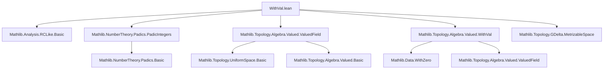

### Technical Brief: `WithVal.lean`

---

#### **1. Key Definitions & Theorems**

| Name | Type | Purpose |
|------|------|---------|
| `isUniformInducing_cast_withVal` | `IsUniformInducing ((Rat.castHom ℚ_[p]).comp (WithVal.equiv (Rat.padicValuation p)).toRingHom)` | Proves the canonical map from the `WithVal`-based completion to `ℚ_[p]` is uniformly inducing (i.e., preserves uniform structure injectively and uniformly). |
| `isDenseInducing_cast_withVal` | `IsDenseInducing ((Rat.castHom ℚ_[p]).comp (WithVal.equiv (Rat.padicValuation p)).toRingHom)` | Shows the same map has dense range, enabling extension to an isomorphism of completions. |
| `withValRingEquiv` | `(Rat.padicValuation p).Completion ≃+* ℚ_[p]` | Field isomorphism between the completion of `ℚ` at `Rat.padicValuation p` and the `p`-adic numbers. Constructed via `extensionHom` and `extend`. |
| `withValUniformEquiv` | `(Rat.padicValuation p).Completion ≃ᵤ ℚ_[p]` | Uniform space isomorphism, derived from `withValRingEquiv`. |
| `coe_withValRingEquiv` | `⇑(withValRingEquiv) = Completion.extension ((↑) ∘ (WithVal.equiv ...))` | Describes the underlying function of `withValRingEquiv`. |
| `coe_withValRingEquiv_symm` | `⇑(withValRingEquiv).symm = extend Completion.coe'` | Describes the inverse map. |
| `withValUniformEquiv_cast_apply` | `withValUniformEquiv x = WithVal.equiv x` for `x : WithVal (Rat.padicValuation p)` | Confirms compatibility on dense subspace. |
| `norm_rat_le_one_iff_padicValuation_le_one` | `‖(x : ℚ_[p])‖ ≤ 1 ↔ Rat.padicValuation p x ≤ 1` | Relates `p`-adic norm ≤ 1 to valuation ≤ 1 for rationals. |
| `withValUniformEquiv_norm_le_one_iff` | `‖withValUniformEquiv x‖ ≤ 1 ↔ Valued.v x ≤ 1` | Extends the above to the completion, linking norm and valuation. |
| `withValIntegersRingEquiv` | `𝒪[(Rat.padicValuation p).Completion] ≃+* ℤ_[p]` | Ring isomorphism between integers of the completion and `p`-adic integers. |
| `withValIntegersUniformEquiv` | `𝒪[(Rat.padicValuation p).Completion] ≃ᵤ ℤ_[p]` | Uniform isomorphism on integers. |

---

#### **2. Naming Conventions**

- **Prefixes**:
  - `withVal_`: Indicates constructions involving `WithVal (Rat.padicValuation p)` or its completion.
  - `padic_`, `padicValuation`: Standard for `p`-adic objects.
  - `coe_`, `symm`: For coercion and inverse of equivalences.
- **Suffixes**:
  - `_equiv`: For equivalences (ring, uniform, etc.).
  - `_integers`: For integer subrings (e.g., `withValIntegersRingEquiv`).
- **Functional style**:
  - `castHom`, `comp`, `extensionHom`, `extend`: Reflect categorical/functional constructions.

---

#### **3. Tactic Stack**

| Tactic | Usage Frequency | Purpose |
|--------|------------------|---------|
| `simp` / `simp_all` | High | Simplify goals using lemmas, especially `padicNorm`, `map_sub`, `Valuation` homomorphism properties. |
| `rw` | Very High | Rewrite using definitions (e.g., `Valuation.map_sub_swap`, `padicNorm`, `zpow_neg`). |
| `induction ... using ...` | Medium | Structural induction on completions (`induction_on`, `isClosed_property`). |
| `have`, `set`, `generalize_proofs` | Medium | Local definitions and hypothesis management. |
| `exact`, `refine`, `apply` | High | Goal-directed proof steps, especially for uniform continuity, continuity, closedness. |
| `split_ifs` | Medium | Handle `if-then-else` branches in `padicNorm` definition. |
| `simpa` | Medium | Simplify and discharge goals using assumptions. |
| `ring`, `linarith`, `zpow_right_mono₀`, `inv_le_inv₀` | Medium | Arithmetic reasoning in ordered monoids/fields. |
| `isClosed_eq`, `continuous_*`, `uniformContinuous_*` | Medium | Topological reasoning (continuity, closedness, uniform continuity). |

---

#### **4. Proof Logic**

The proofs follow a standard pattern for constructing isomorphisms between completions:

1. **Uniform embedding + dense range**:
   - Prove `isUniformInducing_cast_withVal` and `isDenseInducing_cast_withVal`.
   - Use `Valued.hasBasis_uniformity`, `dist_eq_norm_sub`, and properties of `padicNorm` and `Rat.padicValuation`.
   - Key lemmas: `map_sub`, `Valuation.map_sub_swap`, `padicNorm`, `zpow_right_mono₀`, `inv_le_inv₀`.

2. **Extension to completion**:
   - Use `Completion.extensionHom` for forward direction.
   - Use `IsDenseInducing.extend` for inverse.
   - Verify left/right inverses via induction on completion elements.

3. **Ring homomorphism properties**:
   - `map_mul'`, `map_add'` follow from general properties of `extensionHom`.

4. **Norm/valuation correspondence**:
   - First prove for rationals (`norm_rat_le_one_iff_padicValuation_le_one`) using `isUnit_iff`.
   - Extend to completion via continuity and density (using `isClosed_setOf_iff`, `uniformContinuous_uniformly_extend`).

5. **Integer subring restriction**:
   - Use `withValUniformEquiv_norm_le_one_iff` to show the equivalence restricts to unit balls → integers.

---

#### **5. Imports**

| Module | Role |
|--------|------|
| `Mathlib.Analysis.RCLike.Basic` | Real/complex-like analysis, norms, continuity. |
| `Mathlib.NumberTheory.Padics.PadicIntegers` | `p`-adic integers `ℤ_[p]`, basic properties. |
| `Mathlib.Topology.Algebra.Valued.ValuedField` | Theory of valued fields, valuations, uniform structures. |
| `Mathlib.Topology.Algebra.Valued.WithVal` | Construction of `WithVal v`, the space underlying the completion. |
| `Mathlib.Topology.GDelta.MetrizableSpace` | Used for metrizability and Baire category (possibly for density arguments). |

---

#### **6. Mermaid Diagrams**

##### **Dependency Graph (High-Level)**



##### **Overview of Theoretical Flow**

```mermaid
flowchart LR
  subgraph Setup
    V["ValuedField v"] --> W["WithVal v"]
    W --> C["Completion v"]
  end

  subgraph RatEmbedding
    Q["ℚ"] -->["Rat.castHom"] Qp["ℚ_[p]"]
    Q -->["WithVal.equiv v"] W
  end

  subgraph MainIso
    C["Completion v"] <-->["withValRingEquiv"] Qp
    C <-->["withValUniformEquiv"] Qp
  end

  subgraph Integers
    OC["𝒪[Completion v]"] <-->["withValIntegersRingEquiv"] Zp["ℤ_[p]"]
    OC <-->["withValUniformEquiv"] Zp
  end

  V --> RatEmbedding
  RatEmbedding --> MainIso
  MainIso --> Integers
```

---

#### **7. Theory Summary**

This file establishes the foundational equivalence between two constructions of the `p`-adic numbers:

- The classical completion of `ℚ` at the `p`-adic valuation, realized via `Valuation.Completion`.
- The `p`-adic numbers `ℚ_[p]` as a topological field.

It leverages the `WithVal` construction to embed the valuation domain into a metric space, then uses uniform embedding + density to extend to an isomorphism of completions. The integer subring version follows by restricting to the unit ball via norm/valuation correspondence.

The key insight is that `WithVal v` provides a concrete dense subspace of `Completion v`, and `WithVal.equiv v` identifies it with `ℚ`, enabling a clean bridge between valuation-theoretic and topological constructions.

--- 

Let me know if you'd like a formalized dependency graph (e.g., in `leanpkg` format) or a proof outline for a specific lemma.
