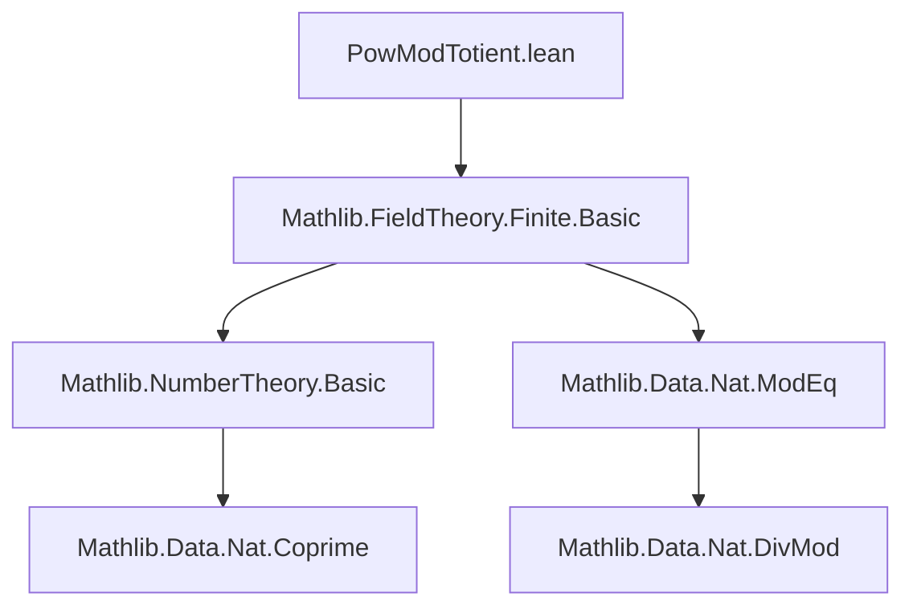
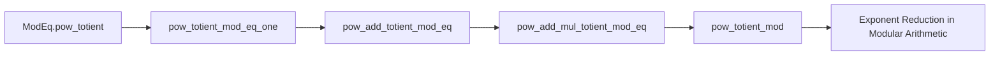

### Technical Brief: `PowModTotient.lean`

---

#### **1. Key Definitions & Theorems**

| Name | Type / Signature | Purpose |
|------|------------------|---------|
| `pow_totient_mod_eq_one` | `∀ {x n : ℕ}, 1 < n → x.Coprime n → (x ^ φ n) % n = 1` | Euler’s theorem in modular arithmetic: base coprime to modulus implies $x^{\varphi(n)} \equiv 1 \pmod{n}$. |
| `pow_add_totient_mod_eq` | `∀ {x k n : ℕ}, 1 < n → x.Coprime n → (x ^ (k + φ n)) % n = (x ^ k) % n` | Shows exponent can be increased by $\varphi(n)$ without changing residue mod $n$. |
| `pow_add_mul_totient_mod_eq` | `∀ {x k l n : ℕ}, 1 < n → x.Coprime n → (x ^ (k + l * φ n)) % n = (x ^ k) % n` | Generalizes previous lemma: exponent shift by any multiple of $\varphi(n)$ preserves residue. Proven by induction on $l$. |
| `pow_totient_mod` | `∀ {x k n : ℕ}, 1 < n → x.Coprime n → x ^ k % n = x ^ (k % φ n) % n` | Main result: exponent $k$ can be reduced modulo $\varphi(n)$ when computing $x^k \bmod n$, under coprimality. |

> Note: All results assume $n > 1$ (`1 < n`) and $\gcd(x, n) = 1$ (`x.Coprime n`).

---

#### **2. Naming Conventions**

- **Prefixes**:
  - `pow_...`: Indicates exponentiation-related lemmas.
  - `..._mod_eq_one`: Result equals 1 modulo $n$.
  - `..._mod_eq`: Result equals another modular expression.
- **Structure**:
  - `pow_add_totient_mod_eq`: exponent addition with $\varphi(n)$.
  - `pow_add_mul_totient_mod_eq`: exponent addition with multiple of $\varphi(n)$.
  - `pow_totient_mod`: full exponent reduction modulo $\varphi(n)$.

---

#### **3. Tactic Stack**

Frequently used tactics in proofs:
- `rw`: Rewriting using lemmas like `pow_add`, `mul_mod`, `pow_totient_mod_eq_one`.
- `simp only [...]`: Simplification with specific rewrite rules (e.g., `mul_one`, `dvd_refl`, `mod_mod_of_dvd`).
- `induction ... with | zero | succ ...`: Structural induction on natural numbers.
- `exact`: Directly applying a proven `ModEq` fact (`ModEq.pow_totient`) to derive equality via `mod_eq_of_modEq`.
- `mod_eq_of_modEq`: Converts congruence (`ModEq`) to equality modulo a bound.

---

#### **4. Proof Logic**

- **Core Strategy**: Leverage Euler’s theorem (`ModEq.pow_totient`) and properties of modular arithmetic.
- **Typical Flow**:
  1. Use `div_add_mod'` to decompose exponent $k = q \cdot \varphi(n) + (k \bmod \varphi(n))$.
  2. Apply `pow_add_mul_totient_mod_eq` to eliminate the $q \cdot \varphi(n)$ term.
  3. Simplify remaining terms using basic modular arithmetic identities.
- **Induction**: Used in `pow_add_mul_totient_mod_eq` to extend from single $\varphi(n)$ shifts to arbitrary multiples.

---

#### **5. Imports & Dependencies**

- **Primary Import**:
  ```lean
  import Mathlib.FieldTheory.Finite.Basic
  ```
  - Provides foundational finite field theory, including Euler’s theorem (`ModEq.pow_totient`) and totient function (`φ`) properties.

- **Implicit Dependencies**:
  - `Nat` module (standard library for natural numbers).
  - `ModEq` and `Coprime` from `Mathlib.NumberTheory.Basic` (likely imported transitively via `Finite.Basic`).
  - Modular arithmetic lemmas (`mul_mod`, `mod_mod_of_dvd`, etc.) from `Mathlib.Data.Nat.ModEq`.

---

#### **6. Mermaid Diagrams**

##### **Dependency Graph (Module-Level)**



##### **Overview of Theoretical Flow**



##### **Proof Structure of `pow_totient_mod`**

```mermaid
flowchart TD
  Start[Start: k = q·φ(n) + r] --> Step1[rewrite with div_add_mod']
  Step1 --> Step2[apply pow_add_mul_totient_mod_eq]
  Step2 --> Step3[simplify using mul_mod, pow_totient_mod_eq_one]
  Step3 --> Step4[apply mod_mod_of_dvd & simp]
  Step4 --> End[Result: x^k % n = x^r % n]
```

---

#### **7. TODOs & Future Work**

- Extend to non-coprime cases (e.g., using Carmichael function or lifting exponent lemmas).
- Implement a tactic/simproc for automatic exponent reduction in expressions like $a^{b^{c}} \bmod n$.

--- 

This file formalizes a core component of modular exponentiation used in cryptography and number theory, grounded in Euler’s theorem and Lean’s `Nat` arithmetic infrastructure.
