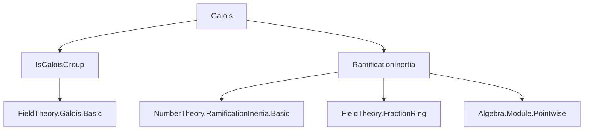

### Technical Brief: `Galois.lean` — Ramification Theory in Galois Extensions of Dedekind Domains

---

#### **1. Key Definitions & Theorems**

| Name | Type / Signature | Purpose |
|------|------------------|---------|
| `ramificationIdxIn` | `Ideal A → Type* → ℕ` | Defines the *common* ramification index over a prime `p` in a Galois extension (independent of choice of lift `P`). |
| `inertiaDegIn` | `Ideal A → Type* → ℕ` | Defines the *common* inertia degree over a prime `p` in a Galois extension. |
| `exists_smul_eq_of_isGaloisGroup` | `∃ σ : G, σ • P = Q` | Transitivity of Galois group action on primes lying over `p`. |
| `ramificationIdx_eq_of_isGaloisGroup` | `p.ramificationIdx P = p.ramificationIdx Q` | All ramification indices over `p` are equal in Galois extensions. |
| `inertiaDeg_eq_of_isGaloisGroup` | `inertiaDeg p P = inertiaDeg p Q` | All inertia degrees over `p` are equal in Galois extensions. |
| `ramificationIdxIn_eq_ramificationIdx` | `ramificationIdxIn p B = ramificationIdx p P` | `ramificationIdxIn` coincides with any actual ramification index. |
| `inertiaDegIn_eq_inertiaDeg` | `inertiaDegIn p B = inertiaDeg p P` | `inertiaDegIn` coincides with any actual inertia degree. |
| `ncard_primesOver_mul_ramificationIdxIn_mul_inertiaDegIn` | `r * (e * f) = [L : K]` | Fundamental identity in Galois case: number of primes × ramification index × inertia degree = extension degree. |
| `card_inertia_eq_ramificationIdxIn` | `#InertiaGroup = e` | Cardinality of inertia subgroup equals ramification index. |
| `inertiaDegIn_mul_inertiaDegIn` | `e_{p}^{B/A} · e_{P}^{C/B} = e_{p}^{C/A}` | Multiplicativity of inertia degrees in towers (Galois). |
| `ramificationIdxIn_mul_ramificationIdxIn` | `f_{p}^{B/A} · f_{P}^{C/B} = f_{p}^{C/A}` | Multiplicativity of ramification indices in towers (Galois). |

---

#### **2. Naming Conventions**

- **Prefixes**:
  - `ramificationIdxIn`, `inertiaDegIn`: suffix `In` indicates *global* (independent of choice) version.
  - `primesOver`: set of primes in `B` lying over a given prime `p` in `A`.
  - `galRestrict`: restriction of Galois automorphism to subring.
- **Suffixes**:
  - `_eq_of_isGaloisGroup`: equality holds due to Galois action transitivity.
  - `_mul_`: multiplicative behavior in towers.
- **Variable naming**:
  - `p`: prime in base ring `A`.
  - `P`, `Q`: primes in extension ring `B`.
  - `G`: Galois group.
  - `σ`, `τ`: group elements.

---

#### **3. Tactic Stack**

Frequently used tactics in proofs:

| Tactic | Usage |
|--------|-------|
| `rcases` / `obtain` | Extract witnesses from existential hypotheses (e.g., `exists_smul_eq`). |
| `rw [← smul_eq_mul, ← coe_primesOverFinset]` | Convert between group action and ideal maps. |
| `simp only [map_one, map_mul, one_smul]` | Simplify structural properties of ring/ideal maps. |
| `apply Subtype.val_inj.mp` | Prove equality of subtype elements by equality of underlying values. |
| `ring` | Simplify polynomial identities in `ℕ` or `ℤ`. |
| `congr 1` | Reduce equality of products to equality of factors (using injectivity lemmas). |
| `exact` / `convert` | Apply known lemmas or adapt them via intermediate equalities. |
| `have : ... := ...` | Introduce intermediate facts (e.g., separability, integrality). |
| `ext x` | Extensionality for ideal membership or function equality. |

---

#### **4. Proof Logic**

**General proof strategy**:

1. **Transitivity via Galois action**:
   - Use `exists_smul_eq_of_isGaloisGroup` to show any two primes `P, Q` over `p` are related by some `σ ∈ G`.
   - This yields `IsPretransitive` instance for `primesOver p B`.

2. **Equality of invariants**:
   - Use `ramificationIdx_map_eq`, `inertiaDeg_map_eq`, and transitivity to show invariants are constant across primes over `p`.

3. **Tower laws**:
   - Lift to fraction fields, use multiplicativity of ramification/inertia in towers (`ramificationIdx_algebra_tower`, `inertiaDeg_algebra_tower`).
   - Combine with previous equalities to get `ramificationIdxIn_mul_...`.

4. **Fundamental identity**:
   - Use `sum_ramification_inertia` (classical identity) and transitivity to replace local invariants with global ones (`ramificationIdxIn`, `inertiaDegIn`).
   - Conclude `r · e · f = [L : K] = #G`.

5. **Inertia group size**:
   - Use orbit-stabilizer: `(primesOver p B).ncard * #Stabilizer = #G`.
   - Show stabilizer = inertia group under separability assumption.
   - Use `card_inertia_eq_ramificationIdxIn` to identify inertia size with ramification index.

---

#### **5. Imports & Dependencies**

| Module | Purpose |
|--------|---------|
| `Mathlib.FieldTheory.Galois.IsGaloisGroup` | Defines `IsGaloisGroup`, Galois group actions, and basic properties. |
| `Mathlib.NumberTheory.RamificationInertia.Basic` | Defines `ramificationIdx`, `inertiaDeg`, `primesOver`, and basic lemmas. |
| `FractionRing`, `IsFractionRing`, `IsIntegralClosure` | Used to lift to fraction fields and relate integral closures. |
| `Module`, `Algebra`, `Pointwise`, `Classical` | Standard algebraic infrastructure. |

---

#### **6. Mermaid Diagrams**

##### **Dependency Graph (Module-Level)**



##### **Overview of Theory Flow**

```mermaid
flowchart LR
  A[Dedekind Domain A] -->|finite integral extension| B[Dedekind Domain B]
  A -->|fraction field| K[Field K]
  B -->|fraction field| L[Field L]
  K -->|Galois extension| L
  G[Gal(L/K)] -->|acts on| Primes[Primes in B over p]
  Primes -->|transitively| Primes
  G -->|stabilizer of P| Inertia[Inertia Group]
  Inertia -->|cardinality = e| RamIdx[ramificationIdxIn]
  Primes -->|# = r| r
  RamIdx -->|e| e
  Inertia -->|f = [S/P : R/p]| InertDeg[inertiaDegIn]
  r * e * f -->|fundamental identity| #G
```

---

#### **7. Summary**

This file formalizes **Hilbert’s ramification theory** in the setting of finite Galois extensions of Dedekind domains. It leverages the **transitive Galois action** on primes to define *global* ramification and inertia invariants (`ramificationIdxIn`, `inertiaDegIn`), proves their multiplicativity in towers, and establishes the **fundamental identity** `r · e · f = [L : K]`. A key result is the identification of the **inertia group size** with the **ramification index**, under separability assumptions.

The formalization is highly structured, with heavy use of:
- `MulAction` and `IsGaloisGroup` infrastructure,
- `primesOver` type for organizing primes over a base prime,
- `FractionRing` and `IsIntegralClosure` to pass to function fields.

It serves as a bridge between abstract Galois theory and classical algebraic number theory.

--- 

Let me know if you'd like a formalization roadmap or a proof sketch for a specific theorem.
