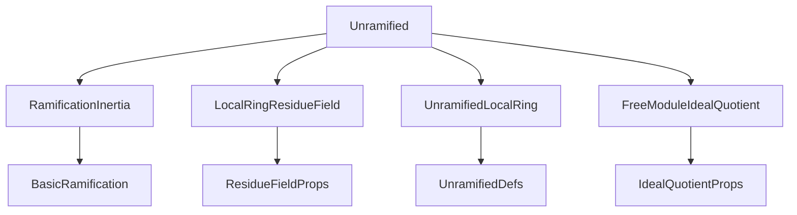

**Technical Brief: `Unramified.lean`**

---

### 1. **Key Definitions & Theorems**

| Name | Type / Signature | Purpose |
|------|------------------|---------|
| `e(P | R)` | Notation for `Ideal.ramificationIdx (algebraMap R S) (Ideal.under R P) P` | Denotes the **ramification index** of a prime `P ⊆ S` over `R`. |
| `Ideal.ramificationIdx_eq_one_of_isUnramifiedAt` | `{p : Ideal S} [p.IsPrime] [IsNoetherianRing S] [IsUnramifiedAt R p] → p ≠ ⊥ → [IsDomain S] → [EssFiniteType R S] → e(p|R) = 1` | Shows that if `p` is unramified over `R`, then its ramification index is 1 (under mild hypotheses). |
| `IsUnramifiedAt.of_liesOver_of_ne_bot` | `(p : Ideal S) (P : Ideal T) [P.LiesOver p] ... → IsUnramifiedAt R p` | Propagates unramifiedness from a larger prime `P` in a tower `T/S/R` down to `p = P ∩ S`, assuming `p ≠ ⊥` and technical conditions (e.g., `S` Dedekind, torsion-freeness). |
| `Algebra.IsUnramifiedAt.of_liesOver` | Same premises as above, but with `[IsDomain T] [Module.IsTorsionFree S T]` instead of `hP₂` | A cleaner version of the previous lemma, using torsion-freeness to avoid explicit `≠ ⊥` checks. |
| `Algebra.isUnramifiedAt_iff_of_isDedekindDomain` | `{p : Ideal S} [p.IsPrime] [IsDedekindDomain S] ... → p ≠ ⊥ → (Algebra.IsUnramifiedAt R p ↔ e(p|R) = 1)` | **Main theorem**: For a Dedekind domain `S` finite over a characteristic-0 finite-type ℤ-algebra `R`, unramifiedness at `p` is equivalent to ramification index `e(p|R) = 1`. |

---

### 2. **Naming Conventions**

- **Prefixes**:
  - `isUnramifiedAt_`: predicates involving `IsUnramifiedAt`.
  - `ramificationIdx_`: lemmas about `Ideal.ramificationIdx`.
  - `of_liesOver`: propagation lemmas for primes lying over.
- **Suffixes**:
  - `_of_ne_bot`: lemmas requiring non-zero-prime assumption.
  - `_iff_`: characterizations (biconditionals).
- **Notation**:
  - `e(P|R)` for ramification index.
  - `P.under R` for contraction of `P` along `R → S`.
  - `P.LiesOver p` for the relation `P ∩ R = p`.

---

### 3. **Tactic Stack**

Frequently used tactics in proofs:

| Tactic | Usage |
|--------|-------|
| `rw` | Rewriting definitions (`isUnramifiedAt_iff_map_eq`, `ramificationIdx_eq_one_iff`, etc.). |
| `exact` / `refine` | Constructing proofs via known lemmas. |
| `by_cases` | Splitting on `p = ⊥` or similar. |
| `subst` | Substituting equalities (e.g., `hp : p = ⊥`). |
| `convert` / `replace` | Modifying hypotheses via monotonicity or map properties. |
| `infer_instance` | Solving typeclass goals (e.g., `Finite`, `IsDomain`). |
| `simp_rw` (implicit via `rw`) | Simplifying with rewrite lemmas. |
| `exact?` / `aesop` (not explicit here, but likely in surrounding files) | Not heavily used in this file; proofs are mostly manual and structural. |

---

### 4. **Proof Logic**

The logical flow is **structural and case-analytic**, with heavy use of:

- **Localization & residue fields**: `isUnramifiedAt_iff_map_eq` reduces unramifiedness to an isomorphism after localizing at the prime.
- **Ideal theory in Dedekind domains**: `ramificationIdx_eq_one_iff` links ramification index to ideal factorization.
- **Tower properties**: `IsScalarTower`, `LiesOver`, and `map_map` lemmas to relate primes across rings.
- **Indirect contradiction**: Many proofs assume `e(p|R) ≠ 1` and derive a contradiction using monotonicity of ideal maps.

**Typical proof pattern**:
1. Reduce to localization/residue field via `isUnramifiedAt_iff_map_eq`.
2. Use `ramificationIdx_eq_one_iff` to connect to ideal powers.
3. Apply monotonicity of `Ideal.map` and properties of `LiesOver`.
4. Use `hp ≠ ⊥` to avoid degenerate cases (e.g., zero ideal).
5. Conclude via equivalence or contradiction.

---

### 5. **Imports**

| Module | Role |
|--------|------|
| `Mathlib.NumberTheory.RamificationInertia.Basic` | Defines `Ideal.ramificationIdx`, `ramificationIdx_eq_one_iff`, etc. |
| `Mathlib.RingTheory.LocalRing.ResidueField.Instances` | Provides residue field constructions and properties. |
| `Mathlib.RingTheory.Unramified.LocalRing` | Core definitions: `IsUnramifiedAt`, `isUnramifiedAt_iff_map_eq`. |
| `Mathlib.LinearAlgebra.FreeModule.IdealQuotient` | Used for finite-type and torsion-freeness arguments (e.g., `Finite`, `IsTorsionFree`). |

---

### 6. **Mermaid Diagrams**

#### **Dependency Graph (Module-Level)**



#### **Overview of Theoretical Flow**

```mermaid
graph LR
  A[Algebra R S] --> B[Prime p ⊆ S]
  A --> C[Prime P ⊆ T, P.LiesOver p]
  C --> D[IsUnramifiedAt R P]
  D --> E[IsUnramifiedAt R p]
  B --> F[e(p|R) = 1]
  D --> F
  E --> F
  F -->|iff| D
```

- **Main equivalence**: `IsUnramifiedAt R p ↔ e(p|R) = 1` under Dedekind + finite-type + char 0 assumptions.
- **Propagation**: Unramifiedness descends along integral extensions (via `of_liesOver` lemmas).

---

### 7. **Domain-Specific AI Agent Notes**

- **Key domain**: Algebraic number theory / commutative algebra.
- **Core concepts**: Ramification, unramified morphisms, Dedekind domains, localization, residue fields.
- **Common proof patterns**:
  - Reduction to local case via `isUnramifiedAt_iff_map_eq`.
  - Use of `ramificationIdx_eq_one_iff` to translate between ideal-theoretic and categorical notions.
  - Handling of `≠ ⊥` via `LiesOver` and torsion-freeness.
- **Suggested AI focus**:
  - Automate `rw [isUnramifiedAt_iff_map_eq]` + `ramificationIdx_eq_one_iff` chains.
  - Detect towers `R → S → T` and apply `of_liesOver` automatically.
  - Suggest `hp : p ≠ ⊥` as a missing assumption when `ramificationIdx` appears.

--- 

Let me know if you'd like a formalized dependency graph (e.g., `.lean`-level imports) or a tactic-level proof sketch.
