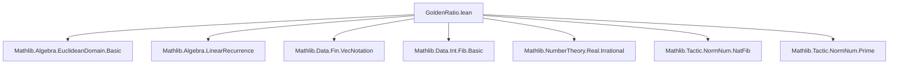

### Technical Brief: `GoldenRatio.lean`

---

#### **1. Key Definitions & Theorems**

| Name | Type / Purpose |
|------|----------------|
| `goldenRatio : ℝ` | Definition: $ \varphi = \frac{1 + \sqrt{5}}{2} $ — the golden ratio |
| `goldenConj : ℝ` | Definition: $ \psi = \frac{1 - \sqrt{5}}{2} $ — the conjugate of the golden ratio |
| `inv_goldenRatio` | Theorem: $ \varphi^{-1} = -\psi $ |
| `inv_goldenConj` | Theorem: $ \psi^{-1} = -\varphi $ |
| `goldenRatio_mul_goldenConj` | Theorem: $ \varphi \cdot \psi = -1 $ |
| `goldenRatio_add_goldenConj` | Theorem: $ \varphi + \psi = 1 $ |
| `goldenRatio_sub_goldenConj` | Theorem: $ \varphi - \psi = \sqrt{5} $ |
| `goldenRatio_sq`, `goldenConj_sq` | Theorems: $ \varphi^2 = \varphi + 1 $, $ \psi^2 = \psi + 1 $ |
| `goldenRatio_irrational`, `goldenConj_irrational` | Theorems: $ \varphi $, $ \psi $ are irrational |
| `fibRec` | Definition: Linear recurrence $ a_{n+2} = a_{n+1} + a_n $ (order 2, coeffs $[1,1]$) |
| `fibRec_charPoly_eq` | Theorem: Characteristic polynomial is $ X^2 - X - 1 $ |
| `geom_goldenRatio_isSol_fibRec`, `geom_goldenConj_isSol_fibRec` | Theorems: Sequences $ n \mapsto \varphi^n $, $ n \mapsto \psi^n $ satisfy `fibRec` |
| `coe_fib_eq'`, `coe_fib_eq` | Theorems: **Binet’s formula**: $ \text{fib}(n) = \frac{\varphi^n - \psi^n}{\sqrt{5}} $ |
| `coe_intFib_eq` | Theorem: Binet’s formula extended to integer-indexed Fibonacci numbers |
| `fib_succ_sub_goldenRatio_mul_fib`, `goldenConj_mul_fib_succ_add_fib`, `goldenRatio_mul_fib_succ_add_fib`, `fib_succ_sub_goldenConj_mul_fib` | Theorems: Linear relations linking Fibonacci numbers and powers of $ \varphi $, $ \psi $ |

---

#### **2. Naming Conventions**

- **Prefixes**:
  - `goldenRatio_...`, `goldenConj_...`: Core definitions and properties of $ \varphi $, $ \psi $
  - `inv_...`, `mul_...`, `add_...`, `sub_...`: Algebraic identities
  - `geom_...`: Geometric sequences (powers of $ \varphi $, $ \psi $)
  - `fib_...`: Fibonacci-related identities
- **Suffixes**:
  - `_eq`: Equality theorems (e.g., `goldenRatio_sq`)
  - `_isSol_...`: Membership in solution space of recurrence
  - `_irrational`: Irrationality proofs
- **Deprecated aliases** use `_root_` and `gold*` variants (e.g., `gold_mul_goldConj`), indicating legacy naming.

---

#### **3. Tactic Stack**

Frequent tactics used in proofs:
- `grind`: Automated simplification (custom tactic in Mathlib for algebraic simplification)
- `ring`: Polynomial/ring simplification (e.g., verifying identities like $ \varphi^2 = \varphi + 1 $)
- `simp` / `simp only`: Simplification with lemmas, often with `only` to avoid over-simplification
- `norm_num`: Numerical normalization (e.g., verifying $ \sqrt{5} $ irrationality via $ 5 $ prime)
- `linarith`: Linear arithmetic (e.g., sign arguments like $ \psi < 0 $)
- `calc`: Chain of equalities (e.g., bounding $ \varphi < 2 $)
- `induction`: Structural induction on natural numbers (e.g., for Fibonacci identities)
- `convert`, `rw`, `exact`: Rewriting and unification for proof construction

---

#### **4. Proof Logic**

- **Algebraic identities**: Proven via `grind`/`ring` using definitions of $ \varphi $, $ \psi $.
- **Irrationality**: Uses:
  - `Nat.Prime.irrational_sqrt` for $ \sqrt{5} $,
  - closure under rational operations (`ratCast_add`, `ratCast_mul`, etc.),
  - `convert` + `simp` + `ring` to match target expression.
- **Recurrence & Binet’s formula**:
  - Show $ \varphi^n $, $ \psi^n $ are solutions via `geom_sol_iff_root_charPoly`.
  - Use `LinearRecurrence.sol_eq_of_eq_init` to prove uniqueness of solution given initial values.
  - Verify base cases $ n = 0,1 $ manually (via `norm_cast`, `fin_cases`, `ring`).
- **Fibonacci–golden ratio identities**:
  - Often proven by substituting Binet’s formula and simplifying with `ring`, `mul_inv_cancel₀`, etc.
  - Inductive proofs for identities like $ \varphi \cdot F_{n+1} + F_n = \varphi^{n+1} $.

---

#### **5. Imports & Scope**

**Primary dependencies**:
- `Mathlib.Algebra.EuclideanDomain.Basic`: For PID/ED structure (used implicitly in linear recurrences).
- `Mathlib.Algebra.LinearRecurrence`: Core theory of linear recurrences, characteristic polynomials, solution spaces.
- `Mathlib.Data.Fin.VecNotation`: Syntax for finite vectors (used in `fibRec.coeffs := ![1,1]`).
- `Mathlib.Data.Int.Fib.Basic`: Integer-indexed Fibonacci numbers.
- `Mathlib.NumberTheory.Real.Irrational`: Tools for proving irrationality of algebraic reals.
- `Mathlib.Tactic.NormNum.NatFib`, `Mathlib.Tactic.NormNum.Prime`: Tactics for normalizing Fibonacci numbers and primality checks.

**Scope**:
- `noncomputable section`: Allows use of classical analysis (e.g., $ \sqrt{5} $).
- `scoped[goldenRatio] notation`: Local notation for $ \varphi $, $ \psi $.

---

#### **6. Mermaid Diagrams**

##### **Dependency Graph (Module-Level)**



##### **Theoretical Overview (Conceptual Flow)**

```mermaid
flowchart LR
  subgraph Definitions
    φ[φ = (1 + √5)/2]
    ψ[ψ = (1 − √5)/2]
  end

  subgraph Algebraic Properties
    inv[φ⁻¹ = −ψ, ψ⁻¹ = −φ]
    quad[φ² = φ + 1, ψ² = ψ + 1]
    sum[φ + ψ = 1, φψ = −1]
  end

  subgraph Irrationality
    irrφ[φ irrational]
    irrψ[ψ irrational]
  end

  subgraph Recurrence Theory
    fibRec[Fibonacci recurrence]
    charPoly[Char. poly: X² − X − 1]
    sol[φⁿ, ψⁿ ∈ Sol(fibRec)]
  end

  subgraph Binet & Identities
    Binet[Binet’s formula]
    fibId[Fibonacci–golden ratio identities]
  end

  Definitions --> AlgebraicProperties
  AlgebraicProperties --> Irrationality
  AlgebraicProperties --> RecurrenceTheory
  RecurrenceTheory --> Binet
  Binet --> fibId
```

---

#### **7. Theory Context**

This file sits at the intersection of:
- **Algebra**: Linear recurrences, characteristic polynomials, solution spaces.
- **Analysis**: Real numbers, square roots, irrationality.
- **Number Theory**: Fibonacci sequence, integer extensions, Diophantine properties.

It serves as a foundational module for deeper results involving:
- Continued fractions,
- Pisano periods,
- Lucas sequences,
- Algebraic integers (since $ \varphi $, $ \psi $ are algebraic integers).

The structure follows Lean’s *“mathlib style”*: definitions first, then algebraic properties, then connections to known sequences (Fibonacci), culminating in Binet’s formula — a canonical bridge between combinatorics and analysis.

--- 

Let me know if you'd like a formalized dependency graph (e.g., `.lean`-level imports) or a proof-term extraction.
