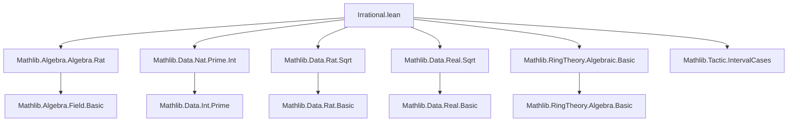

### Technical Brief: `Irrational.lean` (Lean 4)

---

#### **1. Key Definitions & Theorems**

| Name | Type / Signature | Purpose |
|------|------------------|---------|
| `Irrational x` | `x : ℝ → Prop` | Predicate: $x$ is irrational iff $x \notin \mathbb{Q}$ (i.e., not in the range of `↑ : ℚ → ℝ`) |
| `irrational_iff_ne_rational` | `∀ x : ℝ, Irrational x ↔ ∀ a b : ℤ, b ≠ 0 → x ≠ a / b` | Equivalence between irrationality and not being equal to any rational $a/b$ |
| `irrational_nrt_of_notint_nrt` | `x^n = m ∈ ℤ, n > 0, ¬∃ y : ℤ, x = y ⇒ Irrational x` | If $x^n$ is integer but $x$ is not integer, then $x$ is irrational |
| `irrational_nrt_of_n_not_dvd_multiplicity` | `x^n = m ≠ 0, multiplicity p m % n ≠ 0 ⇒ Irrational x` | Uses $p$-adic multiplicity to detect irrationality of $n$-th roots |
| `irrational_sqrt_of_multiplicity_odd` | `multiplicity p m % 2 = 1 ⇒ Irrational (√m)` | Special case for square roots: odd multiplicity ⇒ irrational |
| `irrational_sqrt_ratCast_iff_of_nonneg` | `0 ≤ q ⇒ Irrational (√q) ↔ ¬IsSquare q` | Square root of nonnegative rational is irrational iff not a square |
| `irrational_sqrt_ratCast_iff` | `Irrational (√q) ↔ ¬IsSquare q ∧ 0 ≤ q` | Full characterization for rational square roots |
| `irrational_sqrt_intCast_iff` | `Irrational (√z) ↔ ¬IsSquare z ∧ 0 ≤ z` | Same for integers |
| `irrational_sqrt_natCast_iff` | `Irrational (√n) ↔ ¬IsSquare n` | For naturals (nonnegativity automatic) |
| `Nat.Prime.irrational_sqrt` | `p prime ⇒ Irrational (√p)` | Square root of prime is irrational |
| `irrational_sqrt_two` | `Irrational (√2)` | Classic example, derived from above |
| `exists_irrational_btwn` | `x < y ⇒ ∃ r, Irrational r ∧ x < r < y` | Density of irrationals in ℝ |
| `Transcendental.irrational` | `Transcendental ℚ r ⇒ Irrational r` | Transcendental ⇒ irrational |

**Dot-style constructors** (e.g., `Irrational.ratCast_add`, `Irrational.neg`, `Irrational.mul_ratCast`, etc.) provide convenient ways to manipulate irrationality under arithmetic operations.

---

#### **2. Naming Conventions**

- **Predicates**: `Irrational`, `IsSquare`, `multiplicity`, `Transcendental`
- **Theorems**:
  - `irrational_*`: Main irrationality results (e.g., `irrational_nrt_*`, `irrational_sqrt_*`)
  - `not_irrational_*`: Negative results (e.g., `not_irrational_zero`, `not_irrational_one`)
  - `*_iff_*`: Biconditional characterizations (e.g., `irrational_sqrt_ratCast_iff`)
  - `*_cases`: Case analysis (e.g., `add_cases`, `mul_cases`)
  - `of_*`, `*_of_*`: Elimination/introduction patterns (e.g., `of_ratCast_add`, `add_ratCast_of`)
  - `*_ratCast`, `*_intCast`, `*_natCast`: Coercion-specific lemmas
  - `neg`, `inv`, `add`, `sub`, `mul`, `div`, `pow`, `zpow`: Algebraic operation lemmas

Prefixes/suffixes:
- `ratCast_`, `intCast_`, `natCast_`: Coercions from ℚ, ℤ, ℕ
- `of_*`: “if result is irrational, then operand is”
- `*_of`: “if operand is irrational, then result is”
- `*_iff`: Biconditional simplification lemmas (often `@[simp]`)

---

#### **3. Tactic Stack**

Frequently used tactics:
- `simp` / `simp_rw`: Simplify using definitions and lemmas (especially `irrational_iff_ne_rational`, `cast_*`, `mul_self_sqrt`)
- `intro` / `intro rfl`: Assume equality to rational and derive contradiction
- `contrapose!`: Turn negated implication into positive one
- `rw [← cast_*]`: Work in ℚ/ℤ before casting to ℝ
- `exact`, `refine`, `obtain`, `subst`: Standard proof scripting
- `mod_cast`: Cast equalities across coercions (e.g., ℤ → ℝ)
- `decidable_of_iff'`: Derive decidability from biconditional with decidable prop
- `aesop` / `grind`: Used in `exists_rat_of_not_irrational` and possibly other automation
- `interval_cases`: For numeric literals (e.g., `n = 0` or `n = 1`)
- `ring`, `linarith`: Implicitly used in algebraic manipulations

---

#### **4. Proof Logic**

- **Structure of irrationality proofs**:
  1. Assume $x = q ∈ ℚ$ (i.e., $x$ rational).
  2. Derive contradiction using algebraic properties (e.g., divisibility, multiplicity, parity).
- **Root irrationality proofs**:
  - Use `irrational_nrt_of_notint_nrt`: Show $x^n = m ∈ ℤ$, but $x$ not integer.
  - Or use `irrational_nrt_of_n_not_dvd_multiplicity`: Show $n ∤ v_p(m)$ for some prime $p$.
  - For square roots: Use odd multiplicity or non-squareness.
- **Dot-style lemmas**:
  - Prove one direction (e.g., `x` irrational ⇒ `x + q` irrational), then derive converse via `of_*`.
  - Often use `cast_*` lemmas to reduce to ℚ/ℤ arithmetic.
- **Decidability**:
  - Derived via `decidable_of_iff'` + `irrational_sqrt_*_iff` + decidability of `IsSquare` and comparisons.

---

#### **5. Imports & Dependencies**

| Module | Role |
|--------|------|
| `Mathlib.Algebra.Algebra.Rat` | Rational algebra, coercion `↑ : ℚ → ℝ` |
| `Mathlib.Data.Nat.Prime.Int` | Prime integers, multiplicity, factorial decomposition |
| `Mathlib.Data.Rat.Sqrt` | Square roots in ℚ, `IsSquare`, decidability |
| `Mathlib.Data.Real.Sqrt` | Square roots in ℝ, `sq_sqrt`, `sqrt_mul_self_eq_abs` |
| `Mathlib.RingTheory.Algebraic.Basic` | Algebraic/transcendental definitions (`Transcendental.irrational`) |
| `Mathlib.Tactic.IntervalCases` | For numeric case splits (e.g., $n = 0$ or $n > 0$) |

---

#### **6. Mermaid Diagrams**

##### **Dependency Graph (Top-Level)**



##### **Overview of Theory Flow**

```mermaid
flowchart LR
  Def[Irrational x := x ∉ range(ℚ → ℝ)] --> Thm1[irrational_iff_ne_rational]
  Thm1 --> Thm2[ne_rational]
  Thm1 --> Thm3[exists_rat_of_not_irrational]

  Def --> RootThms[Root Irrationality Theorems]
  RootThms --> NrtNotInt[irrational_nrt_of_notint_nrt]
  RootThms --> Mult[Nrt not dvd multiplicity]
  RootThms --> OddMult[odd multiplicity ⇒ √m irrational]

  Def --> Ops[Dot-style Operations]
  Ops --> Add[add/sub with ℚ/ℤ/ℕ]
  Ops --> Mul[mul/div by ℚ/ℤ/ℕ]
  Ops --> Neg[Negation]
  Ops --> Inv[Inverse]
  Ops --> Pow[Power]

  Def --> Dec[Decidability Instances]
  Dec --> Nat[n : ℕ]
  Dec --> Int[z : ℤ]
  Dec --> Rat[q : ℚ]

  Def --> Density[exists_irrational_btwn]
  Def --> Poly[Polynomial root degree > 1]

  Thm2 --> Transcendental[Transcendental ⇒ Irrational]
```

---

#### **7. Notable Idioms & Patterns**

- **Contrapositive + rational assumption**: Core proof pattern: assume $x = a/b$, derive contradiction.
- **Multiplicity-based irrationality**: Leverages unique factorization: if $x^n = m$, then $v_p(x)$ must be rational with denominator dividing $n$; if $n ∤ v_p(m)$, impossible.
- **Dot-style API**: Provides a “calculus” of irrationality preservation under arithmetic, mirroring `Rat`, `Int`, `Nat` coercion lemmas.
- **Decidability via biconditionals**: `Decidable (Irrational √n)` follows from `Irrational √n ↔ ¬IsSquare n`, and decidability of `IsSquare`.

---

#### **8. Example Usage**

```lean
-- Prove √2 irrational
example : Irrational (√2) := by
  exact irrational_sqrt_two

-- Prove √24 irrational using decidability
unseal Nat.sqrt.iter in
example : Irrational (√24) := by
  decide

-- Use dot-style lemma
example (x : ℝ) (hx : Irrational x) : Irrational (x - 3 / 2) := by
  exact hx.sub_ratCast (3 / 2)
```

--- 

This file forms a foundational part of the *irrationality* theory in Mathlib, with strong automation for square roots and rational/integer shifts/multiples, and connects to deeper algebraic concepts (algebraic vs transcendental, multiplicity, polynomial roots).
