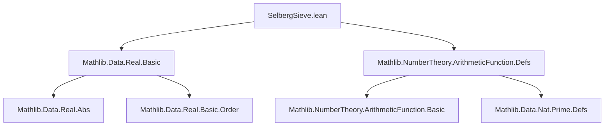
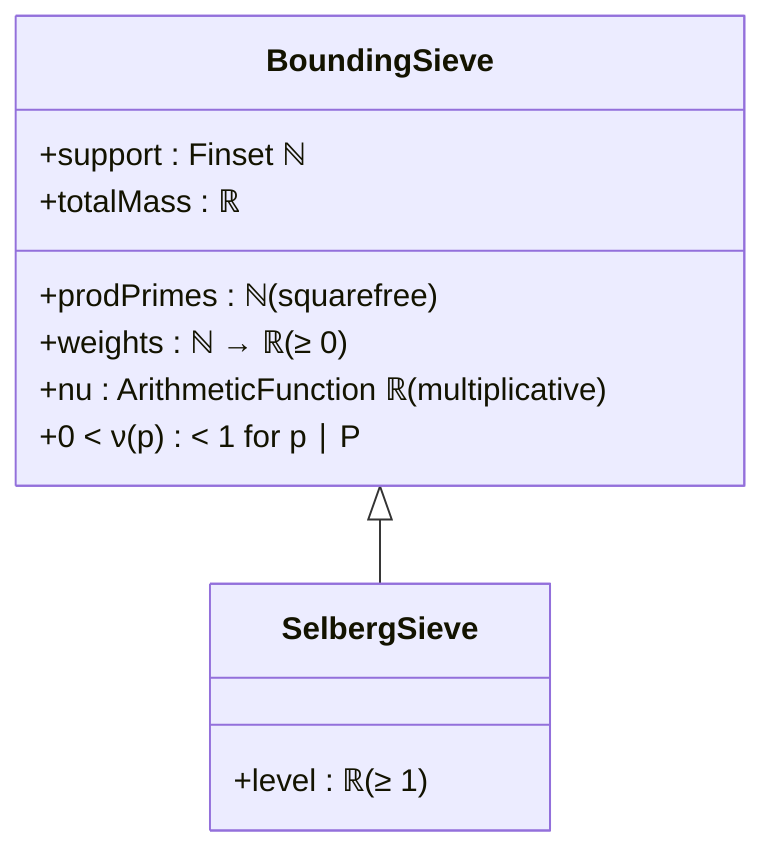

### Technical Brief: `SelbergSieve.lean`

---

#### **1. Key Definitions & Theorems**

| Name | Type / Signature | Purpose |
|------|------------------|---------|
| `BoundingSieve` | `Type` (structure) | Encodes the sieve setup: finite support set `support`, product of sifted primes `prodPrimes`, weights `weights`, approximation function `nu`, and assumptions on `nu`. |
| `SelbergSieve` | `BoundingSieve` extension | Adds a real-valued `level` parameter ≥ 1, controlling inclusion-exclusion depth and error tradeoff. |
| `multSum d` | `ℝ` | Weighted count of elements in `support` divisible by `d`: $\sum_{n \in \text{support},\, d \mid n} a_n$. |
| `rem d` | `ℝ` | Remainder term in approximation $A_d = \nu(d) X + R_d$: $\text{rem}(d) = \text{multSum}(d) - \nu(d) \cdot \text{totalMass}$. |
| `siftedSum` | `ℝ` | Weighted count of elements in `support` coprime to `prodPrimes`: $\sum_{n \in \text{support},\, \gcd(n,P)=1} a_n$. |
| `mainSum μ⁺` | `ℝ` | Main term in upper bound: $\sum_{d \mid P} \mu^+(d) \nu(d)$. |
| `errSum μ⁺` | `ℝ` | Error term: $\sum_{d \mid P} |\mu^+(d)| \cdot |\text{rem}(d)|$. |
| `IsUpperMoebius μ⁺` | `Prop` | Condition on coefficients: $\forall n,\, [n=1] \le \sum_{d \mid n} \mu^+(d)$. Ensures $\mu^+$ yields an upper bound via sieve inequality. |
| `siftedSum_le_sum_of_upperMoebius` | `theorem` | Core sieve inequality: if `μ⁺` is upper Moebius, then $\text{siftedSum} \le \sum_{d \mid P} \mu^+(d) \cdot \text{multSum}(d)$. |
| `siftedSum_le_mainSum_errSum_of_upperMoebius` | `theorem` | Final upper bound: $\text{siftedSum} \le X \cdot \text{mainSum}(\mu^+) + \text{errSum}(\mu^+)$. |

---

#### **2. Naming Conventions**

- **Prefixes**:
  - `prod_`: relates to `prodPrimes` (e.g., `prodPrimes_ne_zero`, `prod_primeFactors_nu`)
  - `nu_`: properties of `nu` (e.g., `nu_pos_of_prime`, `nu_lt_one_of_dvd_prodPrimes`)
  - `multSum`, `rem`, `siftedSum`, `mainSum`, `errSum`: functional naming for sieve components
- **Suffixes**:
  - `_of_`: condition-based specialization (e.g., `nu_pos_of_dvd_prodPrimes`)
  - `_of_upperMoebius`: theorem applies under `IsUpperMoebius` assumption
- **Adjectives**:
  - `squarefree_`, `nonneg`, `mult` (for multiplicative functions)
- **Predicate naming**:
  - `IsUpperMoebius`: predicate on sequences, following Lean’s `Is*` convention

---

#### **3. Tactic Stack**

Frequent tactics used in proofs:
- `simp_rw`, `simp only`, `congr`, `ext`: for rewriting and extensionality
- `calc` + `have`, `exact`, `apply`: structured chain of inequalities/equalities
- `gcongr`: for monotonicity in sums/absolute values
- `ring`: algebraic simplification (e.g., in `multSum_eq_main_err`)
- `rw [← ...]`, `dsimp`: to unfold definitions and reorganize expressions
- `apply prod_pos`, `apply prod_lt_prod_of_nonempty`: for positivity/inequality in products over `primeFactors`
- `aesop` not used (explicit manual reasoning dominates)

---

#### **4. Proof Logic**

- **Structure**: Modular, definition-first; proofs follow standard analytic sieve logic:
  1. **Setup**: Define sieve data (`BoundingSieve`, `SelbergSieve`)
  2. **Properties of `P` and `ν`**:
     - Use squarefreeness to reduce to prime factor products
     - Prove `ν(d) > 0`, `ν(d) < 1` for `d > 1`, `d ∣ P`
  3. **Sieve inequality**:
     - Start from `siftedSum = ∑ a_n · [gcd(n,P)=1]`
     - Apply upper Moebius condition: replace indicator with sum over divisors
     - Swap sums (Fubini-style): `∑_n ∑_{d ∣ gcd(n,P)} → ∑_{d ∣ P} ∑_{n : d ∣ n}`
     - Express in terms of `multSum(d)` and decompose via `rem(d)`
  4. **Bounding error**:
     - Use triangle inequality: $|ab| = |a||b|$, then $x ≤ |x|$
     - Final bound separates main term (`X · mainSum`) and error (`errSum`)

- **Induction**: Not used directly; relies on finite sums over divisors and prime factorizations.

---

#### **5. Imports & Dependencies**

| Module | Role |
|--------|------|
| `Mathlib.Data.Real.Basic` | Real numbers, order, absolute value, basic analysis |
| `Mathlib.NumberTheory.ArithmeticFunction.Defs` | Arithmetic functions, multiplicativity (`IsMultiplicative`), Moebius function context |

**Key external concepts used**:
- `Finset`, `BigOperators`, `Squarefree`, `Coprime`, `divisors`, `primeFactors`
- `ArithmeticFunction` with `IsMultiplicative`, `map_prod_of_subset_primeFactors`
- `PositivityExt` for tactic extension (`positivity`)

---

#### **6. Mermaid Diagrams**

##### **Dependency Graph (Module-Level)**



##### **Theoretical Overview (Sieve Logic Flow)**

```mermaid
flowchart LR
  A[BoundingSieve] --> B[Support A, Primes P, Weights a_n]
  A --> C[Approximation: A_d ≈ ν(d)·X]
  C --> D[rem(d) = A_d − ν(d)·X]
  D --> E[SiftedSum = ∑_{(n,P)=1} a_n]
  E --> F[IsUpperMoebius(μ⁺)]
  F --> G[∑ μ⁺(d)·A_d ≥ SiftedSum]
  G --> H[= X·mainSum(μ⁺) + errSum(μ⁺)]
  H --> I[Upper bound on sifted set]
```

##### **Structure Hierarchy**



---

#### **7. Notational Notes**

- Uses $\nu(n)$ instead of Heath-Brown’s $\omega(n)/n$ (as stated in docstring).
- `prodPrimes` encodes the finite prime set via its product (squarefree), enabling:
  - Multiplicative extension of $\nu$
  - Divisor-sum manipulations via Moebius inversion
- `Coprime s.prodPrimes d` ≡ `gcd(prodPrimes, d) = 1`

---

#### **8. References Embedded**

- Heath-Brown, *Lectures on sieves* (2002)
- Koukoulopoulos, *The Distribution of Prime Numbers* (2019)

These inform the structure of the sieve inequality and the choice of upper Moebius condition.

--- 

This file formalizes the *upper bound sieve* framework for the Selberg sieve, culminating in a clean decomposition of the sifted sum into main and error terms — a foundational step toward the fundamental lemma of sieve theory.
