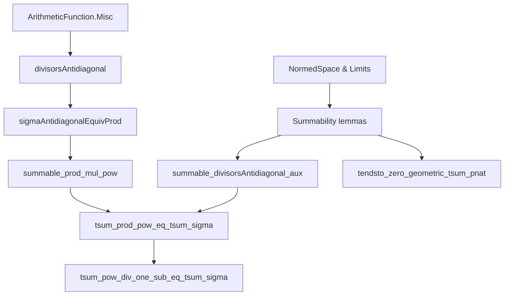

### Technical Brief: `TsumDivisorsAntidiagonal.lean`

---

#### **1. Key Definitions & Theorems**

| Name | Type / Signature | Purpose |
|------|------------------|---------|
| `divisorsAntidiagonalFactors` | `n : ℕ+ → Nat.divisorsAntidiagonal n → ℕ+ × ℕ+` | Maps each decomposition $ n = a \cdot b $ (with $ a, b \in \mathbb{N}^+ $) to the pair $ (a, b) $. |
| `sigmaAntidiagonalEquivProd` | `(Σ n : ℕ+, Nat.divisorsAntidiagonal n) ≃ ℕ+ × ℕ+` | Equivalence between the disjoint union over $ n $ of antidiagonal divisors and $ \mathbb{N}^+ \times \mathbb{N}^+ $. Central for reindexing sums. |
| `summable_norm_pow_mul_geometric_div_one_sub` | `k : ℕ → ‖r‖ < 1 → Summable (n ↦ n^k * r^n / (1 - r^n))` | Ensures convergence of the Lambert series terms $ \frac{n^k r^n}{1 - r^n} $. |
| `summable_divisorsAntidiagonal_aux` | `k : ℕ → ‖r‖ < 1 → Summable (⟨n, x⟩ ↦ a^k * r^{a b})` where $ x : a b = n $ | Key technical summability lemma over the antidiagonal indexing set. |
| `summable_prod_mul_pow` | `k : ℕ → ‖r‖ < 1 → Summable ((a,b) ↦ b^k r^{ab})` | Follows from the equivalence and previous lemma; ensures absolute convergence of double sums. |
| `tsum_prod_pow_eq_tsum_sigma` | `k : ℕ → ‖r‖ < 1 → ∑'_{d,c} c^k r^{dc} = ∑'_e σ_k(e) r^e` | Core identity: reindexing the double sum over $ \mathbb{N}^+ \times \mathbb{N}^+ $ via divisor sum $ \sigma_k(e) = \sum_{d \mid e} d^k $. |
| `tsum_pow_div_one_sub_eq_tsum_sigma` | `‖r‖ < 1 → ∑'_n \frac{n^k r^n}{1 - r^n} = ∑'_n σ_k(n) r^n` | Final Lambert series identity: $ \sum_{n=1}^\infty \frac{n^k r^n}{1 - r^n} = \sum_{n=1}^\infty \sigma_k(n) r^n $. Used in Eisenstein series theory. |
| `tendsto_zero_geometric_tsum_pnat` | `‖r‖ < 1 → \sum'_{n} r^{nm} \to 0$ as $ m \to \infty $ | Shows decay of geometric series indexed by multiples — used for analytic estimates. |

---

#### **2. Naming Conventions**

- **Prefixes**:
  - `divisorsAntidiagonal*`: Relates to the antidiagonal of the divisor relation.
  - `sigmaAntidiagonal*`: Refers to the equivalence involving $ \sum \Sigma $-type.
  - `tsum_*`: Infinite sums (totalized sums over countable types).
  - `summable_*`: Convergence properties.
  - `tendsto_*`: Topological convergence (limits at infinity).
- **Suffixes**:
  - `_eq_*`: Equality of two expressions.
  - `_aux`: Intermediate lemmas used in main proofs.
  - `_pnat`: Explicit use of $ \mathbb{N}^+ $ (positive naturals).
- **Function names**:
  - `divisorsAntidiagonalFactors` — returns factor pair.
  - `sigmaAntidiagonalEquivProd` — equivalence name reflects both source (`σ`-sum over antidiagonal) and target (`×`).

---

#### **3. Tactic Stack**

Frequently used tactics in this file:

| Tactic | Role |
|--------|------|
| `simp` / `simp_rw` | Simplification using definitional equalities, especially for `PNat`, `divisorsAntidiagonal`, and `sigma`. |
| `rw` | Rewriting using equivalences, summability lemmas, and arithmetic identities. |
| `gcongr` | Used in inequalities involving sums and norms (e.g., bounding divisor sums). |
| `exact`, `refine`, `apply` | Proof construction, especially with summability and convergence. |
| `ext` | Extensionality for equality of functions/pairs. |
| `tsum_congr`, `tsum_congr₂` | Reindexing sums via bijections or pointwise equalities. |
| `tsum_comm` | Interchange of iterated sums (justified by absolute convergence). |
| `tendsto_*` lemmas | Applied via `tendsto_*` combinators (e.g., `tendsto_pow_atTop_nhds_zero`). |
| ` positivity` | Automatic positivity proofs (e.g., for norms, powers). |

---

#### **4. Proof Logic**

- **Structure**:
  1. **Equivalence Setup**: Construct `sigmaAntidiagonalEquivProd` to reindex sums over antidiagonal divisors as pairs $ (a,b) $.
  2. **Summability**: Prove convergence of relevant series using:
     - Norm estimates (`norm_pow`, `norm_mul`)
     - Comparison tests (`Summable.of_nonneg_of_le`)
     - Known results like `summable_norm_pow_mul_geometric_of_norm_lt_one`.
  3. **Reindexing**: Use `tsum_congr` and `sigmaAntidiagonalEquivProd.tsum_eq` to switch between:
     - $ \sum_{d,c} c^k r^{dc} $ and $ \sum_e \sigma_k(e) r^e $
     - $ \sum_n \frac{n^k r^n}{1 - r^n} $ and $ \sum_n \sigma_k(n) r^n $
  4. **Lambert Series Derivation**:
     - Expand $ \frac{1}{1 - r^n} = \sum_{m=0}^\infty r^{nm} $
     - Interchange sums (justified by absolute convergence)
     - Group terms by $ e = n m $, yielding $ \sigma_k(e) $.

- **Inductive/Case Analysis**:
  - Minimal use of induction; mostly algebraic and analytic reasoning.
  - `divisorsAntidiagonalFactors_one` uses case analysis on $ n = 1 $.

---

#### **5. Imports**

| Module | Purpose |
|--------|---------|
| `Mathlib.Analysis.SpecificLimits.Normed` | Tools for limits, norms, completeness, nontrivially normed fields. |
| `Mathlib.NumberTheory.ArithmeticFunction.Misc` | Arithmetic functions, divisor sums $ \sigma_k $, `divisorsAntidiagonal`, etc. |

---

#### **8. Mermaid Diagrams**

##### **Dependency Graph (High-Level)**

##### **Overview of File Structure**

```mermaid
flowchart LR
  subgraph Setup
    DAF[divisorsAntidiagonalFactors]
    SAE[sigmaAntidiagonalEquivProd]
  end

  subgraph Summability
    S1[summable_norm_pow_mul_geometric_div_one_sub]
    S2[summable_divisorsAntidiagonal_aux]
    S3[summable_prod_mul_pow]
  end

  subgraph Identities
    T1[tsum_prod_pow_eq_tsum_sigma]
    T2[tsum_pow_div_one_sub_eq_tsum_sigma]
  end

  subgraph Analytic
    T3[tendsto_zero_geometric_tsum_pnat]
  end

  Setup --> Summability
  Summability --> Identities
  Identities --> Analytic
```

---

#### **6. Mathematical Context**

- **Lambert Series Identity**:
  $$
  \sum_{n=1}^\infty \frac{n^k r^n}{1 - r^n} = \sum_{n=1}^\infty \sigma_k(n) r^n
  $$
  where $ \sigma_k(n) = \sum_{d \mid n} d^k $.

- **Applications**:
  - Eisenstein series $ G_k $ have $ q $-expansions involving $ \sigma_{k-1}(n) $.
  - Modular forms, $ q = e^{2\pi i \tau} $, $ |\!q\!| < 1 $.

- **Generalization**:
  - This is a special case of Lambert series: $ \sum_{n} a_n \frac{r^n}{1 - r^n} = \sum_{n} (\sum_{d \mid n} a_d) r^n $.

---

Let me know if you'd like a formalized summary of the Lambert series derivation or a tactic-level trace of `tsum_pow_div_one_sub_eq_tsum_sigma`.
