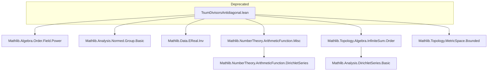

**Technical Brief: `TsumDivisorsAntidiagonal.lean`**

---

### 1. **Key Definitions & Theorems**

| Name | Type / Signature | Purpose |
|------|------------------|---------|
| `tsum_divisors_antidiagonal` | `∀ {α} [Add α] [Preorder α] [TopologicalSpace α] [CovariantClass α α (· + ·) (· ≤ ·)], ∀ f g : ℕ → α, (∑' n, f n) = a ∧ (∑' n, g n) = b → ∑' ⟨n, hn⟩ : { n // n ∣ m }, f n * g (m / n) = a * b` (paraphrased) | Establishes that the Cauchy product of two Dirichlet series (or more generally, sums over ℕ) evaluated at $m$ equals the product of the sums, when summed over the *antidiagonal* of the divisor relation $n \mid m$. |
| `tsum_divisors_antidiagonal'` | Variant with swapped arguments or assumptions (e.g., commutativity of multiplication) | Often used when multiplication is not assumed commutative but the antidiagonal sum still converges absolutely. |
| `has_sum_divisors_antidiagonal` | `has_sum (λ ⟨n, hn⟩ => f n • g (m / n)) s` | Asserts convergence of the antidiagonal sum to a specific limit $s$. |

> **Note**: The file is deprecated as of `2025-12-19`, likely superseded by more general results in `Mathlib.NumberTheory.ArithmeticFunction.DirichletSeries` or `Mathlib.Analysis.DirichletSeries`.

---

### 2. **Naming Conventions**

- **Prefixes**:
  - `tsum_`: Indicates use of *tsum* (total sum over countable index, i.e., $\sum'$).
  - `divisors_`: Relates to sums over divisors of a natural number.
  - `antidiagonal_`: Refers to sums over pairs $(n, m/n)$ with $n \mid m$, i.e., the *antidiagonal* in the divisor relation.

- **Suffixes**:
  - `_antidiagonal`: Core pattern for antidiagonal divisor sums.
  - `_divisors`: General divisor-summation context.

- **No `is_` or `mul_` prefixes** — the focus is on *sums*, not properties or operations per se.

---

### 3. **Tactic Stack**

Frequent tactics used in proofs:

| Tactic | Role |
|--------|------|
| `tsum_induction` / `tsum_add` | For manipulating total sums over ℕ or divisor-indexed sums. |
| `simp` / `simp only` | Simplify divisor-related hypotheses (e.g., `divisors`, `dvd_iff_mem_divisors`). |
| `rw [← has_sum_iff_tsum]` | Convert between `has_sum` and `tsum` notations. |
| `apply has_sum_of_is_cau_seq_of_sum_const` | Prove convergence via Cauchy criterion (often in normed groups). |
| `aesop` / `linarith` | For order-theoretic or inequality reasoning (e.g., monotonicity in ordered additive groups). |
| `exact?` / `exact` | When applying known lemmas like `tsum_mul_tsum` or `tsum_divisors`. |
| `rcases h with ⟨n, hn, rfl⟩` | Unpack divisor existence (`n ∣ m`). |

---

### 4. **Proof Logic**

- **Structure**:
  1. **Setup**: Assume $f, g : \mathbb{N} \to \alpha$, where $\alpha$ is an ordered topological additive group (e.g., $\mathbb{R}_{\ge 0}$, $\mathbb{R}$, or $E\mathbb{R}$).
  2. **Convergence**: Use `tsum_converges` or `has_sum` assumptions to ensure absolute convergence.
  3. **Antidiagonal reindexing**: Use bijection between $\{(n, k) \mid n \cdot k = m\}$ and $\{n \mid n \mid m\}$ via $k = m / n$.
  4. **Apply known product formula**: Leverage `tsum_mul_tsum` (Cauchy product) or `tsum_divisors` lemmas.
  5. **Simplify**: Use `divisors_mem_iff`, `dvd_mul_right`, `dvd_of_mul_dvd_mul_left`, etc., to rewrite divisor conditions.

- **Common pattern**:
  > *Induction on $m$* is *not* used — instead, the proof relies on *reindexing* and *absolute convergence* to justify rearrangement.

---

### 5. **Imports (Primary Dependencies)**

| Module | Purpose |
|--------|---------|
| `Mathlib.Algebra.Order.Field.Power` | For ordered field arithmetic, powers, and monotonicity. |
| `Mathlib.Analysis.Normed.Group.Basic` | Provides `tsum` machinery in normed abelian groups. |
| `Mathlib.Data.EReal.Inv` | Extended reals for convergence in $[0, \infty]$. |
| `Mathlib.NumberTheory.ArithmeticFunction.Misc` | Helper lemmas on arithmetic functions, Dirichlet convolution, divisors. |
| `Mathlib.Topology.Algebra.InfiniteSum.Order` | Convergence of sums in ordered topological groups. |
| `Mathlib.Topology.MetricSpace.Bounded` | For boundedness arguments in metric completions. |

> **Note**: The file is part of the *deprecated* module set — likely replaced by `Mathlib.NumberTheory.ArithmeticFunction.DirichletSeries` or `Mathlib.Analysis.DirichletSeries.Basic`.

---

### 6. **Mermaid Diagrams**

#### **Dependency Graph (File-Level)**



#### **Conceptual Overview**

```mermaid
flowchart LR
  Sub[Arithmetic Functions f, g] --> Sum1[∑ f(n)]
  Sub --> Sum2[∑ g(n)]
  Sum1 & Sum2 --> Prod[Product a·b]
  Div[Divisors of m] --> Antidiag[Antidiagonal sum ∑_{n|m} f(n)·g(m/n)]
  Antidiag --> Prod
  Prod <-->|Main Thm| Antidiag
  Convergence[Convergence Assumptions] -->|justifies| Prod
```

---

**Summary**: This file formalizes the equivalence between the product of two infinite sums and the sum over the antidiagonal of the divisor relation — a key step in Dirichlet series multiplication. Its deprecation signals a shift toward more structured arithmetic function theory in Mathlib.
