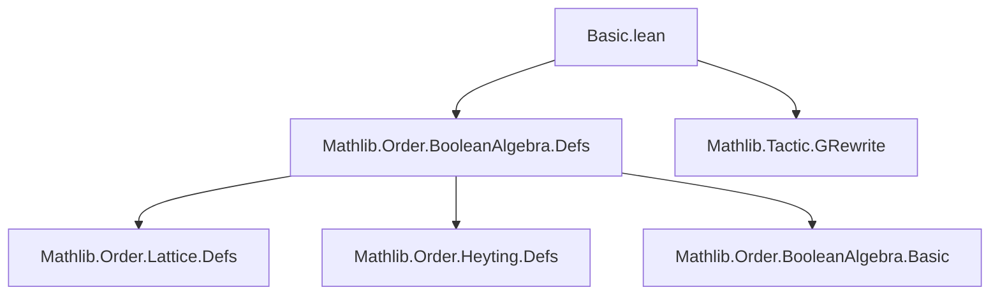
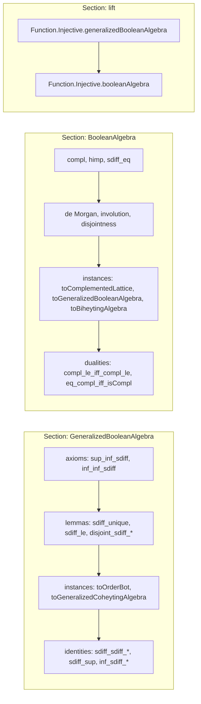

### Technical Brief: `Basic.lean` — Basic Properties of Boolean Algebras

---

#### **1. Key Definitions & Theorems**

| Name | Type / Signature | Purpose |
|------|------------------|---------|
| `GeneralizedBooleanAlgebra` | `Type u → Prop` | Typeclass for generalized Boolean algebras (relatively complemented distributive lattices with `⊥`). |
| `sdiff` (`x \ y`) | `α → α → α` | Symmetric difference / relative complement: largest $z$ s.t. $z ⊓ y = ⊥$ and $z ⊔ (x ⊓ y) = x$. |
| `compl` (`xᶜ`) | `α → α` | Complement in Boolean algebra: $xᶜ = ⊤ \ x$. |
| `himp` (`x ⇨ y`) | `α → α → α` | Heyting implication: $x ⇨ y = y ⊔ xᶜ$. |
| `sdiff_eq` | `x \ y = x ⊓ yᶜ` | Equivalence of relative complement and meet with complement (in Boolean algebras). |
| `sdiff_unique` | `(x ⊓ y ⊔ z = x) → (x ⊓ y ⊓ z = ⊥) → x \ y = z` | Uniqueness of relative complement. |
| `sdiff_sdiff_right` | `x \ (y \ z) = x \ y ⊔ x ⊓ y ⊓ z` | Double relative complement identity. |
| `sdiff_sdiff_right_self` | `x \ (x \ y) = x ⊓ y` | Special case of double sdiff. |
| `sdiff_eq_left` | `x \ y = x ↔ Disjoint x y` | Characterization of when sdiff is identity. |
| `le_sdiff` | `x ≤ y \ z ↔ x ≤ y ∧ Disjoint x z` | Universal property of sdiff. |
| `compl_compl` | `xᶜᶜ = x` | Involution of complement. |
| `compl_inf` | `(x ⊓ y)ᶜ = xᶜ ⊔ yᶜ` | De Morgan law. |
| `sdiff_sup` | `y \ (x ⊔ z) = y \ x ⊓ y \ z` | Distributivity of sdiff over sup. |
| `disjoint_sdiff_comm` | `Disjoint (x \ z) y ↔ Disjoint x (y \ z)` | Symmetry of disjointness w.r.t. sdiff. |
| `sup_eq_sdiff_sup_sdiff_sup_inf` | `x ⊔ y = x \ y ⊔ y \ x ⊔ x ⊓ y` | Partition of join into symmetric parts and intersection. |
| `GeneralizedBooleanAlgebra.toBooleanAlgebra` | `[GBA] → [OrderTop] → BooleanAlgebra` | Bounded GBA ⇒ Boolean algebra. |
| `BooleanAlgebra.toGeneralizedBooleanAlgebra` | `BooleanAlgebra → GeneralizedBooleanAlgebra` | Every Boolean algebra is a GBA. |

---

#### **2. Naming Conventions**

- **Prefixes**:
  - `sdiff_`: operations involving relative complement (`\`).
  - `compl_`: operations involving complement (`ᶜ`).
  - `disjoint_`: properties about disjointness (`Disjoint`).
  - `sdiff_le`, `sdiff_lt`, `sdiff_eq`: relational lemmas about sdiff.
  - `sdiff_sdiff_*`: double sdiff identities.
  - `inf_sdiff_*`, `sup_sdiff_*`: interaction of sdiff with meet/join.
  - `himp_*`: Heyting implication properties.

- **Suffixes**:
  - `_left`, `_right`: indicate which argument is fixed in symmetric identities.
  - `_self`: when both arguments are same or self-referential (e.g., `sdiff_sdiff_right_self`).
  - `_comm`: commutativity variants.
  - `_iff`: biconditional characterizations.
  - `_eq_bot`, `_eq_top`: characterizations of when expressions equal `⊥` or `⊤`.

- **Notable patterns**:
  - `sdiff_eq_left` vs `sdiff_eq_self_iff_disjoint`: both characterize when `x \ y = x`, but via different lemmas.
  - `sdiff_le_sdiff_right`, `sdiff_le_sdiff_left`: monotonicity of sdiff in each argument.

---

#### **3. Tactic Stack**

| Tactic | Frequency | Role |
|--------|-----------|------|
| `rw` / `rwa` | Very High | Rewriting definitions and lemmas (e.g., `sdiff_eq`, `inf_sdiff_self_right`). |
| `simp` / `simp_rw` | High | Simplifying using `@[simp]` lemmas (e.g., `sdiff_inf_sdiff`, `inf_sdiff_self_left`). |
| `calc` | High | Chain of equalities for complex identities (e.g., `sdiff_sup`, `sdiff_sdiff_right`). |
| `grind` / `grw` | Medium | Custom simplifier for lattice/GBA theory (e.g., `grind [sdiff_le', ...]`). |
| `ac_rfl` | Medium | Associativity/commutativity normalization (e.g., in `sdiff_sdiff_right`). |
| `aesop` | Medium | Automated reasoning for simple goals (e.g., `himp_eq_left`). |
| `conv` / `gcongr` | Medium | Contextual rewriting and congruence closure. |
| `funext`, `ext` | Medium | Extensionality for functions/products. |
| `exact`, `apply`, `intro`, `cases` | Medium | Standard proof structure. |
| `linarith`, `ring` | Low | Rarely needed (lattice-theoretic, not arithmetic). |

---

#### **4. Proof Logic**

- **Inductive/structural style**: Proofs are mostly *algebraic*, leveraging lattice identities and axioms of `GeneralizedBooleanAlgebra`.
- **Common proof patterns**:
  1. **Uniqueness via `sdiff_unique`**: Show two candidates $z_1, z_2$ satisfy $x ⊓ y ⊔ z_i = x$ and $x ⊓ y ⊓ z_i = ⊥$.
  2. **Disjointness via `disjoint_iff_inf_le`**: Reduce to proving $\inf = ⊥$.
  3. **Double sdiff reduction**: Use `sdiff_sdiff_right` or `sdiff_sdiff_right_self` to simplify nested sdiff.
  4. **Complement duality**: Translate GBA lemmas to Boolean algebra via `compl`, often using `compl_compl` and De Morgan.
  5. **Monotonicity + antisymmetry**: Prove $x ≤ y$ and $y ≤ x$ separately (e.g., `le_sdiff`).
  6. **Product/PI lifting**: Use `funext` and `Prod.ext` to lift properties pointwise.

- **Typical flow**:
  ```lean
  calc
    _ = _ := by rw [lemma1]
    _ = _ := by rw [lemma2]
    _ = _ := by rw [axiom]
  ```

---

#### **5. Imports & Dependencies**

| Module | Role |
|--------|------|
| `Mathlib.Order.BooleanAlgebra.Defs` | Core definitions: `GeneralizedBooleanAlgebra`, `BooleanAlgebra`, `GeneralizedCoheytingAlgebra`, `himp`, `sdiff`. |
| `Mathlib.Tactic.GRewrite` | Provides `grw`/`grind` for lattice-aware rewriting. |

---

#### **6. Mermaid Diagrams**

##### **Dependency Graph (Module-Level)**



##### **Conceptual Overview (Theory Flow)**

```mermaid
graph LR
  A[GeneralizedBooleanAlgebra] -->|bounded + top| B[BooleanAlgebra]
  B --> C[ComplementedLattice]
  B --> D[HeytingAlgebra]
  B --> E[GeneralizedCoheytingAlgebra]
  A --> F[OrderBot]
  A --> G[DistribLattice]
  B --> H[BiheytingAlgebra]

  I[SDiff \\(\\setminus\\)] --> A
  I --> B
  J[Complement \\(ᶜ\\)] --> B
  K[Heyting Implication \\(⇨\\)] --> D
  K --> B
```

##### **File-Level Overview**



---

#### **7. Notes & Observations**

- **`sdiff` is central**: Almost all lemmas revolve around its algebraic behavior.
- **Duality**: Complement and sdiff are interdefinable (`xᶜ = ⊤ \ x`, `x \ y = x ⊓ yᶜ`).
- **Canonical forms**: Many lemmas normalize expressions to canonical forms (e.g., `x ⊓ y ⊔ x \ y = x`).
- **Instance priorities**: `priority := 100` avoids ambiguity with other lattice instances.
- **`grind`/`grw`**: Custom tactic for lattice simplification (not standard `simp`), crucial for automation.
- **TODOs**: 
  - Alternative GBA axiomatization using `Disjoint x (y \ x)` and `x ⊔ (y \ x) = y`.
  - `IsCompl_of` predicate for relative complements (requires `OrderBot` typeclass).

--- 

Let me know if you'd like a formalized dependency graph (e.g., `.lean`-level imports) or a tactic trace for a specific proof.
