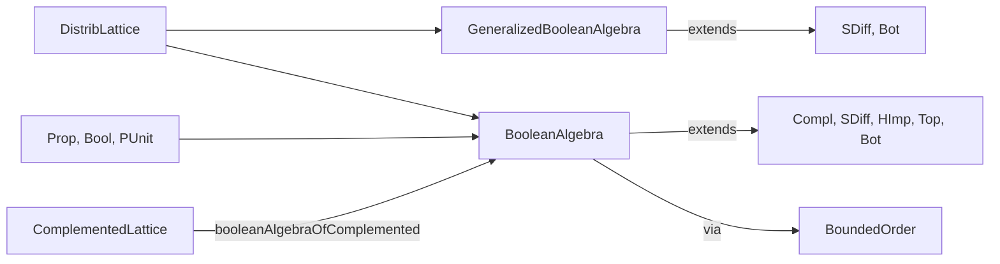
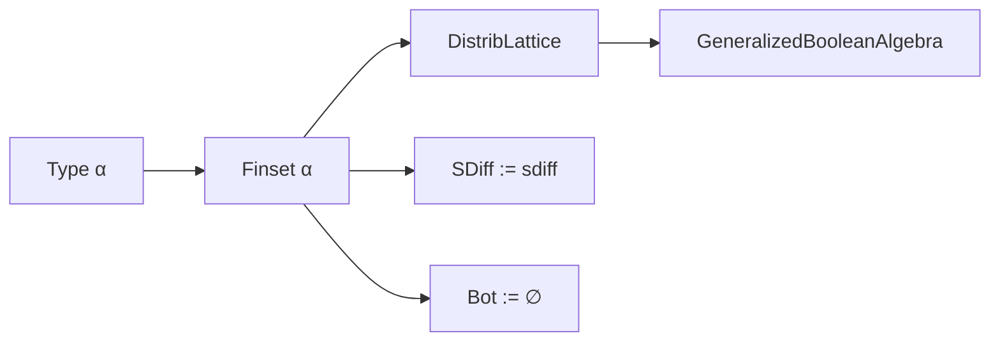

**Technical Brief: `Defs.lean` — Generalized and Boolean Algebras in Lean 4**

---

### 1. KEY DEFINITIONS & THEOREMS

| Name | Type / Signature | Purpose |
|------|------------------|---------|
| `GeneralizedBooleanAlgebra` | `class (α : Type u) extends DistribLattice α, SDiff α, Bot α` | Type class for generalized Boolean algebras: distributive lattices with bottom and relative complement (`sdiff`), satisfying `(a ⊓ b) ⊔ (a \ b) = a` and `(a ⊓ b) ⊓ (a \ b) = ⊥`. |
| `BooleanAlgebra` | `class (α : Type u) extends DistribLattice α, Compl α, SDiff α, HImp α, Top α, Bot α` | Type class for Boolean algebras: bounded distributive lattices with complement, relative complement, and Heyting implication, satisfying standard Boolean identities. |
| `sdiff` | `x \ y` | Relative complement: `x \ y = x ⊓ yᶜ` in Boolean algebras; primitive in generalized Boolean algebras. |
| `compl` | `xᶜ` | Global complement: `xᶜ` satisfies `x ⊓ xᶜ = ⊥`, `x ⊔ xᶜ = ⊤`. |
| `himp` | `x ⇨ y` | Heyting implication: `x ⇨ y = y ⊔ xᶜ` in Boolean algebras. |
| `BooleanAlgebra.toBoundedOrder` | `[BooleanAlgebra α] → BoundedOrder α` | Forgetful instance to bounded order. |
| `Prop.instBooleanAlgebra` | `BooleanAlgebra Prop` | Boolean algebra structure on propositions: `compl = Not`, `sdiff = λ p q, p ∧ ¬q`, `himp = λ p q, q ∨ ¬p`. |
| `Bool.instBooleanAlgebra` | `BooleanAlgebra Bool` | Boolean algebra on booleans: `compl = not`, `sdiff = λ a b, a ∧ ¬b`, etc. |
| `booleanAlgebraOfComplemented` | `[BoundedOrder α] → [ComplementedLattice α] → BooleanAlgebra α` | Alternative constructor: any complemented bounded distributive lattice is a Boolean algebra (uses choice). |
| `Bool.sup_eq_bor`, `Bool.inf_eq_band`, `Bool.compl_eq_bnot` | `rfl`-provable equalities | Identify lattice ops with boolean ops (`sup = or`, `inf = and`, `compl = not`). |

---

### 2. NAMING CONVENTIONS

- **`sdiff`**: Abbreviation for *set difference*; used for relative complement (`x \ y`).
- **`compl`**: Standard notation for global complement (`xᶜ`).
- **`himp`**: *Heyting implication* (`x ⇨ y`).
- **`inf_`, `sup_`**: Prefixes for lattice meet/join properties (e.g., `inf_compl_le_bot`, `top_le_sup_compl`).
- **`_eq` suffix**: Indicates definitional or provable equality (e.g., `sdiff_eq`, `himp_eq`).
- **`inst_` / `to_`**: Instance names (e.g., `BooleanAlgebra.toBoundedOrder`).
- **`_of_`**: Constructor naming (e.g., `booleanAlgebraOfComplemented`).

---

### 3. TACTIC STACK

- `aesop`: Used in `sdiff_eq`, `himp_eq` proofs — automated reasoning for simple algebraic identities.
- `simp`: Used in `PUnit.instBooleanAlgebra`, `Bool.sup_eq_bor`, etc., to simplify definitions.
- `dsimp`: Used in definitional simplification (e.g., `Bool.sup_eq_bor`, `Bool.inf_eq_band`).
- `rfl`: For definitional equalities (e.g., `Bool.compl_eq_bnot`).
- `Classical.choose`, `Classical.choose_spec`: In `booleanAlgebraOfComplemented`, to extract witnesses from existence proofs.
- `propext`: Used in `Prop.instBooleanAlgebra` to equate propositions up to logical equivalence.

---

### 4. PROOF LOGIC

- **Structure-driven reasoning**: Most proofs follow from unfolding definitions and applying lattice/Boolean identities.
- **Case analysis**: In `Prop.instBooleanAlgebra`, uses `Classical.em` and propositional extensionality.
- **Choice-based construction**: `booleanAlgebraOfComplemented` uses classical choice to pick complements.
- **Simplification + extensionality**: For `Prop`, `Bool`, and `PUnit`, proofs reduce to simplifying definitions and using propositional logic or small finite case analysis.
- **No induction**: No inductive types are involved in this file; reasoning is purely algebraic/axiomatic.

---

### 5. IMPORTS & DEPENDENCIES

- **Core dependency**: `Mathlib.Order.Heyting.Basic`
  - Provides Heyting algebras, implication, and related lattice-theoretic infrastructure.
- **Implicit dependencies** (via `DistribLattice`, `SDiff`, `Bot`, `Top`, `Compl`, `HImp`):
  - `Mathlib.Order.Lattice`, `Mathlib.Order.BoundedOrder`, `Mathlib.Order.Compl`, etc.
- **Logical infrastructure**:
  - `Classical`, `Propext`, `Function`, `OrderDual`, `Function` (for `universe` handling).

---

### 6. MERMAID DIAGRAMS

#### Dependency Graph (Module-Level)

```mermaid
graph TD
  A[Defs.lean] --> B[Mathlib.Order.Heyting.Basic]
  B --> C[Mathlib.Order.Lattice]
  B --> D[Mathlib.Order.BoundedOrder]
  B --> E[Mathlib.Order.Compl]
  B --> F[Mathlib.Order.Heyting.Basic]
  A --> G[Mathlib.Order.DistribLattice]  %% implied via extends
  A --> H[Mathlib.Data.Finset.Basic]     %% e.g., Finset α is a generalized Boolean algebra
```

#### Overview of Theory Flow



#### Example: `Finset α` as Generalized Boolean Algebra



---

### 7. SUMMARY

This file formalizes the foundational theory of **generalized Boolean algebras** and **Boolean algebras** in Lean 4, building on Heyting and lattice theory. It introduces two type classes (`GeneralizedBooleanAlgebra`, `BooleanAlgebra`) with axioms modeled after set-theoretic operations, and provides canonical instances for `Prop`, `Bool`, and `PUnit`. The design reflects a careful separation between *relative* (generalized) and *global* (Boolean) complementation, and supports future development (e.g., `Finset`, Boolean rings, Stone duality). The proofs are mostly definitional or rely on classical logic where needed.

--- 

Let me know if you'd like a formalization checklist or a plan for extending this theory (e.g., Boolean rings, Stone representation).
