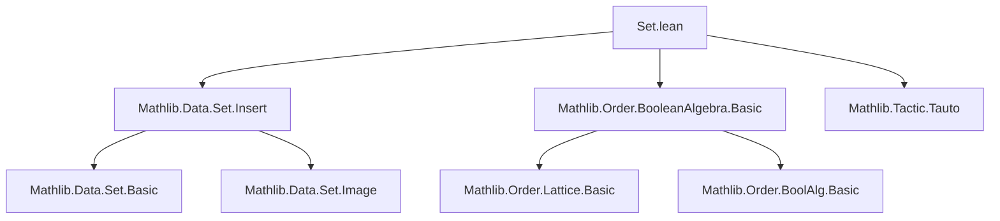
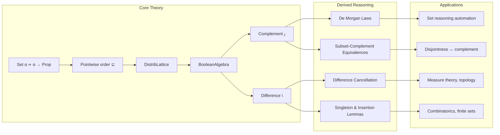

### Technical Brief: `Set.lean` — Boolean Algebra of Sets in Lean 4

---

#### **1. Key Definitions & Theorems**

| Name | Type / Signature | Purpose |
|------|------------------|---------|
| `instBooleanAlgebra` | `BooleanAlgebra (Set α)` | Establishes `Set α` as a Boolean algebra, inheriting structure from `α → Prop`. |
| `compl_def` | `sᶜ = { x | x ∉ s }` | Defines set complement extensionally. |
| `compl_empty`, `compl_univ`, `compl_union`, `compl_inter` | `∅ᶜ = univ`, `(univ)ᶜ = ∅`, `(s ∪ t)ᶜ = sᶜ ∩ tᶜ`, `(s ∩ t)ᶜ = sᶜ ∪ tᶜ` | Standard complement identities (De Morgan laws). |
| `diff_eq_compl_inter` | `s \ t = tᶜ ∩ s` | Relates set difference to complement and intersection. |
| `diff_union_diff_cancel`, `diff_union_diff_cancel'` | `s \ t ∪ t \ u = s \ u` under inclusion hypotheses | Generalized cancellation laws for differences. |
| `diff_diff`, `diff_diff_comm`, `diff_diff_right` | `(s \ t) \ u = s \ (t ∪ u)`, `(s \ t) \ u = (s \ u) \ t`, `s \ (t \ u) = s \ t ∪ s ∩ u` | Associativity, commutativity, and distributivity of difference. |
| `ite` | `Set.ite t s s' := s ∩ t ∪ s' \ t` | If-then-else for sets: piecewise definition over `t` and `tᶜ`. |
| `ite_inter_self`, `ite_inter_compl_self` | `t.ite s s' ∩ t = s ∩ t`, `t.ite s s' ∩ tᶜ = s' ∩ tᶜ` | Characterization of `ite` via intersection with `t` and `tᶜ`. |
| `subset_compl_comm`, `subset_compl_iff_disjoint_left/right` | `s ⊆ tᶜ ↔ t ⊆ sᶜ`, `s ⊆ tᶜ ↔ Disjoint s t` | Links subset, complement, and disjointness. |
| `diff_nonempty`, `inter_compl_nonempty_iff` | `(s \ t).Nonempty ↔ ¬s ⊆ t` | Nonemptiness of difference ↔ not subset. |
| `diff_subset_diff`, `diff_subset_diff_left/right` | Monotonicity of set difference in both arguments. |
| `diff_singleton_eq_self`, `diff_singleton_ssubset`, `insert_diff_singleton` | Simplifications for singleton differences and insertions. |
| `subset_insert_iff`, `ssubset_iff_sdiff_singleton` | Characterizations of subset and strict subset via singleton insertions/differences. |

---

#### **2. Naming Conventions**

- **Prefixes**:
  - `compl_`: complement-related lemmas (`compl_empty`, `compl_union`, `compl_eq_univ_diff`)
  - `diff_`: set difference (`diff_eq_compl_inter`, `diff_union_cancel`, `diff_diff`, `diff_singleton_eq_self`)
  - `ite_`: if-then-else (`ite_inter_self`, `ite_same`, `ite_mono`)
  - `subset_`, `disjoint_`, `nonempty_`: relational properties (`subset_compl_comm`, `disjoint_compl_left_iff_subset`, `nonempty_compl`)
- **Suffixes**:
  - `_self`: self-interaction (`diff_self`, `inter_compl_self`, `union_diff_self`)
  - `_left`, `_right`: argument position (`diff_subset_diff_left`, `inter_diff_distrib_right`)
  - `_comm`: commutativity variants (`diff_diff_comm`, `inter_diff_right_comm`)
  - `_iff`: equivalence statements (`diff_eq_empty`, `compl_subset_compl`, `subset_insert_iff`)
  - `_of_`: conditional variants (`diff_union_of_subset`, `ite_eq_of_subset_left`)
  - `'` (prime): generalized or alternate version (`diff_union_diff_cancel'`)

---

#### **3. Tactic Stack**

- **Core automation**:
  - `rfl`, `ext`, `simp`, `simp_rw`, `push _ ∈ _`
- **Logical reasoning**:
  - `tauto`, `grind`, `by_cases`, `exact`, `apply`, `intro`, `cases`
- **Algebraic simplification**:
  - `ring` (not used here), but `rw` heavily for rewriting using `:=`-proven equalities
- **Set-specific simplifications**:
  - `simp +contextual`, `simp only [subset_def, ← forall_and]`
- **Proof style**:
  - Mostly *extensional*: proofs via `ext x; simp` or `tauto`
  - Induction not needed (no natural numbers or inductive types in this file)

---

#### **4. Proof Logic**

- **Extensionality-first**: Most proofs start with `ext x` to reduce to element-wise reasoning.
- **Case analysis on membership**: `by_cases hx : x ∈ t` is common, followed by `simp [*]` or `tauto`.
- **Algebraic rewriting**: Use of `rw [diff_eq, inter_comm, ...]` to reduce to known Boolean algebra identities.
- **Leveraging Boolean algebra structure**: Many lemmas are direct corollaries of `BooleanAlgebra (α → Prop)` instance (e.g., `compl_sup`, `inf_compl_eq_bot`).
- **Disjointness ↔ complement subset**: Key equivalence used repeatedly: `Disjoint s t ↔ s ⊆ tᶜ`.
- **Singleton handling**: Specialized lemmas for `insert`, `diff_singleton`, `mem_compl_singleton_iff`, etc., often proven via `ext` + `simp`.

---

#### **5. Imports**

| Import | Purpose |
|--------|---------|
| `Mathlib.Data.Set.Insert` | Defines `insert`, `singleton`, and basic insertion/difference lemmas. |
| `Mathlib.Order.BooleanAlgebra.Basic` | Provides `BooleanAlgebra` typeclass and core lemmas (e.g., `compl_sup`, `inf_compl_eq_bot`). |
| `Mathlib.Tactic.Tauto` | Enables `tauto` tactic for propositional logic automation. |

> **Note**: The module builds on `Set α ≃ α → Prop` (via `Set` definition as predicate type), and inherits Boolean algebra structure from function types.

---

#### **6. Mermaid Diagrams**

##### **Dependency Graph (Module-Level)**

##### **Overview of Theoretical Structure**

---

#### **7. Summary**

This file formalizes the **Boolean algebra structure of sets**, emphasizing:
- Complement and difference identities (including De Morgan, cancellation, distributivity).
- Equivalences linking subset, disjointness, and complement.
- A rich theory of **singleton and insertion operations**, crucial for finite set reasoning.
- A clean `ite` (if-then-else) operator for piecewise set definitions.

It serves as foundational infrastructure for higher-level developments (e.g., measure theory, topology, combinatorics) where set-theoretic reasoning is pervasive.

--- 

Let me know if you'd like a **dependency graph of lemmas**, **proof complexity metrics**, or **comparison with other formalizations** (e.g., Coq, Isabelle).
