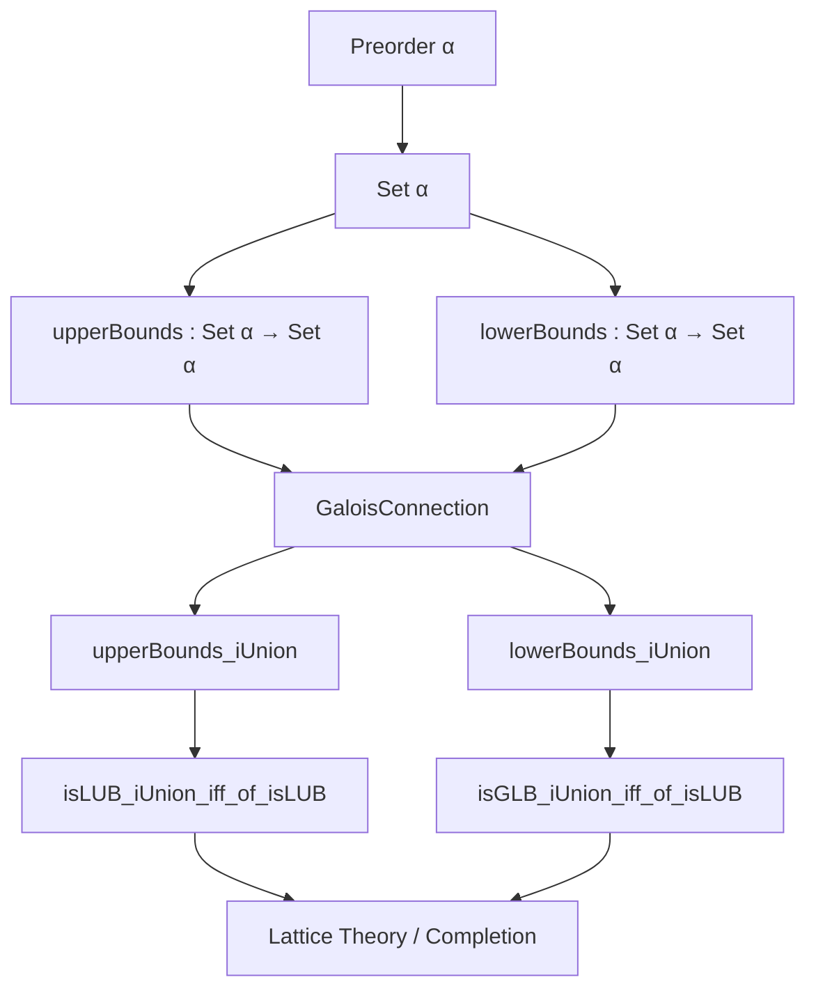
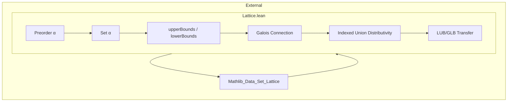

**Technical Brief: `Lattice.lean` (Unions and Intersections of Bounds)**

---

### 1. **Key Definitions & Theorems**

| Name | Type / Signature | Purpose |
|------|------------------|---------|
| `upperBounds` | `Set α → Set α` | Maps a set $S \subseteq \alpha$ to its set of upper bounds: $\{x \mid \forall s \in S,\, s \le x\}$ |
| `lowerBounds` | `Set α → Set α` | Maps a set $S \subseteq \alpha$ to its set of lower bounds: $\{x \mid \forall s \in S,\, x \le s\}$ |
| `gc_upperBounds_lowerBounds` | `GaloisConnection ...` | Establishes a Galois connection between `upperBounds` (dualized) and `lowerBounds`, forming a contravariant adjunction between upper and lower bounds. |
| `upperBounds_iUnion` | `upperBounds (⋃ i, s i) = ⋂ i, upperBounds (s i)` | Shows that upper bounds of a union equal the intersection of upper bounds — a distributivity of upper bounds over unions. |
| `lowerBounds_iUnion` | `lowerBounds (⋃ i, s i) = ⋂ i, lowerBounds (s i)` | Dual: lower bounds of a union equal the intersection of lower bounds. |
| `isLUB_iUnion_iff_of_isLUB` | `IsLUB (Set.range u) c ↔ IsLUB (⋃ i, s i) c` | Under pointwise LUB assumptions (`∀ i, IsLUB (s i) (u i)`), the LUB of the union of sets equals the LUB of the range of the selector function $u$. |
| `isGLB_iUnion_iff_of_isLUB` | `IsGLB (Set.range u) c ↔ IsGLB (⋃ i, s i) c` | Dual: under pointwise GLB assumptions, GLB of union equals GLB of range. |

> Note: `isLUB_iUnion_iff_of_isLUB` and `isGLB_iUnion_iff_of_isLUB` are stated with a slightly misleading name — they use `isLUB` in the hypothesis but apply to both LUB and GLB cases; the GLB version should arguably be named `isGLB_iUnion_iff_of_isGLB`.

---

### 2. **Naming Conventions**

- **Prefixes**:
  - `upperBounds_`, `lowerBounds_`: for functions and theorems about bounds.
  - `gc_`: for Galois connection lemmas.
  - `iUnion`, `iInf`, `iSup`: indexed unions/intersections (i.e., $\bigcup$, $\bigcap$, $\bigsqcup$, $\bigsqcap$).
- **Suffixes**:
  - `_iff_of_`: equivalence under assumptions (e.g., `isLUB_iUnion_iff_of_isLUB`).
- **Dualization**:
  - `OrderDual.toDual`, `OrderDual.ofDual`: used to encode contravariance via duality.

---

### 3. **Tactic Stack**

| Tactic | Usage |
|--------|-------|
| `simpa` | Simplify using target and rewrite rules (e.g., in `gc_upperBounds_lowerBounds`). |
| `simp_rw` | Rewrite with simplification lemmas (e.g., `range_eq_iUnion`, `upperBounds_singleton`). |
| `refine` | Partial proof construction (e.g., `refine isLUB_congr ?_`). |
| `forall₂_swap` | Used implicitly in `simpa` to swap quantifiers (via `forall_swap`-style reasoning). |

No heavy automation (e.g., `aesop`, `linarith`, `omega`) — proofs are mostly structural and rely on lattice-theoretic properties and set-theoretic simplifications.

---

### 4. **Proof Logic**

- **Structure**:
  1. Prove a **Galois connection** (`gc_upperBounds_lowerBounds`) between upper/lower bounds via duality.
  2. Derive **indexed distributivity** (`upperBounds_iUnion`, `lowerBounds_iUnion`) from the Galois connection using `l_iSup`/`u_iInf`.
  3. Use these to prove **LUB/GLB transfer** lemmas via:
     - `isLUB_congr` / `isGLB_congr` (equality of bounds implies equivalence of LUB/GLB status),
     - `range_eq_iUnion` to rewrite `Set.range u` as `⋃ i, {u i}`,
     - `upperBounds_singleton` / `lowerBounds_singleton` to simplify bounds of singletons.

- **Logical Flow**:
  > *Galois connection* ⇒ *indexed meet/join preservation* ⇒ *pointwise LUB/GLB ⇒ global LUB/GLB*.

---

### 5. **Imports**

| Import | Role |
|--------|------|
| `Mathlib.Data.Set.Lattice.Image` | Provides lattice-theoretic infrastructure for sets (e.g., `upperBounds`, `lowerBounds`, `isLUB`, `isGLB`). |
| `Set` (open) | Opens `Set` namespace for `upperBounds`, `lowerBounds`, `iUnion`, etc. |
| `Preorder α` | Provides order-theoretic context (no need for full lattice or complete lattice). |

> Minimal dependencies: only `Preorder` and basic set lattice theory — no completeness assumptions.

---

### 6. **Mermaid Diagrams**

#### **Dependency Graph**

#### **Overview of File Scope**

> **Scope**: This module bridges *pointwise* and *global* bounds over indexed families of sets, leveraging Galois connections to avoid assuming completeness. It serves as a foundational lemma set for later results about suprema/infima of unions, especially in contexts like Dedekind-MacNeille completion or domain theory.

--- 

Let me know if you'd like a formalized dependency graph for the broader `Mathlib.Data.Set.Lattice` hierarchy.
