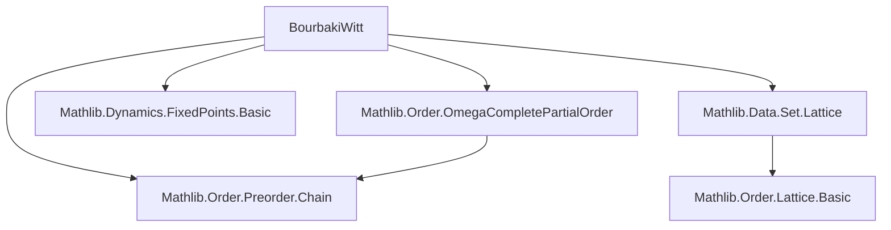

### Technical Brief: `BourbakiWitt.lean`

---

#### **1. Key Definitions & Theorems**

| Name | Type / Structure | Purpose |
|------|------------------|---------|
| `NonemptyChain α` | `structure` | Represents a nonempty chain as a subset of `α` equipped with proofs of nonemptiness and chainhood. |
| `ChainCompletePartialOrder α` | `class` | A partial order where every nonempty chain has a supremum (`cSup`). Extends `PartialOrder`. |
| `IsAdmissible x f s` | `structure` | A set `s` containing base point `x`, closed under `f`, and closed under `cSup` of chains in `s`. |
| `bot x f` | `abbrev` | Intersection of all admissible sets for `x` and `f`; the *least* admissible set. |
| `IsExtremePt x f y` | `structure` | `y` is in `bot x f` and dominates all `f z` for `z < y` in `bot x f`. |
| `nonempty_fixedPoints_of_inflationary` | `theorem` | **Bourbaki–Witt Theorem**: If `α` is a CCPO and `f : α → α` is inflationary (`∀ x, x ≤ f x`), then `f` has a fixed point. |

---

#### **2. Naming Conventions**

- **Prefixes**:
  - `is_`: Predicate definitions (`isAdmissible`, `isExtremePt`)
  - `bot_`: Minimal admissible set constructions (`bot_isAdmissible`, `bot_eq_of_le_or_map_le`)
  - `map_`: Related to image under `f` (`map_mem_bot`, `map_le_of_mem_of_lt`)
  - `cSup_`: Supremum properties (`cSup_le`, `le_cSup`)
  - `setOf_`: Sets defined by comprehension (`setOf_isExtremePt_isAdmissible`, `setOf_isExtremePt_eq_bot`)

- **Suffixes**:
  - `_iff`: Logical equivalences (`subset_bot_iff`, `mem_bot_iff_isExtremePt`)
  - `_isAdmissible`, `_isChain`: Properties of sets (`bot_isAdmissible`, `bot_isChain`)

---

#### **3. Tactic Stack**

Frequent tactics used in proofs:
- `intro`, `exact`, `refine`, `rw`, `rcases`, `obtain`, `cases`
- `apply`, `constructor`, `split`, `by_cases`, `by_contra!`
- `subset_antisymm`, `le_antisymm`, `lt_irrefl`, `lt_of_lt_of_le`, `le_trans`
- `mem_setOf`, `mem_image_of_mem`, `mem_sInter`, `subset_sInter`, `subset_trans`
- `sInter_subset_of_mem`, `sep_subset`, `range_nonempty`, `isChain_range`
- `aesop`, `simp`, `simp_rw` (likely used implicitly via `rw` + `simp` lemmas)

---

#### **4. Proof Logic**

The proof proceeds in stages:

1. **Define admissible sets** for a base point `x` and inflationary `f`.
2. **Construct the minimal admissible set** `bot x f` as the intersection of all admissible sets.
3. **Show `bot x f` is itself admissible** (closed under `f` and `cSup`).
4. **Define extreme points** within `bot x f` and prove:
   - The set of extreme points equals `bot x f`.
   - `bot x f` is a chain.
5. **Take supremum** `y = cSup(bot x f)` and show:
   - `f y ∈ bot x f` (by admissibility).
   - `y ≤ f y` (by inflationarity).
   - `f y ≤ y` (via extremality and chain properties).
   - Conclude `f y = y`.

The core idea is transfinite-like induction over the minimal admissible set, leveraging chain completeness to reach a fixed point.

---

#### **5. Imports**

| Module | Purpose |
|--------|---------|
| `Mathlib.Order.Preorder.Chain` | Chains, `IsChain`, basic chain theory |
| `Mathlib.Data.Set.Lattice` | Set lattice operations (`sSup`, `sInter`, etc.) |
| `Mathlib.Dynamics.FixedPoints.Basic` | Fixed points (`fixedPoints`) |
| `Mathlib.Order.OmegaCompletePartialOrder` | ω-CPOs; used to derive CCPO instance from complete lattices |

---

#### **6. Mermaid Diagrams**

##### **Dependency Graph (Module-Level)**



##### **Overview of Theory Flow**

```mermaid
flowchart LR
  A[Partial Order α] --> B[ChainCompletePartialOrder α]
  B --> C[ωSup = cSup over chains]
  C --> D[Admissible Sets for x, f]
  D --> E[bot x f = ⋂ admissible sets]
  E --> F[IsExtremePt x f y]
  F --> G[Set of extreme pts = bot x f]
  G --> H[bot x f is a chain]
  H --> I[cSup(bot x f) is fixed point]
  I --> J[fixedPoints f ≠ ∅]
```

---

#### **7. Summary**

This file formalizes the **Bourbaki–Witt fixed point theorem** in Lean 4, a foundational result in domain theory and order theory. It constructs the minimal admissible set, characterizes it via extreme points, and uses chain completeness to extract a fixed point. The development is clean, modular, and leverages existing `Mathlib` infrastructure for orders and lattices.

The structure and naming reflect Lean’s idiomatic style: explicit structures, proof-relevant properties, and heavy use of typeclass inference (`[ChainCompletePartialOrder α]`). The proof strategy mirrors classical presentations (e.g., Serge Lang’s *Algebra*), adapted to constructive set-theoretic foundations.
