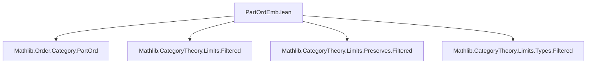
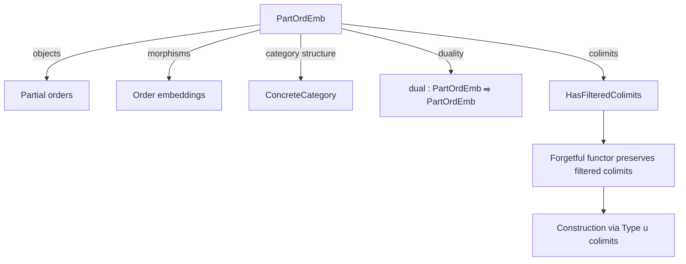
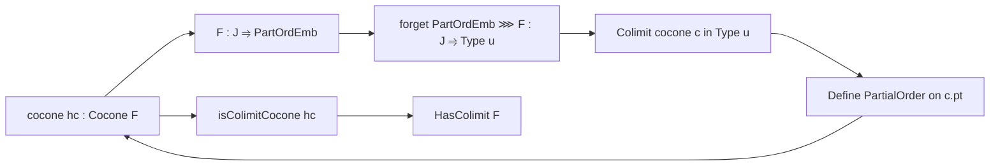

### Technical Brief: `PartOrdEmb.lean`

---

#### **1. Key Definitions & Theorems**

| Name | Type / Structure | Purpose |
|------|------------------|---------|
| `PartOrdEmb` | `Type u → Type u` (structure) | Bundled partial orders; objects of the category. |
| `Hom X Y` | `Type u` (structure) | Morphisms are order embeddings `X ↪o Y`. |
| `instance : Category PartOrdEmb` | `Category (PartOrdEmb.{u})` | Defines composition and identity via `OrderEmbedding`. |
| `instance : ConcreteCategory PartOrdEmb (· ↪o ·)` | `ConcreteCategory PartOrdEmb (· ↪o ·)` | Embedding into `Type u` via underlying type; morphisms are order embeddings. |
| `Hom.hom` | `f : X ⟶ Y ↦ f.hom' : X ↪o Y` | Projection to underlying order embedding. |
| `ofHom` | `X ↪o Y → of X ⟶ of Y` | Inclusion of order embeddings as morphisms in `PartOrdEmb`. |
| `Iso.mk` | `α ≃o β → α ≅ β` | Constructs categorical isomorphism from order isomorphism. |
| `dual : PartOrdEmb ⥤ PartOrdEmb` | Functor | Sends `X` to `Xᵒᵈ` and `f` to `f.dual`. |
| `dualEquiv : PartOrdEmb ≌ PartOrdEmb` | Equivalence of categories | Self-duality via `OrderDual`. |
| `CoconePt hc` | `Type u` | Underlying type of the colimit cocone point, equipped with a partial order. |
| `instance : PartialOrder (CoconePt hc)` | `PartialOrder` | Defines the partial order on the colimit type. |
| `cocone hc : Cocone F` | Colimit cocone in `PartOrdEmb` | Constructed from a colimit cocone in `Type u`. |
| `CoconePt.desc hc s` | `CoconePt hc ↪o s.pt` | Mediating order embedding for colimit universal property. |
| `isColimitCocone hc` | `IsColimit (cocone hc)` | Proves `cocone hc` is a colimit in `PartOrdEmb`. |
| `instance : HasColimit F` | `HasColimit F` | Every functor `F : J ⥤ PartOrdEmb` (with `J` filtered) has a colimit. |
| `instance : PreservesColimitsOfShape J (forget PartOrdEmb)` | `PreservesColimitsOfShape J (forget ...)` | The forgetful functor preserves filtered colimits. |
| `instance : HasFilteredColimitsOfSize.{u, u} PartOrdEmb` | `HasFilteredColimitsOfSize` | `PartOrdEmb` has all filtered colimits. |

---

#### **2. Naming Conventions**

- **Prefixes**:
  - `of_`: From `Type u` with structure to `PartOrdEmb`.
  - `hom_`: Projection to underlying order embedding.
  - `cocone_`, `CoconePt_`: Colimit-related constructions.
  - `dual_`: Dualization constructions.
- **Suffixes**:
  - `_hom`: Refers to underlying `OrderEmbedding`.
  - `_apply`: Application lemmas (e.g., `id_apply`, `comp_apply`).
  - `_ext`: Extensionality lemmas.
  - `_symm`, `_inv`: Inverses in isomorphisms.
- **Structure fields**:
  - `of ::` (record constructor), `carrier`, `hom'`.

---

#### **3. Tactic Stack**

Frequently used tactics in proofs:
- `simp` / `dsimp`: Simplification of homs, applications, and projections.
- `ext`: Extensionality (for morphisms, functions, cocones).
- `rw`, `conv`: Rewriting and congruence reasoning, especially for order-theoretic lemmas.
- `obtain ⟨...⟩`: Existential destructuring (filtered colimit properties).
- `exact`, `refine`: Goal-directed proof construction.
- `simpa`: Simplify and discharge.
- `cases`, `intro`: Basic intro/cases for structure fields.
- `have`, `set`: Local definitions and intermediate claims.
- `bowtie`: From `IsFiltered`, used to connect diagrams in filtered categories.

---

#### **4. Proof Logic**

- **Category construction**:  
  Define `Hom` as order embeddings, then verify identity and composition via `OrderEmbedding.refl` and `trans`. Use `ConcreteCategory` to lift structure.

- **Colimit construction** (main technical contribution):
  1. Start with a colimit cocone `c` of `F ⋙ forget` in `Type u`.
  2. Define a partial order on `c.pt` using filteredness:  
     $x ≤ y \iff \exists j, x', y' : x = c.ι_j(x'), y = c.ι_j(y'), x' ≤ y'$.
  3. Prove `≤` is reflexive, transitive, antisymmetric using:
     - Filteredness (bowtie lemma) to unify indices.
     - Properties of colimit cocone (joint surjectivity, uniqueness).
     - Monotonicity of morphisms in `F`.
  4. Define cocone maps `c.ι_j` as `ofHom` of order embeddings (injective, reflect order).
  5. Verify cocone naturality and colimit universal property:
     - Mediating map `CoconePt.desc` is an order embedding.
     - Uniqueness follows from `hc.fac` and injectivity.

- **Preservation of colimits**:  
  Use `preservesColimit_of_preserves_colimit_cocone` and `hasColimitsOfShape`.

---

#### **5. Imports & Dependencies**

| Import | Purpose |
|--------|---------|
| `Mathlib.Order.Category.PartOrd` | Category of partial orders with order embeddings. |
| `Mathlib.CategoryTheory.Limits.Filtered` | Filtered categories and colimits. |
| `Mathlib.CategoryTheory.Limits.Preserves.Filtered` | Preservation of filtered colimits. |
| `Mathlib.CategoryTheory.Limits.Types.Filtered` | Colimits in `Type u` (filtered). |

---

#### **6. Mermaid Diagrams**

##### **Dependency Graph (Module Level)**

##### **Overview of Theory Flow**

##### **Colimit Construction Pipeline**

---

#### **7. Summary**

This file formalizes the **category of partial orders with order embeddings**, denoted `PartOrdEmb`, and proves that it **has all filtered colimits**, with the forgetful functor preserving them. The key technical work is constructing the partial order on the colimit type using filteredness to handle index unification, and verifying all order-theoretic properties (especially antisymmetry). The formalization leverages `ConcreteCategory` and `OrderEmbedding` heavily, and uses standard filtered colimit machinery from `Mathlib`.
