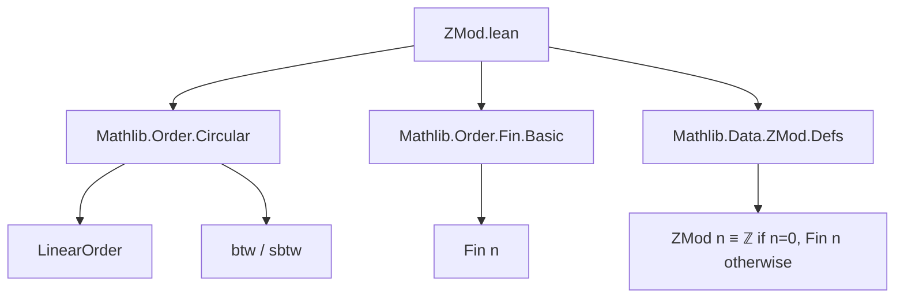
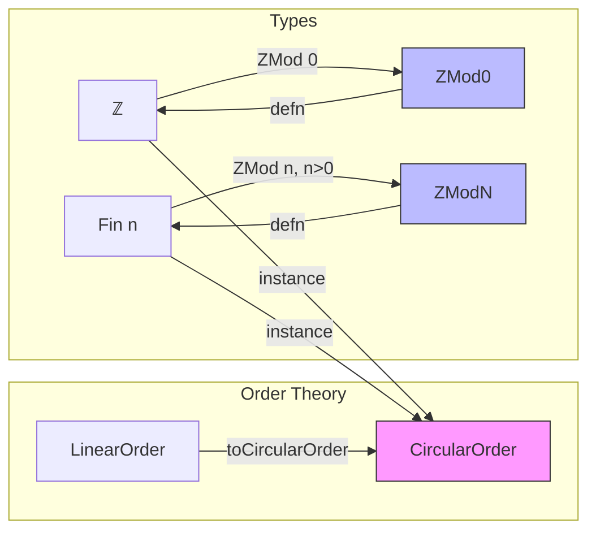

**Technical Brief: `ZMod.lean` — Circular Order on `ZMod n`**

---

### 1. **Key Definitions & Theorems**

| Name | Type / Signature | Purpose |
|------|------------------|---------|
| `Int.btw_iff` | `btw a b c ↔ a ≤ b ∧ b ≤ c ∨ b ≤ c ∧ c ≤ a ∨ c ≤ a ∧ a ≤ b` | Characterizes betweenness (`btw`) in the integers using linear order. |
| `Int.sbtw_iff` | `sbtw a b c ↔ a < b ∧ b < c ∨ b < c ∧ c < a ∨ c < a ∧ a < b` | Characterizes strict betweenness (`sbtw`) in ℤ. |
| `Fin.btw_iff` | `btw a b c ↔ a ≤ b ∧ b ≤ c ∨ b ≤ c ∧ c ≤ a ∨ c ≤ a ∧ a ≤ b` | Same as above, but for `Fin n` (finite types with linear order). |
| `Fin.sbtw_iff` | `sbtw a b c ↔ a < b ∧ b < c ∨ b < c ∧ c < a ∨ c < a ∧ a < b` | Strict betweenness for `Fin n`. |
| `instance : CircularOrder ℤ` | `LinearOrder.toCircularOrder _` | Lifts the linear order on ℤ to a circular order. |
| `instance (n : ℕ) : CircularOrder (Fin n)` | `LinearOrder.toCircularOrder _` | Lifts linear order on `Fin n` to circular order. |
| `instance : ∀ (n : ℕ), CircularOrder (ZMod n)` | `match n with | 0 => ... | n+1 => ...` | Defines a circular order on `ZMod n` by cases: ℤ for `n = 0`, `Fin (n+1)` for `n+1`. |

> **Note**: `ZMod 0` is definitionally equal to `ℤ`, and `ZMod (n+1)` is definitionally equal to `Fin (n+1)` in Mathlib.

---

### 2. **Naming Conventions**

- **Prefixes**:
  - `Int.` / `Fin.` / `ZMod.` — module-qualified lemmas.
  - `btw_`, `sbtw_` — standard for *betweenness* and *strict betweenness* predicates.
- **Suffixes**:
  - `_iff` — equivalence characterizations (↔).
- **Pattern**:
  - `LinearOrder.toCircularOrder _` — canonical way to derive a `CircularOrder` from a `LinearOrder`.

---

### 3. **Tactic Stack**

- `.rfl` — used in all four `btw_iff`/`sbtw_iff` lemmas (definitionally equal).
- `inferInstanceAs` — used to coerce instances via type class resolution.
- `match` + `| 0 => ... | n+1 => ...` — pattern-matching on natural numbers for case analysis.

No heavy automation (`aesop`, `ring`, `simp_rw`) is used — the file is definitional and structural.

---

### 4. **Proof Logic**

- **Strategy**: *Definitional lifting*.
  - For ℤ and `Fin n`, the circular order is *defined* as the canonical one induced from their linear order via `LinearOrder.toCircularOrder`.
  - For `ZMod n`, the circular order is defined *by cases*:
    - `ZMod 0 ≡ ℤ`, so reuse the ℤ instance.
    - `ZMod (n+1) ≡ Fin (n+1)`, so reuse the `Fin` instance.
- **No inductive or case-based reasoning** beyond the structural decomposition of `n`.

---

### 5. **Imports**

| Import | Role |
|--------|------|
| `Mathlib.Order.Circular` | Provides `CircularOrder`, `btw`, `sbtw`, and `LinearOrder.toCircularOrder`. |
| `Mathlib.Order.Fin.Basic` | Provides `Fin`, its linear order, and `LinearOrder` instance. |
| `Mathlib.Data.ZMod.Defs` | Provides `ZMod`, its definition as `Fin n` for `n > 0`, and `ℤ` for `n = 0`. |

> These imports define the *ambient order-theoretic and algebraic context*.

---

### 6. **Mermaid Diagrams**

#### **Dependency Graph (Module-Level)**

#### **Conceptual Overview (Theory Flow)**

---

### 7. **Summary**

This file establishes that `ZMod n` carries a natural **circular order**, inherited from its identification with `ℤ` (when `n = 0`) or `Fin (n+1)` (when `n > 0`). All properties are *definitional* — no nontrivial proofs are needed beyond unfolding definitions and applying `LinearOrder.toCircularOrder`. The structure is foundational for later work on modular arithmetic with cyclic geometry (e.g., modular angles, cyclic groups, or circular topology on finite rings).
