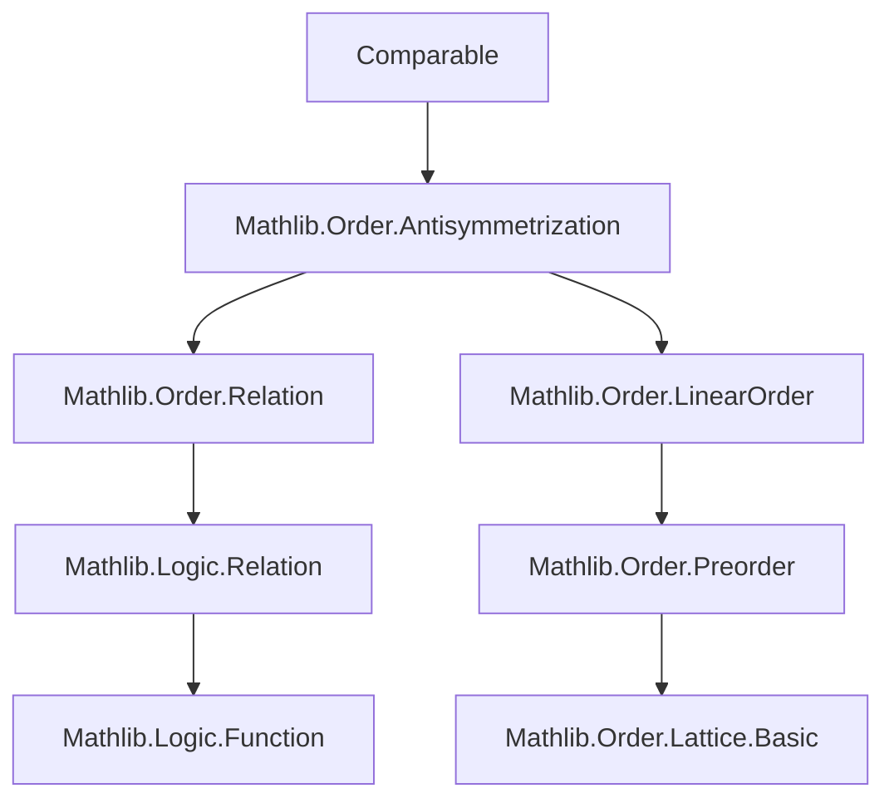
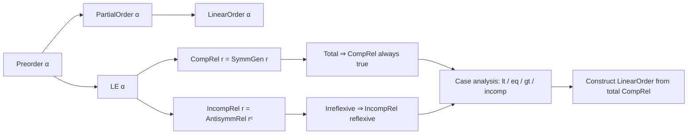
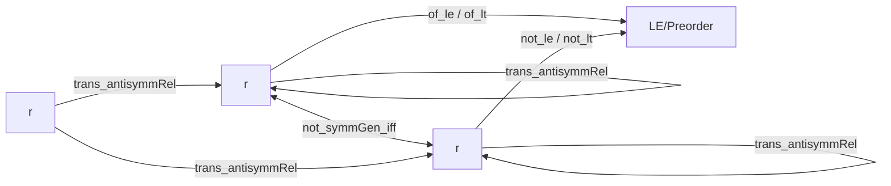

### Technical Brief: `Comparable.lean`

---

#### **1. Key Definitions & Theorems**

| Name | Type / Signature | Purpose |
|------|------------------|---------|
| `CompRel r a b` | `r a b ∨ r b a` | Deprecated alias for `Relation.SymmGen r a b`; expresses that `a` and `b` are comparable under `r`. |
| `IncompRel r a b` | `¬ r a b ∧ ¬ r b a` | Expresses that `a` and `b` are incomparable under `r`. |
| `linearOrderOfSymmGen` | `[PartialOrder α] → (∀ a b, SymmGen (· ≤ ·) a b) → LinearOrder α` | Constructs a `LinearOrder` from a `PartialOrder` where all elements are comparable. |
| `not_symmGen_iff` | `¬ SymmGen r a b ↔ IncompRel r a b` | Connects negation of comparability with incomparability. |
| `not_incompRel_iff_symmGen` | `¬ IncompRel r a b ↔ SymmGen r a b` | Dual of above; connects incomparability’s negation with comparability. |
| `incompRel_of_incompRel_of_antisymmRel` | `IncompRel a b → AntisymmRel b c → IncompRel a c` | Transitivity-like property linking incomparability and antisymmetry. |
| `lt_or_antisymmRel_or_gt_or_incompRel` | `a < b ∨ AntisymmRel a b ∨ b < a ∨ IncompRel a b` | Exhaustive 4-way case analysis for preorders. |
| `lt_or_eq_or_gt_or_incompRel` | `[PartialOrder α] → a < b ∨ a = b ∨ b < a ∨ IncompRel a b` | Refined version for partial orders (uses `AntisymmRel` ≡ `a = b`). |

---

#### **2. Naming Conventions**

- **Prefixes**:
  - `CompRel`, `IncompRel`: Relation names.
  - `of_`, `not_`, `trans_`, `congr_`, `comm`: Logical operation prefixes.
  - `instTrans`, `instRefl`, `instSymm`: Instance names for typeclass proofs.
- **Suffixes**:
  - `_rel`, `_apply`: For relation definitions and their application variants.
  - `_left`, `_right`, `_symm`: For symmetry/congruence variants.
- **Aliases**:
  - `compRel_swap`, `compRel_of_total`, `not_compRel_iff`, etc., are deprecated aliases pointing to `symmGen_*` equivalents.

---

#### **3. Tactic Stack**

Frequent tactics used in proofs:
- `simp` / `simp_rw`: Simplification using definitional equalities and lemmas (e.g., `antisymmRel_compl`, `not_symmGen_iff`).
- `tauto`: For propositional tautologies (e.g., in `lt_or_antisymmRel_or_gt_or_incompRel`).
- `rw`: Rewriting using equivalences and definitions.
- `intro` / `rintro`: Introducing hypotheses and destructing conjunctions.
- `exact`, `refine`, `apply`: Direct proof construction.
- `symm`, `trans`: For symmetry/transitivity reasoning (often via instance resolution).
- `mt`: Modus tollens for negation reasoning (e.g., `mt le_of_lt`).
- `tauto`, `aesop`: Not explicitly used here, but `tauto` suffices for propositional reasoning.

---

#### **4. Proof Logic**

- **Structure**: Most proofs follow a *definition-first* pattern:
  1. Expand definitions (`IncompRel`, `CompRel`, `SymmGen`, `AntisymmRel`).
  2. Use `simp` to reduce to basic logic (e.g., `¬ (P ∨ Q) ↔ ¬P ∧ ¬Q`).
  3. Apply propositional logic (`tauto`, `and_iff_intro`, etc.).
- **Induction**: Not used directly; reasoning is mostly *algebraic* over relations.
- **Case analysis**: Common in totality/comparability results (e.g., `lt_or_antisymmRel_or_gt_or_incompRel`).
- **Transitivity lemmas**: Prove via chaining implications using `le.trans`, `lt_iff_le_not_ge`, and `AntisymmRel` properties.

---

#### **5. Imports**

- `Mathlib.Order.Antisymmetrization`: Core dependency; provides `AntisymmRel`, `SymmGen`, and related infrastructure.
- `Function`, `Relation`: From core Lean / Mathlib logic libraries.

---

#### **6. Dependency & Theory Overview (Mermaid Diagrams)**

##### **Dependency Graph**

##### **Conceptual Overview**

##### **Relation Interactions**

---

#### **7. Notes on Deprecations & Migration**

- `CompRel` is deprecated in favor of `Relation.SymmGen`.
- `IncompRel` is *not* deprecated; it is the canonical name for `AntisymmRel rᶜ`.
- All `CompRel.*` theorems redirect to `SymmGen.*` equivalents.
- Migration path: Replace `CompRel r a b` with `SymmGen r a b`, and use `not_symmGen_iff` to switch to `IncompRel`.

---

#### **8. Todo / Future Work**

- Link to `IsChain` and `IsAntichain` (as noted in the file’s `## Todo`).
- Possibly define `IsChain (r : α → α → Prop) := ∀ a b, CompRel r a b`.
- Possibly define `IsAntichain r := ∀ a b, IncompRel r a b`.

--- 

This file formalizes foundational relation-theoretic concepts for ordered structures, with a focus on *symmetrization* and *antisymmetrization* of binary relations. It serves as a bridge between abstract relation theory and concrete order-theoretic reasoning in Mathlib.
