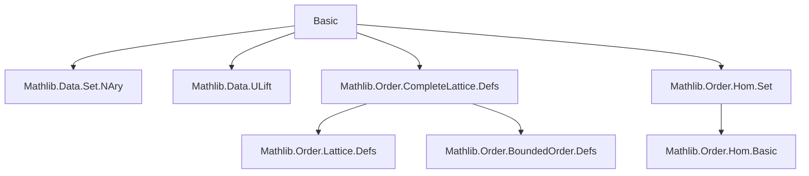
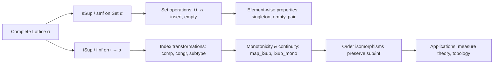
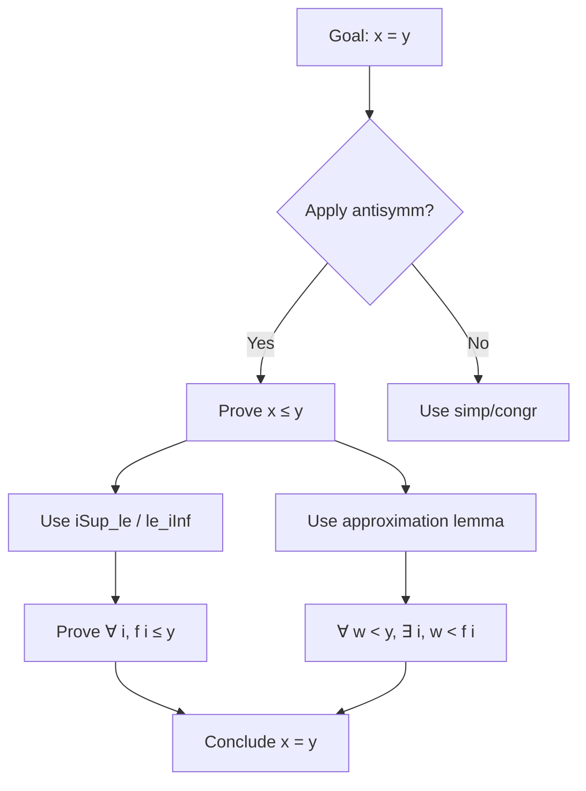

### Technical Brief: `Basic.lean` — Complete Lattices in Lean 4 (Mathlib)

---

#### **1. Key Definitions & Theorems**

| Name | Type / Signature | Purpose |
|------|------------------|---------|
| `sSup`, `sInf` | `Set α → α` | Supremum / infimum of a *set* |
| `iSup`, `iInf` | `(ι → α) → α` | Supremum / infimum of a *family* (indexed function) |
| `iSup₂`, `iInf₂` | `(∀ i, κ i → α) → α` | Nested sup/inf over two indices |
| `biSup`, `biInf` | `(p : ι → Prop) → (i : ι → p i → α) → α` | Bounded sup/inf: `⨆ i ∈ s, f i` |
| `isLUB_sSup`, `isGLB_sInf` | `IsLUB s (sSup s)`, `IsGLB s (sInf s)` | Characterization of `sSup`/`sInf` as lub/glb |
| `sSup_singleton`, `sInf_singleton` | `sSup {a} = a`, `sInf {a} = a` | Sup/inf of singleton sets |
| `sSup_empty`, `sInf_empty` | `sSup ∅ = ⊥`, `sInf ∅ = ⊤` | Sup/inf of empty set |
| `sSup_insert`, `sInf_insert` | `sSup (insert a s) = a ⊔ sSup s`, etc. | Recursive behavior under insertion |
| `sSup_union`, `sInf_union` | `sSup (s ∪ t) = sSup s ⊔ sSup t`, etc. | Sup/inf over unions |
| `le_iSup`, `iInf_le` | `f i ≤ ⨆ j, f j`, `⨅ j, f j ≤ f i` | Basic bounds for indexed sup/inf |
| `iSup_le_iff`, `le_iInf_iff` | `iSup f ≤ a ↔ ∀ i, f i ≤ a`, etc. | Universal property of sup/inf |
| `iSup_mono`, `iInf_mono` | `(∀ i, f i ≤ g i) → iSup f ≤ iSup g`, etc. | Monotonicity of sup/inf |
| `iSup_const`, `iInf_const` | `[Nonempty ι] → ⨆ _, a = a`, etc. | Sup/inf of constant families |
| `iSup_comm`, `iInf_comm` | `⨆ i j, f i j = ⨆ j i, f i j`, etc. | Commutativity of nested sup/inf |
| `iSup_sup_eq`, `iInf_inf_eq` | `⨆ x, f x ⊔ g x = (⨆ x, f x) ⊔ ⨆ x, g x`, etc. | Distributivity over lattice ops |
| `OrderIso.map_iSup`, `OrderIso.map_iInf` | `f (⨆ i, x i) = ⨆ i, f (x i)`, etc. | Order isomorphisms preserve sup/inf |
| `iSup_eq_of_forall_le_of_forall_lt_exists_gt` | Intro rule for equality of sup | Characterization of sup via approximation |
| `biSup_lt_eq_iSup`, `biInf_ge_eq_iInf`, etc. | Equalities like `⨆ (j < i), f j = ⨆ i, f i` under order conditions | Simplification over directed index sets |

---

#### **2. Naming Conventions**

- **Prefixes**:
  - `sSup`, `sInf`: *set*-based sup/inf.
  - `iSup`, `iInf`: *indexed* sup/inf (function-based).
  - `biSup`, `biInf`: *bounded* indexed sup/inf (`i ∈ s`).
  - `iSup₂`, `iInf₂`: *nested* indexed sup/inf (e.g., `∀ i, κ i → α`).
- **Suffixes**:
  - `_eq`: equality with a simpler form (e.g., `sSup_singleton`).
  - `_iff`: equivalence (e.g., `iSup_le_iff`).
  - `_mono`, `_mono'`: monotonicity lemmas.
  - `_congr`: congruence lemmas (e.g., `iSup_congr`).
  - `_unique`, `_nonempty`: used when nonemptiness or uniqueness is required.
- **Dualization**:
  - Dual lemmas often use `αᵒᵈ` and are named via `@... αᵒᵈ _ ...`.
  - E.g., `sInf_singleton` = dual of `sSup_singleton`.

---

#### **3. Tactic Stack**

- **Core tactics**:
  - `simp`, `simp only`, `simp_rw`
  - `congr`, `congr with`, `ext`, `funext`
  - `apply`, `exact`, `refine`, `intro`, `cases`
  - `rw`, `convert`, `eq_of_not_lt`, `eq_of_not_gt`
  - `antisymm`, `le_antisymm`
  - `existsi`, `exists_congr`, `Exists.elim`
  - `grind` (custom tactic for grind-style automation)
  - `by_cases`, `by_contra`, `contradiction`
  - `have`, `suffices`, `obtain`
- **Domain-specific automation**:
  - `isLUB.mono`, `isGLB.mono`, `isLUB_sSup`, `isGLB_sInf`
  - `subset_insert_diff_singleton`, `diff_subset`, `insert_subset`
  - `forall_mem_range`, `exists_range_iff`
  - `propext`, `subtype.ext`, `PLift.up_surjective`, `PLift.down_surjective`

---

#### **4. Proof Logic**

- **Inductive structure**:
  - Most proofs follow a **two-sided inequality** (`le_antisymm`) pattern.
  - For sup/inf equalities: prove `≤` and `≥` separately using:
    - `iSup_le`, `le_iInf` for upper/lower bounds,
    - `le_iSup_of_le`, `iInf_le_of_le` for lower/upper bounds,
    - Approximation lemmas like `iSup_eq_of_forall_le_of_forall_lt_exists_gt`.
- **Dualization**:
  - Many lemmas are proven for `sSup`/`iSup`, then dualized via `αᵒᵈ`.
  - E.g., `sInf_union` = `@sSup_union αᵒᵈ _ _ _`.
- **Index manipulation**:
  - Surjectivity/equivalence lemmas (`iSup_comp`, `iSup_congr`) rely on `Surjective`/`Equiv` properties.
  - Subtype indexing (`iSup_subtype`, `iSup_subtype''`) used to relate `iSup` over subtype to `biSup`.
- **Order-theoretic reasoning**:
  - Heavy use of `IsLUB`, `IsGLB`, `upperBounds`, `lowerBounds`, `IsCofinalFor`, `IsCoinitialFor`.
  - Monotonicity/antitonicity via `Monotone`, `Antitone`, `OrderIso`.

---

#### **5. Imports & Dependencies**

| Import | Purpose |
|--------|---------|
| `Mathlib.Data.Set.NAry` | General set operations, n-ary relations |
| `Mathlib.Data.ULift` | Lifting types to avoid universe issues |
| `Mathlib.Order.CompleteLattice.Defs` | Definitions of complete lattices, `sSup`, `sInf`, `iSup`, `iInf` |
| `Mathlib.Order.Hom.Set` | Order homomorphisms on sets, monotone maps, bounds |

**Core dependencies**:
- `CompleteLattice`, `CompleteSemilatticeSup`, `CompleteSemilatticeInf`
- `OrderDual`, `ULift`, `PLift`, `Set`, `Function`
- `LT`, `Preorder`, `NoMaxOrder`, `NoMinOrder` (for index-set lemmas)

---

#### **6. Mermaid Diagrams**

##### **Dependency Graph (Module-Level)**

##### **Overview of Theory Flow**

##### **Proof Strategy Pattern**

---

#### **7. Notes & Observations**

- **TODOs / future work**:
  - Generalization to *conditionally complete lattices* (e.g., `csSup_singleton`, `ciSup_const`).
  - Automation for pattern matching in nested sup/inf proofs (see comment near `iSup_iSup_eq_left`).
- **Design choices**:
  - `iSup`/`iInf` defined via `sSup`/`sInf` on `range f`.
  - Bounded sup/inf (`biSup`, `biInf`) defined via `iSup₂` over subtype.
  - `ULift`/`PLift` lemmas ensure universe consistency.
- **Notational clarity**:
  - `⨆ i, f i` ↔ `iSup f`
  - `⨆ i ∈ s, f i` ↔ `biSup f` with `p i := i ∈ s`
  - `⨆ i j, f i j` ↔ `iSup₂ f`

--- 

Let me know if you'd like a **dependency graph of lemmas**, **proof automation suggestions**, or **migration notes** for future Mathlib versions.
