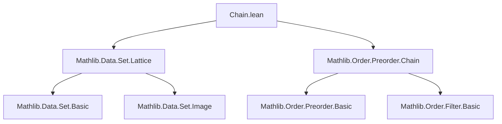
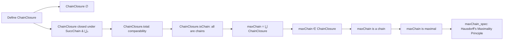
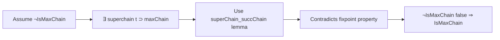

### Technical Brief: `Chain.lean` — Hausdorff’s Maximality Principle in Lean 4

---

#### **1. Key Definitions & Theorems**

| Name | Type / Signature | Purpose |
|------|------------------|---------|
| `ChainClosure r s` | `Prop` | Inductive predicate stating that `s` is reachable from `∅` via `SuccChain` and arbitrary unions. Models “constructible chains” under `r`. |
| `maxChain r` | `Set α` | Defined as `⋃₀ { s | ChainClosure r s }`, i.e., the union of all `ChainClosure`-constructible sets. Intended to be a maximal chain. |
| `chainClosure_empty` | `ChainClosure r ∅` | Base case: empty set is constructible. |
| `chainClosure_maxChain` | `ChainClosure r (maxChain r)` | The maximal chain itself is constructible (as a union of constructible sets). |
| `ChainClosure.total` | `c₁ ⊆ c₂ ∨ c₂ ⊆ c₁` | Any two `ChainClosure`-sets are comparable by inclusion — key step toward totality. |
| `ChainClosure.succ_fixpoint` | `SuccChain r c₂ = c₂ → c₁ ⊆ c₂` | If `c₂` is a fixpoint of `SuccChain`, then all `ChainClosure`-sets are contained in it. |
| `ChainClosure.succ_fixpoint_iff` | `SuccChain r c = c ↔ c = maxChain r` | Characterizes `maxChain r` as the *unique* fixpoint of `SuccChain` within `ChainClosure`. |
| `ChainClosure.isChain` | `IsChain r c` | Every `ChainClosure`-set is an `r`-chain (i.e., totally ordered by `r`). |
| `maxChain_spec` | `IsMaxChain r (maxChain r)` | **Main theorem**: `maxChain r` is a *maximal* chain — no proper superchain is an `r`-chain. |

> **Note**: `IsMaxChain r s` means `s` is a chain (`IsChain r s`) and for any `t`, if `s ⊆ t` and `IsChain r t`, then `s = t`.

---

#### **2. Naming Conventions**

- **Predicates**: `ChainClosure`, `isChain`, `maxChain`, `SuccChain` (imported from `Mathlib.Order.Preorder.Chain`).
- **Inductive constructors**: `succ`, `union`.
- **Lemma prefixes**:
  - `chainClosure_…`: properties of `ChainClosure`.
  - `chainClosure_succ_…`: lemmas involving `SuccChain`.
  - `total`, `fixpoint`, `spec`: high-level structural properties.
- **Suffixes**:
  - `_aux`: auxiliary lemmas used in inductive proofs.
  - `_iff`: equivalence characterizations.
  - `_total`: totality/comparability results.

---

#### **3. Tactic Stack**

Frequent tactics used in proofs:

| Tactic | Role |
|--------|------|
| `induction` | Core: structural induction on `ChainClosure`, often with `generalizing` to preserve hypotheses. |
| `obtain` / `cases` | Extract disjunctions (`∨`) or equalities from lemmas like `chainClosure_succ_total`. |
| `simp only [...]` | Simplify goals using precise rewrite rules (e.g., `sUnion_subset_iff`, `not_or`, `not_forall`). |
| `exact`, `refine`, `apply` | Direct proof steps, especially after `obtain`. |
| `antisymm'` | Prove equality of sets via mutual inclusion. |
| `by_contradiction` | Used in `maxChain_spec` to assume non-maximality and derive contradiction. |
| `aesop` (not present) | Not used — proofs are highly structured and manual. |
| `ring`, `linarith` (not present) | Not needed — set-theoretic reasoning dominates. |

---

#### **4. Proof Logic**

The proof follows a **constructive-inductive strategy**, typical of Zorn-lemma-style arguments:

1. **Define constructible chains** (`ChainClosure`) as the smallest class containing `∅` and closed under:
   - `SuccChain` (adding a comparable element if possible),
   - arbitrary unions.

2. **Show totality**: Any two `ChainClosure`-sets are comparable (`ChainClosure.total`).  
   - Proven via mutual induction on both sets, using `chainClosure_succ_total_aux` and `chainClosure_succ_total`.

3. **Show every constructible set is a chain** (`ChainClosure.isChain`).  
   - Induction: base case trivial; union case uses totality to compare arbitrary elements.

4. **Characterize maximality**:
   - Prove `maxChain r` is a chain (via `chainClosure_maxChain` + `isChain`).
   - Show that if `maxChain r` were not maximal, `SuccChain r (maxChain r)` would strictly extend it — contradicting that `maxChain r` is a fixpoint (`ChainClosure.succ_fixpoint_iff`).

5. **Conclude** via contradiction: assume non-maximality ⇒ existence of a proper superchain ⇒ `SuccChain` strictly increases `maxChain r`, but `maxChain r` is a fixpoint ⇒ contradiction.

---

#### **5. Imports & Dependencies**

| Import | Purpose |
|--------|---------|
| `Mathlib.Data.Set.Lattice` | Set operations, lattice structure, `⋃₀`, `subset`, etc. |
| `Mathlib.Order.Preorder.Chain` | Core chain theory: `IsChain`, `SuccChain`, `IsMaxChain`, `superChain_succChain`. |

> **Note**: `SuccChain` and related order-theoretic notions are imported from `Mathlib.Order.Preorder.Chain`. This file builds on that foundation to prove Hausdorff’s Maximality Principle.

---

#### **6. Mermaid Diagrams**

##### **Dependency Graph (Module-Level)**

##### **Theoretical Overview (Proof Structure)**

##### **Proof Strategy Flow (for `maxChain_spec`)**

---

#### **7. Summary**

This file formalizes **Hausdorff’s Maximality Principle** — a foundational equivalent of the Axiom of Choice — in Lean 4. It constructs a canonical maximal chain (`maxChain r`) as the union of all *constructible* chains (`ChainClosure`), and proves its maximality using careful induction and order-theoretic reasoning. The development is highly structured, relying on inductive definitions and totality arguments, and serves as a stepping stone toward Zorn’s Lemma and related choice principles.

--- 

Let me know if you'd like a formalized dependency graph of `ChainClosure` constructors or a visualization of the `SuccChain` operator behavior.
