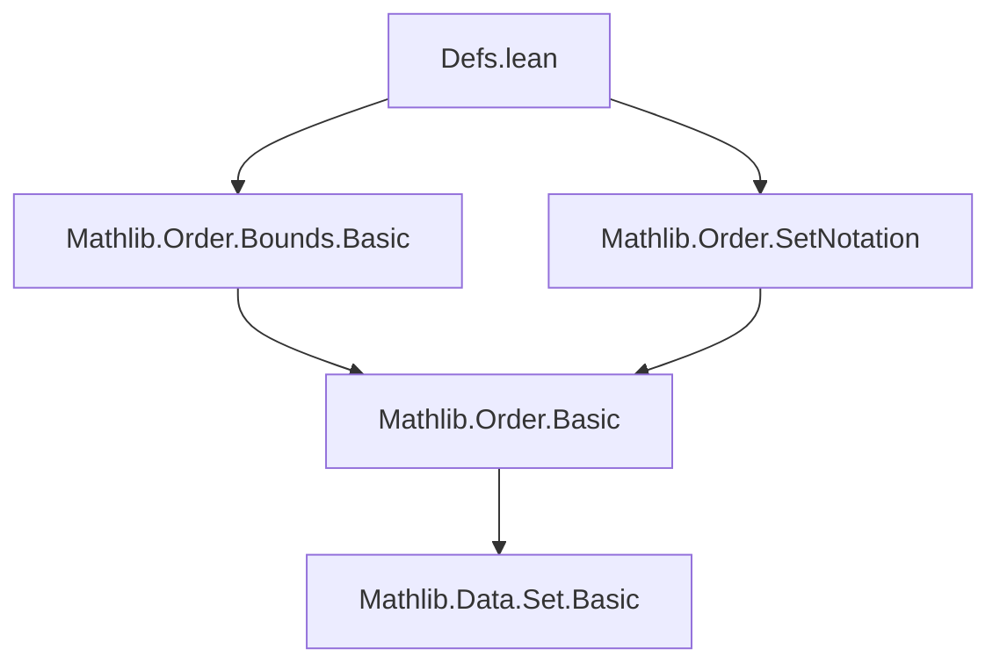
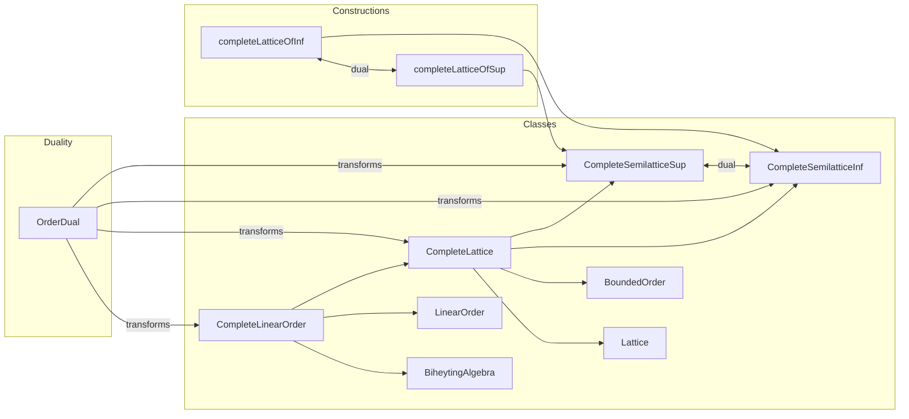

### Technical Brief: `Defs.lean` — Complete Lattices in Lean 4

---

#### **1. Key Definitions & Theorems**

| Name | Type / Signature | Purpose |
|------|------------------|---------|
| `sSup`, `sInf` | `Set α → α` | Supremum / infimum of an arbitrary set |
| `iSup`, `iInf` | `(ι → α) → α` | Indexed supremum / infimum (sup/inf of range of a function) |
| `biSup`, `biInf` | `(s : Set β) → (β → α) → α` | Bounded indexed sup/inf over a set (`iSup₂`/`iInf₂` over membership predicate) |
| `CompleteSemilatticeSup` | `Type u → Type u` | Class for types with *least upper bounds* for all sets; extends `PartialOrder` + `SupSet` |
| `CompleteSemilatticeInf` | `Type u → Type u` | Class for types with *greatest lower bounds* for all sets; extends `PartialOrder` + `InfSet` |
| `CompleteLattice` | `Type u → Type u` | Bounded lattice where *every* subset has sup and inf; extends `Lattice`, `CompleteSemilatticeSup`, `CompleteSemilatticeInf`, `BoundedOrder` |
| `CompleteLinearOrder` | `Type u → Type u` | Linear order whose lattice structure is complete; extends `CompleteLattice`, `BiheytingAlgebra`, `Ord`, with `le_total` and decidability instances |
| `completeLatticeOfInf` | `Type u → ... → CompleteLattice α` | Constructor of `CompleteLattice` from existence of `sInf` satisfying `IsGLB` |
| `completeLatticeOfSup` | `Type u → ... → CompleteLattice α` | Dual constructor using `sSup` satisfying `IsLUB` |
| `isLUB_sSup` | `∀ s, IsLUB s (sSup s)` | `sSup` is the least upper bound of its argument set |
| `isGLB_sInf` | `∀ s, IsGLB s (sInf s)` | `sInf` is the greatest lower bound of its argument set |
| `le_sSup_iff`, `sInf_le_iff`, etc. | `↔`-characterizations | Useful equivalence lemmas for reasoning about sup/inf via universal properties |

---

#### **2. Naming Conventions**

- **Prefixes**:
  - `sSup`, `sInf`: *set* supremum/infimum.
  - `iSup`, `iInf`: *indexed* sup/inf (function over index type).
  - `biSup`, `biInf`: *bounded* indexed sup/inf (over a set with membership).
  - `iSup₂`, `iInf₂`: nested indexed sup/inf (e.g., `⨆ i j, f i j`).
- **Suffixes**:
  - `_le`, `le_`: inequalities involving sup/inf (e.g., `le_sSup`, `sInf_le`).
  - `_iff`: characterizations as biconditionals (e.g., `sSup_le_iff`, `le_sSup_iff`).
- **Dual notation**:
  - `toDual`, `ofDual`: for order duals; often used in `@[simp]` lemmas.
  - `OrderDual` section: dual constructions (e.g., `instCompleteLattice` on `αᵒᵈ`).

---

#### **3. Tactic Stack**

Frequent tactics used in proofs:

| Tactic | Usage |
|--------|-------|
| `simp` / `simp_rw` | Simplifying using `@[simp]` lemmas (e.g., `le_sSup_iff`, `sSup_le_iff`, dualities) |
| `apply`, `exact` | Applying lemmas like `isLUB_sSup`, `isGLB_sInf`, or constructors |
| `intro`, `intro h`, `rintro rfl` | Standard intro-style reasoning |
| `split_ifs` | Handling `if`/`else` in definitions like `min`, `max` |
| `convert`, `congr'` | For definitional equality in constructors (`completeLatticeOfInf`, etc.) |
| `apply ... 1`, `apply ... 2` | Using `IsLUB.1`, `IsLUB.2` to extract bounds |
| `cases` / `rcases` | On `le_total`, `DecidableLE`, etc., especially in `CompleteLinearOrder` proofs |
| `aesop` / `linarith` | Not explicitly used here, but `linarith` may appear in derived files |
| `compareOfLessAndEq_rfl` | Custom tactic for `compare` definitional equality |

---

#### **4. Proof Logic**

- **Inductive structure**: Most proofs follow *universal property* reasoning:
  - Show `sSup s` satisfies `IsLUB s (sSup s)` via `le_sSup` and `sSup_le`.
  - Use `isLUB.unique` to prove equality of suprema.
  - Derive `↔`-lemmas via `isLUB_le_iff`, `le_isGLB_iff`, etc.
- **Dual reasoning**: Many results are mirrored via `OrderDual`:
  - `CompleteSemilatticeSup αᵒᵈ` from `CompleteSemilatticeInf α`, and vice versa.
  - `toDual_sSup = sInf (ofDual ⁻¹' s)` etc., used to transfer lemmas.
- **Constructors** (`completeLatticeOfInf`, `completeLatticeOfSup`):
  - Define `sup`, `inf`, `bot`, `top` in terms of `sInf`/`sSup`.
  - Prove lattice axioms using `IsGLB`/`IsLUB` elimination/introduction.
- **Linear orders**: Use `le_total` to resolve case splits; `min_def`, `max_def` rely on decidability.

---

#### **5. Imports**

- `Mathlib.Order.Bounds.Basic`: Provides `IsLUB`, `IsGLB`, `upperBounds`, `lowerBounds`.
- `Mathlib.Order.SetNotation`: Provides set notation (`{a, b}`, `univ`, `∅`, `⁻¹'`, etc.).

> **Note**: No `Mathlib.Order.CompletePartialOrder` is imported directly — intentional to avoid spurious dependencies in `#min_imports`.

---

#### **6. Mermaid Diagrams**

##### **Dependency Graph (Module-Level)**



##### **Theory Overview (Conceptual)**



##### **Data Flow in `completeLatticeOfInf`**

```mermaid
flowchart LR
  Input[PartialOrder α, InfSet α, isGLB_sInf] --> Construct
  Construct --> Bot[sup := sInf {x | a ≤ x ∧ b ≤ x}]
  Construct --> Top[inf := sInf {a, b}]
  Construct --> Bot[bot := sInf univ]
  Construct --> Top[top := sInf ∅]
  Construct --> Sup[sSup s := sInf (upperBounds s)]
  Bot --> C[CompleteLattice]
  Top --> C
  Bot --> C
  Top --> C
  Sup --> C
```

---

#### **7. Summary**

This file formalizes the foundational theory of **complete lattices** in Lean 4, emphasizing:
- Universal properties of `sSup`/`sInf` via `IsLUB`/`IsGLB`.
- Equivalence between `CompleteSemilatticeSup`/`CompleteSemilatticeInf` and `CompleteLattice`.
- Order duality as a core proof technique.
- Construction of `CompleteLattice` from either suprema or infima.
- Extension to `CompleteLinearOrder`, with decidability and linearity.

It serves as the **core infrastructure** for higher-level results in analysis, measure theory, and domain theory (e.g., `Mathlib.MeasureTheory.MeasurableSpace`, `Mathlib.OrderTheory.ContinuousLattice`).

--- 

Let me know if you'd like a **proof sketch** of a specific theorem (e.g., `completeLatticeOfInf` correctness) or a **dependency analysis** for downstream files.
