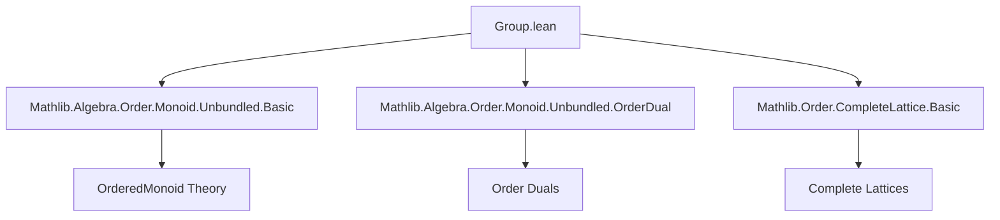
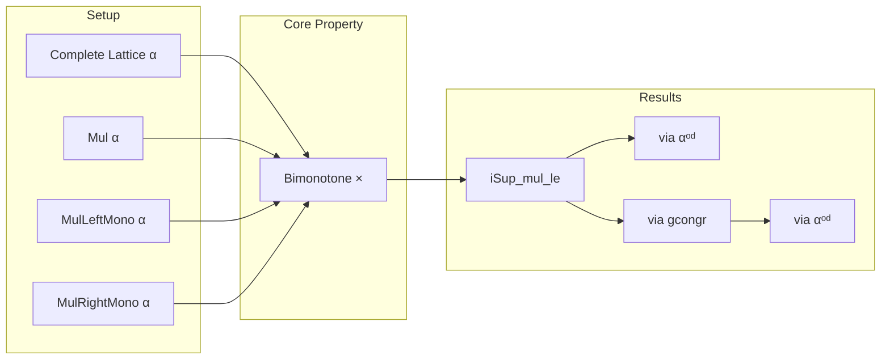

**Technical Brief: `Group.lean` (Mathlib-style Lean 4 formalization)**

---

### 1. **Key Definitions & Theorems**

| Name | Type / Statement | Purpose |
|------|------------------|---------|
| `iSup_mul_le` | `⨆ i, u i * v i ≤ (⨆ i, u i) * ⨆ i, v i` | Shows multiplication preserves directed suprema (i.e., is *monotone* in both arguments w.r.t. suprema). |
| `le_iInf_mul` | `(⨅ i, u i) * ⨅ i, v i ≤ ⨅ i, u i * v i` | Dual of `iSup_mul_le`, expressing that multiplication preserves *infima* in the opposite order (i.e., is *antitone* in the dual lattice). |
| `iSup₂_mul_le` | `⨆ (i) (j), u i j * v i j ≤ (⨆ (i) (j), u i j) * ⨆ (i) (j), v i j` | Extends `iSup_mul_le` to binary indexed suprema (`iSup₂`). |
| `le_iInf₂_mul` | `(⨅ (i) (j), u i j) * ⨅ (i) (j), v i j ≤ ⨅ (i) (j), u i j * v i j` | Dual of `iSup₂_mul_le`, for binary infima. |

All lemmas are equipped with `@[to_additive]`, indicating they have additive analogues (e.g., `iSup_add_le`, etc.) automatically generated.

**Assumptions on `α`**:
- `[CompleteLattice α]`: Complete lattice structure (all suprema/infima exist).
- `[Mul α]`: Binary multiplication.
- `[MulLeftMono α]`: Left multiplication is *monotone*.
- `[MulRightMono α]`: Right multiplication is *monotone*.

These ensure multiplication is *bimonotone*, a key property for the inequalities.

---

### 2. **Naming Conventions**

- **Prefixes**:
  - `iSup_` / `iInf_`: for suprema/infima over a family indexed by a type (`ι → α`).
  - `iSup₂_` / `iInf₂_`: for suprema/infima over *dependent* families (`(i : ι) → κ i → α`), i.e., indexed over a sigma type.
- **Suffixes**:
  - `_le_`: inequality direction (left ≤ right).
  - `mul_`: multiplication-specific variant.
- **Duality**:
  - `le_iInf_` and `le_iInf₂_` are derived via `αᵒᵈ` (order dual), mirroring the dual inequality.

---

### 3. **Tactic Stack**

- `aesop`: Not used here (no automation needed).
- `ring`: Not used (no algebraic simplification of expressions).
- `simp_rw`: Not used.
- **Core tactics**:
  - `iSup_le`, `le_iSup`: standard lattice sup/inf universal properties.
  - `mul_le_mul'`: monotonicity of multiplication (bimonotone assumption).
  - `gcongr`: for congruence of generalized inequalities (used in `iSup₂_mul_le`).
  - `refine`, `exact`, `apply`: standard proof construction.
  - `α := αᵒᵈ`: typeclass argument substitution for duality.

---

### 4. **Proof Logic**

- **Structure**: All proofs follow a *monotonicity-first* pattern:
  1. Use `mul_le_mul'` (from `MulLeftMono`/`MulRightMono`) to reduce to bounding each factor.
  2. Apply `le_iSup` (or dually `iInf_le`) to get componentwise bounds.
  3. For dual statements (`le_iInf_*`), lift to the order dual (`αᵒᵈ`) and reuse the primal lemma.
  4. For `iSup₂_*`, compose two applications of `iSup_mul_le` via `le_trans` and `gcongr`.

**Typical flow** (e.g., `iSup_mul_le`):
```lean
iSup_le fun _ ↦ mul_le_mul' (le_iSup ..) (le_iSup ..)
```
→ For each index `i`, bound `u i * v i` by `(⨆ u) * (⨆ v)` using bimonotonicity.

---

### 5. **Imports**

| Import | Role |
|--------|------|
| `Mathlib.Algebra.Order.Monoid.Unbundled.Basic` | Provides `MulLeftMono`, `MulRightMono`, and unbundled ordered monoid theory. |
| `Mathlib.Algebra.Order.Monoid.Unbundled.OrderDual` | Supplies `αᵒᵈ`, dual order, and `to_additive` infrastructure. |
| `Mathlib.Order.CompleteLattice.Basic` | Defines `CompleteLattice`, `iSup`, `iInf`, and basic lattice operations. |

These imports define the *unbundled* ordered algebraic setting (no `Monoid`/`OrderedMonoid` typeclasses, just bare `Mul` + monotonicity).

---

### 6. **Mermaid Diagrams**

#### Dependency Graph (Module-Level)


#### Theoretical Overview (Conceptual Flow)


---

### 7. **Domain-Specific AI Agent Notes**

- **Target domain**: Formalized order theory + algebra (ordered groups/monoids).
- **Key reasoning patterns**:
  - Use of duality (`αᵒᵈ`) to avoid redundant proofs.
  - Lattice-theoretic reasoning via `iSup`/`iInf` elimination/introduction.
  - Bimonotonicity as the central algebraic hypothesis.
- **Automation potential**: `to_additive` suggests this module could feed into an additive-theory synthesizer (e.g., for `OrderedAddCommMonoid` analogues).
- **Extensibility**: These lemmas generalize to `n`-ary suprema/infima via `iSup_n`/`iInf_n` (not yet present, but pattern is clear).

--- 

Let me know if you'd like the corresponding additive version (`Group.add`-style) or a formalized tactic for generating such lemmas automatically.
