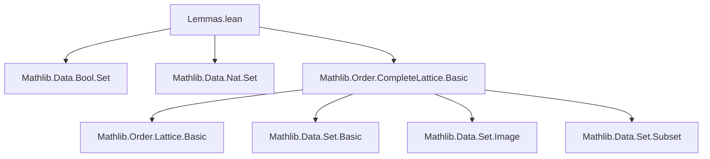
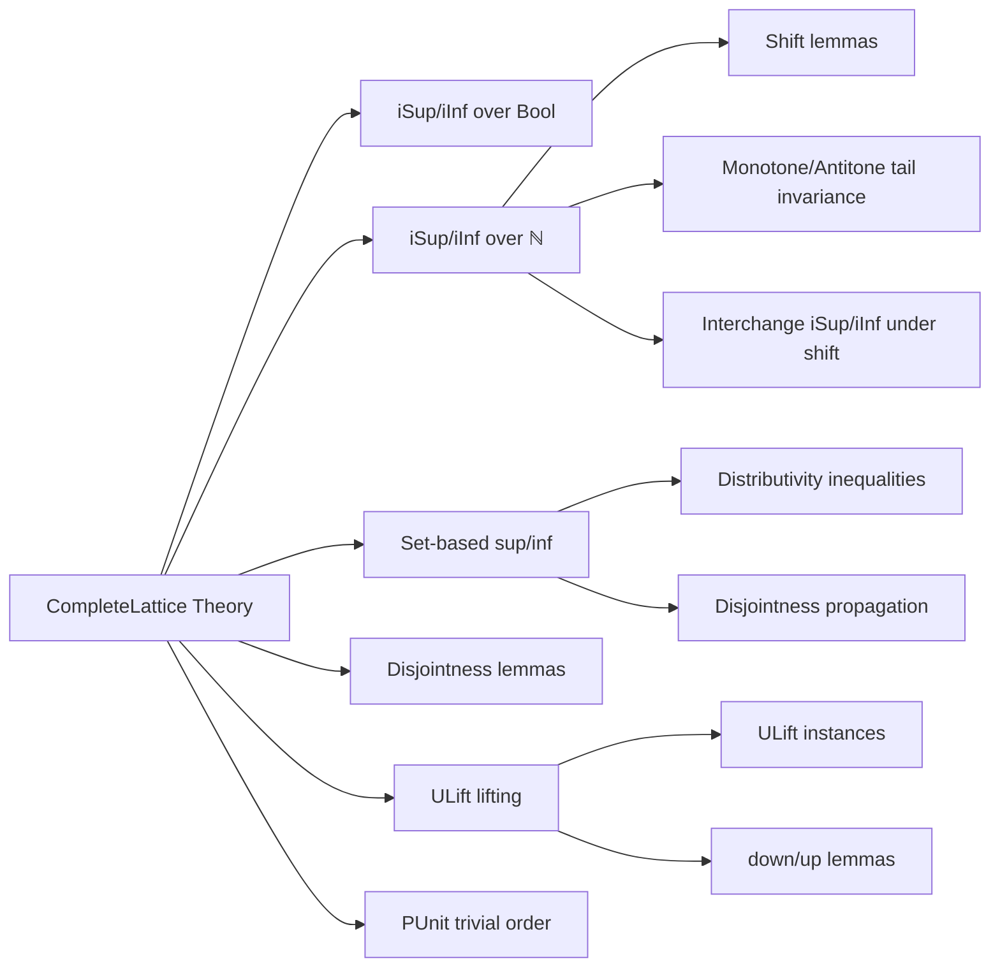

**Technical Brief: `Lemmas.lean` — Theory of Complete Lattices in Lean 4 (Mathlib)**  
*Prepared for Domain-Specific AI Agent Training*

---

### 1. KEY DEFINITIONS & THEOREMS

| Name | Type / Signature | Purpose |
|------|------------------|---------|
| `iSup` | `iSup : (ι → α) → α` | Supremum of a family over an index type `ι` in a complete lattice `α`. |
| `iInf` | `iInf : (ι → α) → α` | Infimum of a family over an index type `ι`. |
| `sSup`, `sInf` | `sSup s : α`, `sInf s : α` for `s : Set α` | Supremum/infimum of a *set* of elements. |
| `biSup`, `biInf` | Implicit via `iSup₂`, `iInf₂` with bounded quantification | Bounded supremum/infimum over `i ∈ s`. |
| `iSup_bool_eq` | `⨆ b : Bool, f b = f true ⊔ f false` | Expresses `iSup` over `Bool` as binary join. |
| `iInf_bool_eq` | `⨅ b : Bool, f b = f true ⊓ f false` | Dual of above. |
| `sup_eq_iSup`, `inf_eq_iInf` | `x ⊔ y = ⨆ b : Bool, cond b x y`, etc. | Characterizes binary join/meet via `iSup`/`iInf`. |
| `iSup_ge_eq_iSup_nat_add` | `⨆ i ≥ n, u i = ⨆ i, u (i + n)` | Shifts index in `iSup` over `ℕ` by `n`. |
| `iInf_ge_eq_iInf_nat_add` | Dual of above. | Shifts index in `iInf`. |
| `Monotone.iSup_nat_add` | `hf : Monotone f ⇒ ⨆ n, f (n + k) = ⨆ n, f n` | `iSup` over tail of monotone sequence is unchanged. |
| `Antitone.iInf_nat_add` | Dual of above. | `iInf` over tail of antitone sequence unchanged. |
| `iSup_iInf_ge_nat_add` | `⨆ n, ⨅ i ≥ n, f (i + k) = ⨆ n, ⨅ i ≥ n, f i` | Commutes `iSup` and `iInf` under shift for monotone `n ↦ ⨅ i ≥ n, f i`. |
| `sup_iSup_nat_succ` | `(u 0 ⊔ ⨆ i, u (i + 1)) = ⨆ i, u i` | Decomposes `iSup` over `ℕ` into first element + rest. |
| `inf_iInf_nat_succ` | Dual of above. | Decomposes `iInf`. |
| `iInf_nat_gt_zero_eq` | `⨅ i > 0, f i = ⨅ i, f (i + 1)` | Shifts `iInf` over positive naturals. |
| `sup_sInf_le_iInf_sup` | `a ⊔ sInf s ≤ ⨅ b ∈ s, a ⊔ b` | One direction of distributivity of `⊔` over `sInf`. |
| `iSup_inf_le_inf_sSup` | `⨆ b ∈ s, a ⊓ b ≤ a ⊓ sSup s` | One direction of distributivity of `⊓` over `sSup`. |
| `le_iSup_inf_iSup` | `⨆ i, f i ⊓ g i ≤ (⨆ i, f i) ⊓ (⨆ i, g i)` | `⊓` preserves `iSup` in each argument (inequality in general). |
| `iInf_sup_iInf_le` | Dual of above. | `⊔` preserves `iInf`. |
| `disjoint_sSup_left/right` | `Disjoint (sSup a) b ⇒ Disjoint i b` for `i ∈ a` | Propagates disjointness from supremum to members. |
| `disjoint_of_sSup_disjoint` | `Disjoint (sSup a) (sSup b) ⇒ Disjoint a b` (under non-⊥ condition) | Lifts disjointness from suprema to sets. |
| `ULift.sSup`, `ULift.iSup`, etc. | Instances & lemmas for `ULift` | Lifts complete lattice structure to `ULift`. |
| `ULift.instCompleteLattice` | Instance | `ULift α` inherits `CompleteLattice` from `α`. |
| `PUnit.instCompleteLinearOrder` | Instance | `PUnit` has trivial complete linear order (all sup/inf = `unit`). |

---

### 2. NAMING CONVENTIONS

| Pattern | Meaning | Examples |
|--------|---------|----------|
| `iSup`, `iInf` | Indexed supremum/infimum over function `ι → α` | `iSup`, `iInf`, `iSup₂`, `iInf₂`, `biSup`, `biInf` |
| `sSup`, `sInf` | Set-based supremum/infimum | `sSup`, `sInf`, `sSup_le`, `le_sInf` |
| `sup_`, `inf_` | Binary join/meet | `sup_eq_iSup`, `inf_iInf_nat_succ`, `sup_sInf_le_iInf_sup` |
| `_eq` suffix | Equality with simpler form | `iSup_bool_eq`, `sup_iSup_nat_succ` |
| `_le_` / `le_` prefix | Inequality direction | `sup_sInf_le_iInf_sup`, `le_iSup_inf_iSup` |
| `disjoint_` prefix | Disjointness lemmas | `disjoint_sSup_left`, `disjoint_of_sSup_disjoint` |
| `down_`, `up_` prefix | `ULift` projection/insertion lemmas | `down_iSup`, `up_sInf` |
| `inst_`, `instCompleteLattice` | Instance construction | `instCompleteLattice`, `instCompleteLinearOrder` |

---

### 3. TACTIC STACK

| Tactic | Frequency | Role |
|--------|-----------|------|
| `rw` | Very High | Rewriting using equalities (e.g., definitions, lemmas) |
| `simp` / `simp_rw` | High | Simplification with `iSup`, `iInf`, `sSup`, `sInf` lemmas |
| `apply` / `exact` | Medium | Applying lemmas or hypotheses |
| `le_antisymm` | Medium | Proving equality via two inequalities |
| `intro` / `intros` | Medium | Introducing variables/hypotheses |
| `calc` | Medium | Chain of equalities/inequalities |
| `congr_arg` | Medium | Congruence for function application |
| `grind` | Low | Custom tactic (likely from `Mathlib.Tactic`) for automated reasoning |
| `refine` | Low | Partial proof construction with holes |
| `dsimp`, `change` | Low | Simplification with definitional equality |

---

### 4. PROOF LOGIC

- **Standard pattern**: Prove equality by `le_antisymm`, i.e., show both `≤` and `≥`.
- **Inductive/structural reasoning**:
  - For `ℕ`-indexed families: use `Nat.add_assoc`, `Nat.sub_add_cancel`, monotonicity/antitonicity.
  - For `Bool`-indexed families: reduce to binary operations via `iSup_bool_eq`.
- **Duality**: Many lemmas are proven via `@... αᵒᵈ _ ...`, i.e., by passing to the dual lattice.
- **Set-based reasoning**: Use `sSup_eq_iSup'`, `sInf_eq_iInf'`, and subtype indexing (`iSup_subtype'`, `iInf_subtype'`).
- **Monotonicity/antitonicity**: Key for shifting indices (`Monotone.iSup_nat_add`, `Antitone.iInf_nat_add`).
- **Disjointness propagation**: Leverages `disjoint_iff_inf_le`, `iSup_inf_le_sSup_inf`, etc.

---

### 5. IMPORTS & DEPENDENCIES

| Module | Role |
|--------|------|
| `Mathlib.Data.Bool.Set` | Boolean set operations, e.g., `Bool.range_eq` |
| `Mathlib.Data.Nat.Set` | Natural number set operations, e.g., `Nat.range_succ`, `Nat.zero_union_range_succ` |
| `Mathlib.Order.CompleteLattice.Basic` | Core definitions: `CompleteLattice`, `sSup`, `sInf`, `iSup`, `iInf`, `sup`, `inf`, `Monotone`, `Antitone`, `Disjoint`, etc. |
| `Function`, `OrderDual`, `Set` | Opened namespaces for `Function.comp`, `OrderDual.op`, `Set.range`, `Set.preimage`, etc. |

---

### 6. MERMAID DIAGRAMS

#### Dependency Graph (Top-Level)

#### Overview of File Structure

---

### 7. SPECIAL NOTES

- **Non-`[simp]` lemmas**: `iSup_iInf_ge_nat_add`, `iInf_iSup_ge_nat_add` avoid `[simp]` due to higher-order unification issues (see Zulip link).
- **Duality principle**: Used pervasively — many lemmas are proven once, then dualized via `@... αᵒᵈ`.
- **`ULift` lifting**: Demonstrates how to transport complete lattice structure along equivalence (`ULift.down_injective.completeLattice`).
- **`PUnit` triviality**: All suprema/infima collapse to the unique element — used for base cases or simplifications.

--- 

Let me know if you'd like a formal dependency graph (e.g., `.lean` file-level), or a tactic trace for a specific proof.
