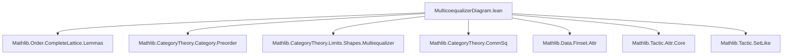
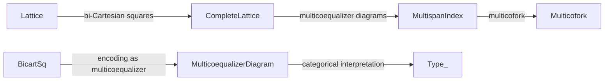
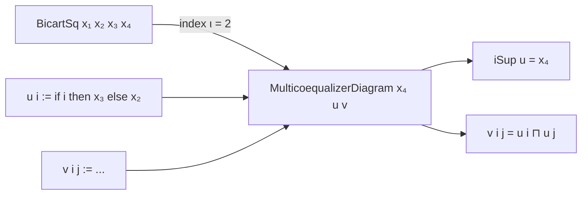

**Technical Brief: `MulticoequalizerDiagram.lean`**

---

### 1. **Key Definitions & Theorems**

| Name | Type | Purpose |
|------|------|---------|
| `BicartSq` | `Prop` | Defines a *bi-Cartesian square* in a lattice: elements $x_1, x_2, x_3, x_4$ such that $x_2 \sqcup x_3 = x_4$ and $x_2 \sqcap x_3 = x_1$. |
| `BicartSq.le₁₂`, `le₁₃`, `le₂₄`, `le₃₄` | `x₁ ≤ x₂`, etc. | Derived monotonicity facts from the lattice operations. |
| `BicartSq.commSq` | `CommSq ...` | Constructs the commuting square in the category associated to the preorder $T$. |
| `MulticoequalizerDiagram` | `Prop` | Generalizes bi-Cartesian squares: $x = \bigsqcup_i u_i$, and $v_{i,j} = u_i \sqcap u_j$. |
| `MulticoequalizerDiagram.multispanIndex` | `MultispanIndex ...` | Encodes the diagram (indexed by $\iota \times \iota$) of objects $u_i$ and morphisms $v_{i,j} = u_i \sqcap u_j$. |
| `MulticoequalizerDiagram.multicofork` | `Multicofork ...` | Constructs a multicofork with apex $x$, using the universal property of suprema. |
| `Lattice.BicartSq.multicoequalizerDiagram` | `MulticoequalizerDiagram ...` | Shows that a bi-Cartesian square yields a multicoequalizer diagram with $\iota = \mathbf{2}$ (binary sum). |

---

### 2. **Naming Conventions**

- **Prefixes**:
  - `le_`: inequalities derived from lattice operations (`le₁₂`, `le₂₄`, etc.).
  - `iSup_`: supremum-related (`iSup_eq`).
  - `eq_`: equality conditions (`eq_inf`).
- **Suffixes**:
  - `_sq`: for bi-Cartesian squares (`BicartSq`, `commSq`).
  - `_diagram`: for diagram constructions (`multicoequalizerDiagram`).
- **Pattern aliases**:
  - `inf_le_left`, `inf_le_right`, `le_sup_left`, `le_sup_right` → used for `grind` tactic automation.

---

### 3. **Tactic Stack**

- `grind`: heavily used for automated lattice reasoning (e.g., `by grind`, `grind [multispanIndex_right, le_iSup_iff]`).
- `rfl`: for definitional equalities (e.g., in `commSq`).
- `rw [← sq.sup_eq, sup_comm, sup_eq_iSup]`: rewriting using lattice identities and `iSup` definitions.
- `bif`: used in case analysis on `i : Fin 2` or boolean indices.

---

### 4. **Proof Logic**

- **Structure**: Definitions are built in layers:
  1. **Lattice level**: `BicartSq` encodes pushout/pullback squares in a lattice.
  2. **Complete lattice level**: `MulticoequalizerDiagram` generalizes to arbitrary families.
  3. **Embedding**: Show how `BicartSq` embeds into `MulticoequalizerDiagram` via binary indexing.
- **Typical proof flow**:
  - Use `grind` to discharge lattice inequalities.
  - Use `rfl` or `rw` for equalities involving suprema/infima.
  - Use `multispanIndex` and `multicofork` to construct categorical data.
  - For `multicoequalizerDiagram`, reduce to known lattice identities (`sup_eq_iSup`, `inf_comm`, etc.).

---

### 5. **Imports**

| Import | Role |
|--------|------|
| `Mathlib.Order.CompleteLattice.Lemmas` | Basic lattice theory and supremum/infimum lemmas. |
| `Mathlib.CategoryTheory.Category.Preorder` | Preorders as categories (`homOfLE`). |
| `Mathlib.CategoryTheory.Limits.Shapes.Multiequalizer` | Multicoequalizer/multispan machinery. |
| `Mathlib.CategoryTheory.CommSq` | Commuting squares in categories. |
| `Mathlib.Data.Finset.Attr`, `Mathlib.Tactic.Attr.Core`, `Mathlib.Tactic.SetLike` | Tactics and attributes for automation (`grind`, `cases`, `local grind`). |

---

### 6. **Mermaid Diagrams**

#### **Dependency Graph (Module Level)**

#### **Conceptual Overview (Theory Flow)**

#### **Diagram of `BicartSq → MulticoequalizerDiagram`**

---

### 7. **Categorical Interpretation (TODO)**

- When $T = \mathcal{P}(X)$ (power set lattice), `MulticoequalizerDiagram` corresponds to a *multicoequalizer diagram* in `Type _`:
  - $x = \bigcup_i u_i$
  - $v_{i,j} = u_i \cap u_j$
- Similarly, `BicartSq` corresponds to a *bicartesian square* (pushout + pullback) in `Type _`.

This sets up the foundation for homotopical or sheaf-theoretic applications (e.g., descent theory).

--- 

Let me know if you'd like a formalization of the `Set X` case or the categorical colimit property.
