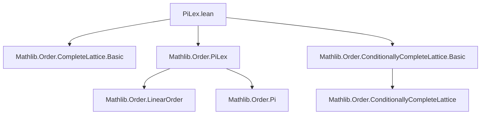

### Technical Brief: PiLex.lean — Complete Linear Order on Lexicographically Ordered Pi Types

---

#### **1. Key Definitions & Theorems**

| Name | Type / Signature | Purpose |
|------|------------------|---------|
| `inf` | `(s : Set (Πₗ i, α i)) → i : ι → α i` | Defines the *i*-th component of the lexicographic infimum over a set `s`, using well-founded recursion on `ι`. |
| `sInf` | `InfSet (Πₗ i, α i)` | Instance defining the infimum (greatest lower bound) of a set in the lexicographic Π-type. |
| `sInf_apply` | `sInf s i = ⨅ e : {e ∈ s | ∀ j < i, e j = sInf s j}, e.1 i` | Characterizes the value of `sInf s` at index `i`. |
| `sInf_apply_le` | `e ∈ s ∧ (∀ j < i, e j = sInf s j) ⇒ sInf s i ≤ e i` | Ensures `sInf s` is ≤ any element of `s` that agrees with `sInf s` up to `i`. |
| `le_sInf_apply` | `(∀ f ∈ s, (∀ j < i, f j = sInf s j) → e i ≤ f i) ⇒ e i ≤ sInf s i` | Converse direction: characterizes when `e i ≤ sInf s i`. |
| `sInf_le`, `le_sInf` | `e ∈ s ⇒ sInf s ≤ e`, `∀ b ∈ s, e ≤ b ⇒ e ≤ sInf s` | Standard lattice-theoretic properties of infimum. |
| `sSup` | `SupSet (Πₗ i, α i)` | Supremum defined via duality: `sSup s := sInf (α := Πₗ i, (α i)ᵒᵈ) s`. |
| `sSup_apply`, `le_sSup_apply`, `sSup_apply_le`, `le_sSup`, `sSup_le` | Analogous to `sInf`-family, for suprema. | Dual properties of suprema. |
| `completeLattice` | `CompleteLattice (Πₗ i, α i)` | Proves that `Πₗ i, α i` under lexicographic order is a complete lattice. |
| `completeLinearOrder` | `CompleteLinearOrder (Πₗ i, α i)` | Final result: `Πₗ i, α i` is a **complete linear order**. |
| `Colex.sInf`, `Colex.sSup`, `Colex.completeLattice`, `Colex.completeLinearOrder` | Analogous to `Lex`, but for colexicographic order on `Colex ((i : ι) → α i)`. | Extends result to colexicographic ordering (dual direction). |

---

#### **2. Naming Conventions**

- **Prefixes**:
  - `inf`, `sInf`, `sSup`: infimum/supremum-related definitions.
  - `le_`, `sInf_le`, `le_sInf`, `le_sSup`, `sSup_le`: order-theoretic inequalities.
  - `apply_`: component-wise evaluation (e.g., `sInf_apply`, `sSup_apply`).
- **Suffixes**:
  - `_apply`: characterizes value at index `i`.
  - `_le`, `_le_apply`: direction of inequality involving `≤`.
- **Dualization**:
  - `α := fun i ↦ (α i)ᵒᵈ`: used to lift lemmas from inf to sup via order dual.
  - `ι := ιᵒᵈ`: used in `Colex` to flip ordering direction.

---

#### **3. Tactic Stack**

| Tactic | Usage Frequency | Role |
|--------|-----------------|------|
| `simp` / `simp_all` | High | Simplify using definitions (`sInf_apply`, etc.). |
| `rw` | High | Rewrite using equalities like `sInf_apply`. |
| `exact` | High | Apply previously proven lemmas directly. |
| `by_contra!` | Medium | Proof by contradiction (common in lattice properties). |
| `obtain ⟨a, ha⟩` | Medium | Extract witness from negated order (`¬ a ≤ b ⇒ ∃ c, c < a ∧ c ≤ b`). |
| `grind` | Medium | Used in `le_sInf_apply` — likely a custom or high-level automation tactic. |
| `apply_le_of_toLex` | Low | Converts inequality in `toLex` to underlying type. |
| `refine` | Medium | Partial proof construction (e.g., in `le_sInf`). |

---

#### **4. Proof Logic**

The proof follows a **well-founded induction + lattice-theoretic duality** strategy:

1. **Well-founded recursion** on `ι` (via `WellFoundedLT ι`) defines `inf s i` component-wise, assuming infima exist in each `α i`.
2. **Component-wise characterizations** (`sInf_apply`, `sInf_apply_le`, `le_sInf_apply`) are proved first.
3. **Lattice axioms** (`sInf_le`, `le_sInf`) are established using:
   - Contrapositive reasoning (`by_contra!`)
   - Extraction of violating elements (`obtain ⟨a, ha⟩`)
   - Application of component-wise lemmas.
4. **Supremum** is defined via duality (`to_dual` pattern), and all sup-related lemmas are lifted from inf lemmas using `α := fun i ↦ (α i)ᵒᵈ`.
5. **Complete linear order** is assembled from:
   - `linearOrder` (inherited from `PiLex.linearOrder`)
   - `completeLattice` (proven above)
   - `LinearOrder.toBiheytingAlgebra _` (for Heyting structure).

The `Colex` section mirrors `Lex`, but uses `ιᵒᵈ` to flip the ordering direction, enabling colexicographic treatment.

---

#### **5. Imports & Dependencies**

| Module | Purpose |
|--------|---------|
| `Mathlib.Order.CompleteLattice.Basic` | Basic definitions and properties of complete lattices. |
| `Mathlib.Order.PiLex` | Lexicographic and colexicographic order definitions on Π-types. |
| `Mathlib.Order.ConditionallyCompleteLattice.Basic` | Conditional completeness (used implicitly via `CompleteLinearOrder`). |

> **Note**: The file builds on `PiLex` infrastructure (lexicographic Π-types), and assumes:
> - `ι` is linearly ordered.
> - Each `α i` is a `CompleteLinearOrder`.
> - `WellFoundedLT ι` (for `Lex`) or `WellFoundedGT ι` (for `Colex`).

---

#### **6. Mermaid Diagrams**

##### **Dependency Graph (Module-Level)**



##### **Theoretical Overview (PiLex Theory)**

```mermaid
flowchart LR
  subgraph Setup
    ι[ι: LinearOrder]
    α[α i: CompleteLinearOrder]
    WF[WellFoundedLT ι / WellFoundedGT ι]
  end

  subgraph Lex
    LexInf[inf s i via WF]
    LexSInf[sInf via toLex]
    LexLem[sInf_apply, sInf_le, le_sInf]
    LexCL[CompleteLinearOrder]
  end

  subgraph Dual
    DualInf[inf in (α i)ᵒᵈ]
    DualSup[sSup = sInfᵒᵈ]
  end

  LexInf --> LexSInf
  LexSInf --> LexLem
  LexLem --> LexCL
  DualInf --> DualSup
  DualSup --> LexLem

  Colex[colext: ιᵒᵈ → Lex] --> DualSup
```

##### **Proof Structure (for `Lex.completeLinearOrder`)**

```mermaid
flowchart TD
  Start[Given: ι LinearOrder, α i CompleteLinearOrder, WellFoundedLT ι] --> DefInf[Define inf s i]
  DefInf --> DefSInf[Define sInf s := toLex (inf s)]
  DefSInf --> Char[sInf_apply, sInf_apply_le, le_sInf_apply]
  Char --> LatticeAxioms[sInf_le, le_sInf]
  LatticeAxioms --> CompleteLattice[CompleteLattice instance]
  CompleteLattice --> DualSup[sSup via (α i)ᵒᵈ]
  DualSup --> DualLem[sSup lemmas]
  DualLem --> CompleteLinearOrder[CompleteLinearOrder instance]
```

---

#### **7. Summary**

This file establishes that **lexicographically ordered dependent function types** over a well-founded index type `ι` and complete linear orders `α i` inherit a **complete linear order** structure. The proof is constructive and relies on:
- Well-founded recursion for component-wise infima,
- Duality for suprema,
- Component-wise order reasoning.

The `Colex` section provides the symmetric result for colexicographic order, using `ιᵒᵈ` to reduce to the `Lex` case.

This is foundational for formalizing transfinite induction, ordinal arithmetic, and higher-type order theory in Lean.
