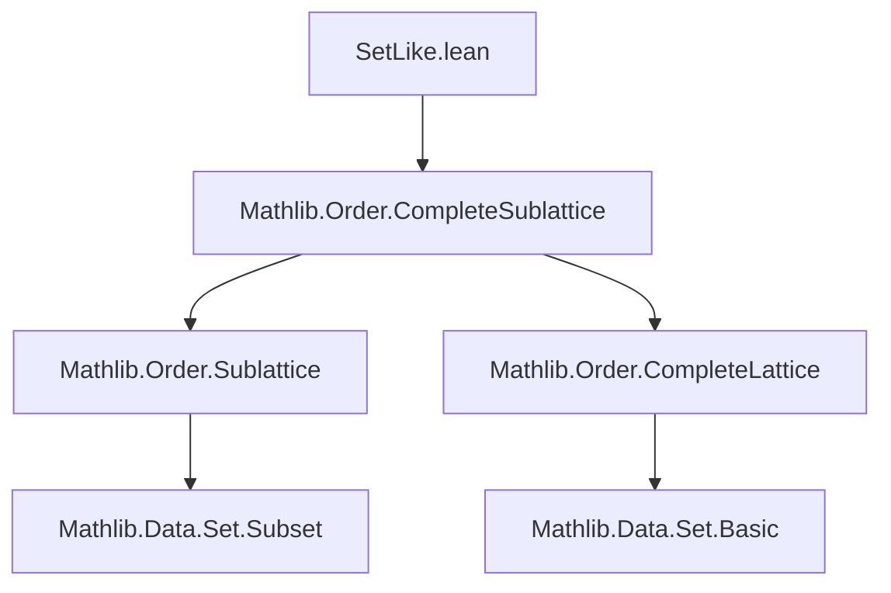
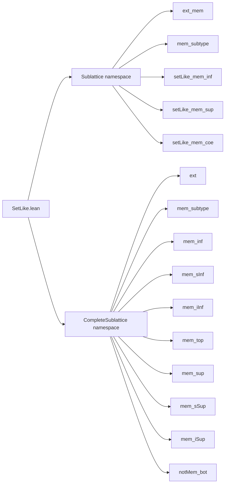

### Technical Brief: `SetLike.lean` — `SetLike` Instance for `CompleteSublattice (Set X)`

---

#### **1. Key Definitions & Theorems**

| Name | Type / Statement | Purpose |
|------|------------------|---------|
| `ext_mem` | `(h : ∀ x, x ∈ S ↔ x ∈ T) → S = T` | Extensionality for `Sublattice (Set X)` elements via membership equivalence. |
| `mem_subtype` | `x ∈ L.subtype T ↔ x ∈ T` | Relates membership in the subtype coercion to membership in the underlying set. |
| `setLike_mem_inf` | `x ∈ S ⊓ T ↔ x ∈ S ∧ x ∈ T` | Characterizes membership in meet (infimum) of sublattice elements. |
| `setLike_mem_sup` | `x ∈ S ⊔ T ↔ x ∈ S ∨ x ∈ T` | Characterizes membership in join (supremum) of sublattice elements. |
| `setLike_mem_coe` | `x ∈ T.val ↔ x ∈ T` | Identity for coercion from subtype to set. |
| `ext` | `(h : ∀ x, x ∈ S ↔ x ∈ T) → S = T` | Extensionality for `CompleteSublattice (Set X)` elements. |
| `mem_inf` | `x ∈ S ⊓ T ↔ x ∈ S ∧ x ∈ T` | Same as `setLike_mem_inf`, but for `CompleteSublattice`. |
| `mem_sInf` | `x ∈ sInf 𝒮 ↔ ∀ T ∈ 𝒮, x ∈ T` | Membership in arbitrary infimum (intersection) of sets in a family. |
| `mem_iInf` | `x ∈ ⨅ i, f i ↔ ∀ i, x ∈ f i` | Membership in indexed infimum. |
| `mem_top` | `x ∈ (⊤ : L)` | Top element contains all elements (i.e., universal set). |
| `mem_sup` | `x ∈ S ⊔ T ↔ x ∈ S ∨ x ∈ T` | Same as `setLike_mem_sup`, for `CompleteSublattice`. |
| `mem_sSup` | `x ∈ sSup 𝒮 ↔ ∃ T ∈ 𝒮, x ∈ T` | Membership in arbitrary supremum (union) of sets. |
| `mem_iSup` | `x ∈ ⨆ i, f i ↔ ∃ i, x ∈ f i` | Membership in indexed supremum. |
| `notMem_bot` | `x ∉ (⊥ : L)` | Bottom element is empty set (no element belongs to it). |

> All `mem_*` lemmas are *simplification rules* (`@[simp]`) that reduce membership in lattice operations to logical combinations of membership in components.

---

#### **2. Naming Conventions**

- **Prefixes**:
  - `mem_`: for membership characterizations.
  - `setLike_mem_`: same as `mem_`, but explicitly in `Sublattice` namespace (avoids name clash).
  - `ext_`: extensionality lemmas.
- **Suffixes**:
  - `_inf`, `_sup`: binary meet/join.
  - `_sInf`, `_sSup`: set-indexed inf/sup.
  - `_iInf`, `_iSup`: indexed inf/sup.
  - `_subtype`: for subtype coercion membership.
  - `_coe`: for coercion (`val`) membership.

> Consistent use of `mem_` and `setLike_mem_` distinguishes between `Sublattice` and `CompleteSublattice` namespaces.

---

#### **3. Tactic Stack**

- `simp`: Dominant tactic, especially with `← mem_subtype` to push membership into the underlying set.
- `by simp [← mem_subtype]`: recurring pattern for all `@[simp]` lemmas.
- `ext`: used implicitly via `@[ext]` attribute to enable extensionality proofs.

No heavy automation (e.g., `aesop`, `ring`, `linarith`) is used — proofs are purely simplification-based.

---

#### **4. Proof Logic**

- **Structure**: All proofs follow the same pattern:
  1. Apply `simp` with `← mem_subtype` to reduce membership in the lattice to membership in the underlying subtype.
  2. Use definitional equality (`Iff.rfl`) or `SetLike.ext` for extensionality.
- **Extensionality**: Proven via `SetLike.ext`, leveraging the `SetLike` instance.
- **No induction or case analysis** needed — all properties are definitional or follow from `SetLike` interface.

---

#### **5. Imports**

- `Mathlib.Order.CompleteSublattice`: Provides the core definitions of `Sublattice` and `CompleteSublattice`.
- `SetLike` infrastructure (implicitly via `Mathlib.Order.CompleteSublattice`, which imports `SetLike`).

> This file is a *utility module* that connects `SetLike` with lattice operations on sublattices of sets.

---

#### **8. Mermaid Diagrams**

##### **Dependency Graph**

##### **Overview of File Structure**

##### **Theoretical Context**

- **Domain**: Order theory, specifically lattices of subsets.
- **Purpose**: Enable reasoning about sublattices of `Set X` as `SetLike` objects, allowing direct use of set-theoretic membership reasoning.
- **Role in Mathlib**: Bridges `SetLike` interface with lattice-theoretic constructions, facilitating uniform treatment of sublattices as sets.

--- 

✅ **Summary**: This file formalizes the `SetLike` interface for sublattices of sets, providing clean, simplifier-friendly characterizations of membership in lattice operations. It is minimal, definitional, and highly uniform in structure.
